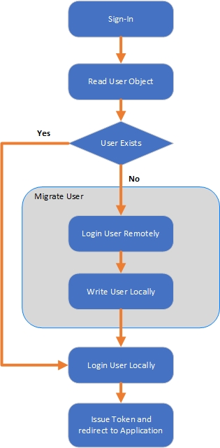

# JIT Migrate from one B2C Instance to another
> Disclaimer: This sample is provided AS IS - a best effort will be made to update this sample as the service evolves.

## Scenario
This sample solution demonstrates how to migrate users from one B2C instance to another using Just In Time (JIT) Migration.
The policy will check to see if the user exists in the current tenant, and if they exist then the normal authenication process is followed (login-Noninteractive).
If the user does not exist within the curren tenant a seperate Remote login call is made to the legacy B2C instance using ROPC.
On successfull Authenitcaion to the legacy tenant, the user details (including password) are written to the local Tenant.

On next login the user will exist in the tenant so the normal authenticaiton process will be followed.
## Flow Diagram
The following diagram illustrates the migration flow:

  

## Configure the sample
To configure this solution, you will need to use Azure AD B2C Custom policies that use the Azure AD B2C Identity Experience Framework.  Review the [getting started with custom B2C applications](https://docs.microsoft.com/en-us/azure/active-directory-b2c/active-directory-b2c-get-started-custom?tabs=applications).

### Instructions
This example builds upon the [Social and Local Display Control Starter pack sample](https://github.com/Azure-Samples/active-directory-b2c-custom-policy-starterpack/tree/master/Display%20Controls%20Starterpack/SocialAndLocalAccounts).

The following changes will need to be made to [B2CMigrate_Extensions](Policy/B2CMigrate_Extensions.xml) file:
1. Change the references from "yourtenant.onmicrosoft.com" to the name of your B2C Tenant.
2. Change the reference from "remoteb2ctenant" on [Line 36](Policy/B2CMigrate_Extensions.xml#L36) and [Line 37](policy/B2CMigrate_Extensions.xml#L37) to your legacy B2C tenant name.
3. Change the reference of "RemoteB2CProxyIdentityExperienceFrameworkAppId" on [Line 44](Policy/B2CMigrate_Extensions.xml#L44) and [Line 53](Policy/B2CMigrate_Extensions.xml#L53) to the Proxy Identitiy Experience Framework Applicaiton Objects Client Id from your legacy tenant.
4. Change the reference of "RemoteB2CIdentityExperienceFrameworkAppId" on [Line 45](Policy/B2CMigrate_Extensions.xml#L45) and [Line 54](Policy/B2CMigrate_Extensions.xml#L54) to the Identitiy Experience Framework Applicaiton Objects Client Id from your legacy tenant.

## Community Help and Support
Use [Stack Overflow](https://stackoverflow.com/questions/tagged/azure-ad-b2c) to get support from the community. Ask your questions on Stack Overflow first and browse existing issues to see if someone has asked your question before. Make sure that your questions or comments are tagged with [azure-ad-b2c].

If you find a bug in the sample, please raise the issue on [GitHub Issues](https://github.com/azure-ad-b2c/samples/issues).

To provide product feedback, visit the [Azure Active Directory B2C Feedback page](https://feedback.azure.com/forums/169401-azure-active-directory?category_id=160596).
