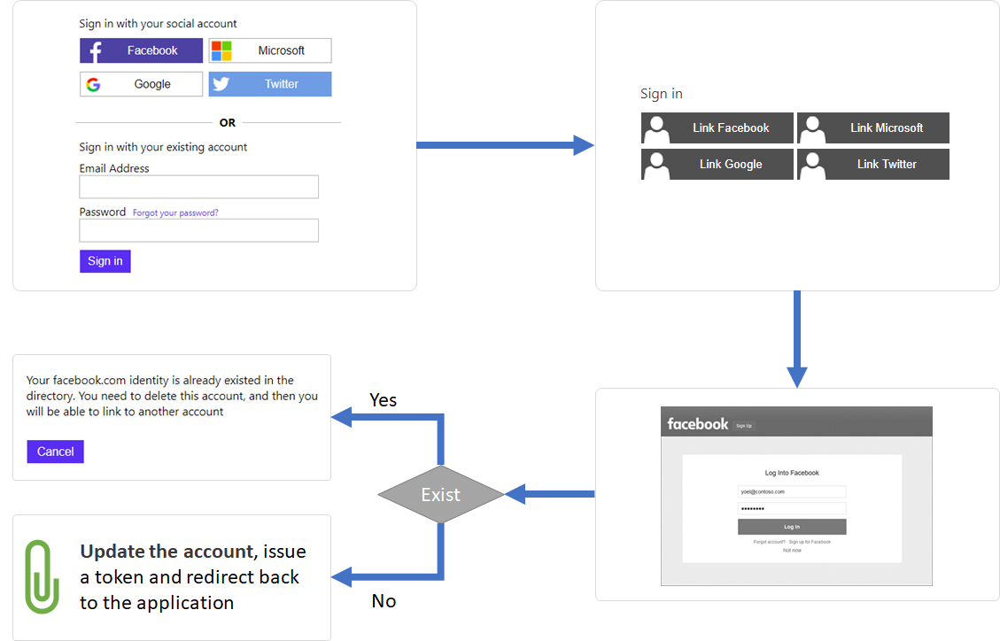

# Azure AD B2C account linkage

With Azure AD B2C a user can have multiple identities. Sign-in with local or social account, and link another social identity to an existing one. Both share the same account in Azure AD B2C. This Azure AD B2C sample demonstrates how to link existing local account to a social account. 

## How it works
* In Azure AD B2C, **local accounts** sign-in names (user name or email address) are stored in the `signInNames` collection in the user record. The `signInNames` contains one or more `signInName` records that specify the sign-in names for the user. Each sign-in name must be unique across the tenant.

* **Social accounts'** identities are stored in `userIdentities` collection. The entry specifies the `issuer` (identity provider name) such as facebook.com and the `issuerUserId`, which is a unique user identifier for the issuer. The `userIdentities` attribute contains one or more UserIdentity records that specify the social account type and the unique user identifier from the social identity provider.

* **Combine local account with social identity**. As mentioned, local account sign-in names, and social account identities are stored in different attributes. `signInNames` is used for local account, while `userIdentities` for social account. A single Azure AD B2C account, can be a local account only, social account only, or combine a local account with social identity in one user record. This behavior allows you to manage a single account, while a user can sign in with the local account credential(s) or with the **multiple social identities**.

* `UserIdentity` Type - Contains information about the identity of a social account user in an Azure AD B2C tenant:
  * `issuer` The string representation of the identity provider that issued the user identifier, such as facebook.com.
  * `issuerUserId` The unique user identifier used by the social identity provider in base64 format.

* Depending on the identity provider, the **Social user ID** is a unique value for a given user per application or development account. Configure the Azure AD B2C policy with the same application ID that was previously assigned by the social provider. Or another application within the same development account.

So, your account may look like this one:
```JSON
"displayName": "Andrew Taylor",
"signInNames": [
    {
        "type": "emailAddress",
        "value": "andrew-taylor@live.com"
    }
],
"userIdentities": [{
        "issuer": "Facebook.com",
        "issuerUserId": "MTIzNDU2Nzg5MA=="
    },
    {
        "issuer": "Live.com",
        "issuerUserId": "MDk4NzY1NDMyMQ=="
    }
]
```


## Link flow
1. To link a local or social account to another social identity, user fist sign-in (with a local or social account).
1. The policy reads the account form the directory, and checks the value of the `userIdentities` attribute. As mentioned above, this attribute is a collection. So, the policy extracts the names of the issuer to a string collection. Based on this string collection, the policy show/hide the technical profile. For example, if the collection is empty, user will see the four options to link with: Facebook, Microsoft, Google, and Twitter. But, after user linked a Facebook account, on the next time user execute the link policy, the user will see only: Microsoft, Google, and Twitter.
1. User clicks on one of the social identity buttons, which takes the user to the social identity provider to complete the sign-in.
1. After user complete the sign-in with the selected identity provider, the policy tries to find such an account in the directory. If found, the policy displays an error message "You facebook.com identity already exists...". If not found, the policy adds the new social identity to the `userIdenitites` collection and update the account
1. Azure AD B2C issues an access token.



## Unlink flow
1. To unlink a local or social account to another social identity, user fist sign-in (with a local or social account).
1. The policy reads the account form the directory, and checks the value of the `userIdentities` attribute. The policy extracts the names of the issuer to a string collection. Based on this string collection, the policy show/hide the technical profile. For example, if the collection has `facebook.com`, user will see the only Facebook option. But, if user linked Facebook and Twitter identities. The policy will show both Facebook and Twitter.
1. User clicks on one of the social identity buttons, which takes the user to the social identity provider to complete the sign-in.
1. After user complete the sign-in with the selected identity provider, the policy removed that issuer from the  `userIdenitites` collection and update the account.
1. Azure AD B2C issues an access token.


## Technical profiles
For each social identity provider, there are four technical profiles. For example:
- **Facebook-OAUTH-Base** define the basic functionality to sign-in with Facebook account.
- **Facebook-OAUTH-SignIn** includes the `Facebook-OAUTH-Base` technical profile, and set the output claims, output claims transformation, and session manager to **sign-in** with Facebook.
- **Facebook-OAUTH-Link** includes the `Facebook-OAUTH-Base` technical profile, and set the output claims, output claims transformation, and session manager to sign-in with Facebook to **link** an account.
- **Facebook-Unlink** remove the Facebook issuer from the userIdentities collection.

## Disclaimer
The sample app is developed and managed by the open-source community in GitHub. The application is not part of Azure AD B2C product and it's not supported under any Microsoft standard support program or service. 
The app is provided AS IS without warranty of any kind.


## Notes
This sample policy is based on [SocialAndLocalAccounts starter pack](https://github.com/Azure-Samples/active-directory-b2c-custom-policy-starterpack/tree/master/SocialAndLocalAccounts). All changes are marked with **Sample:** comment inside the policy XML files. Make the necessary changes in the **Sample action required** sections. 
