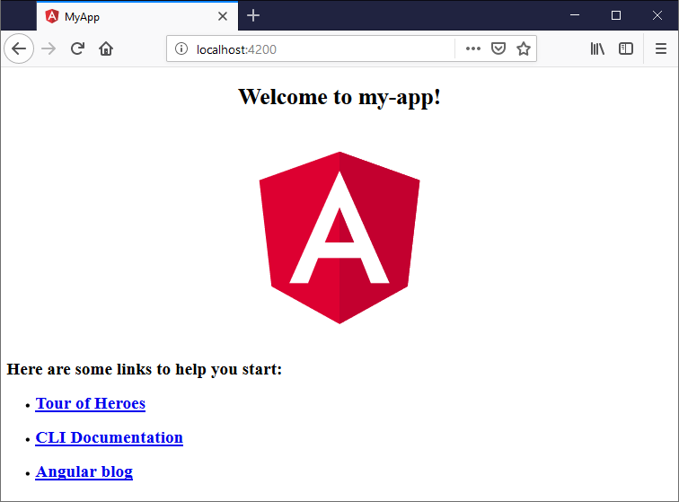
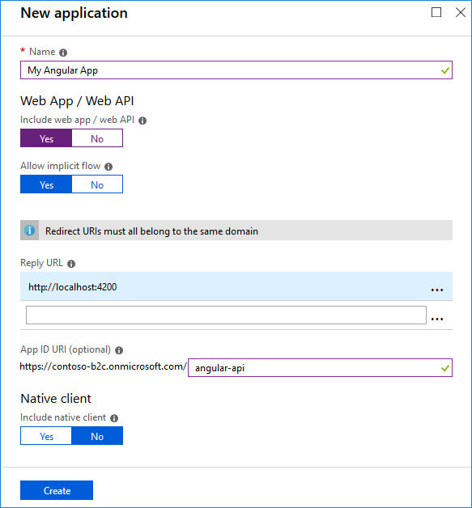
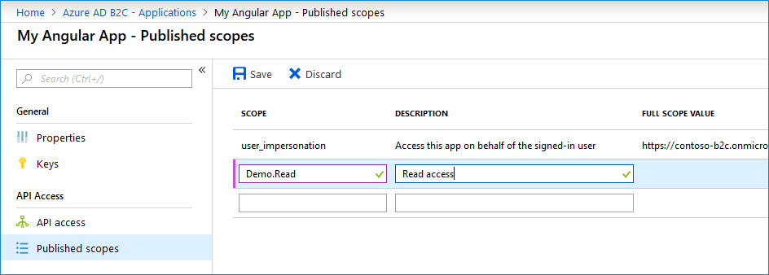
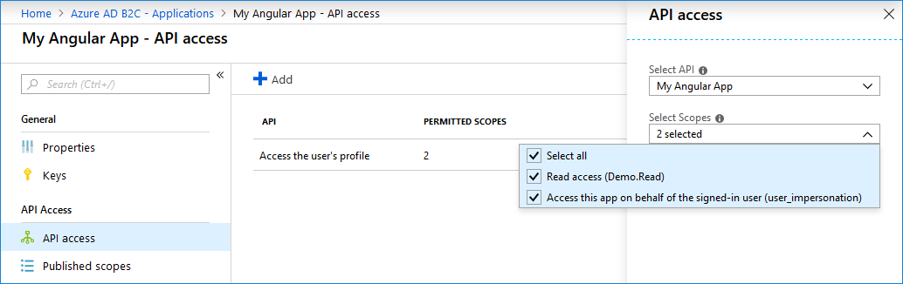

[Angular](https://angular.io/) is a popular JavaScript library for building web apps user interfaces developed by Google. This guide shows you how to 

1. Build and run a new simple Angular2 app 
1. Register your app on Azure AD B2C 
1. Adding the OAuth2 authorization library
1. Configure your library to federate with Azure AD B2C sign-up or sign-in policy
1. Adding the sign-in functionality
1. Adding the sign-out funcritonlity

## Welcome to Angular

We use [Angular CLI tool](https://cli.angular.io/) to create the application a simple application. But you can use any existing or new application. To install and use the command-line interface as well as run the Angular application server, you'll need the [Node.js](https://nodejs.org/) JavaScript runtime and [npm](https://www.npmjs.com/) (the Node.js package manager) installed. npm is included with Node.js, which you can install from [here](https://nodejs.org/en/download/).

>**Tip**: To test that you have Node.js and npm correctly installed on your machine, you can type `node --version` and `npm --version`.

To install the Angular CLI, in a terminal or command prompt type:

```bash
npm install -g @angular/cli
```

This may take a few minutes to install. You can now create a new Angular application by typing:

```bash
ng new my-app
```

`my-app` is the name of the folder for your application. This may take a few minutes to create the Angular application in [TypeScript](/docs/languages/typescript.md) and install its dependencies.

Let's quickly run our Angular application by navigating to the new folder and typing `ng serve` to start the web server and open the application in a browser:

```bash
cd my-app
ng serve --open
```

You should see "Welcome to app!!" on [http://localhost:4200](http://localhost:4200) in your browser. 



We'll leave the web server running while we look at the application with VS Code. To open your Angular application in VS Code, open another terminal (or command prompt) and navigate to the `my-app` folder and type `code .`:

```bash
cd my-app
code .
``` 

## Step 1. Create your own policies

This sample uses three types of policies: 
- Unified sign-up and sign-in policy 
- Password reset policy [TBD]
- Profile editing policy [TBD]

Create one policy of each type by following [the instructions here](https://azure.microsoft.com/documentation/articles/active-directory-b2c-reference-policies).  You may choose to include as many or as few identity providers as you wish. If you already have existing policies in your Azure AD B2C tenant, feel free to reuse those. No need to create new ones just for this sample.

## Step 2. Create your own application

A Web application needs to be registered in your Azure AD B2C tenant before they can accept and respond to protected resource requests by client applications that present an access token.

1. From Azure AD B2C, select **Applications**, and then select **Add**.
1. Enter a name for the application. For example, `My Angular App`.
1. For **Include web app/ web API** and **Allow implicit flow**, select Yes.
1. For **Reply URL**, enter an endpoint where Azure AD B2C should return any tokens that your application requests. In this tutorial, the Angular sample runs locally and listens at `http://localhost:4200`.
1. For **App ID URI**, enter the identifier used for your web API. The full identifier URI including the domain is generated for you. For example, `https://your-tenant.onmicrosoft.com/angular-api`.
    
1. Click **Create**.
1. On the properties page, record the **Application ID** that you'll use when you configure the web application.

### Step 2.1 Configure scopes
Scopes provide a way to govern access to protected resources. Scopes are used by the web API to implement scope-based access control. For example, some users could have both read and write access, whereas other users might have read-only permissions. In this tutorial, you define read permissions for the web API.

1. Select **Applications**, and then select `My Angular App`.
1. Select **Published Scopes**.
1. For **scope**, enter `Demo.Read`, and for **description**, enter `Read access`.
    
1. Click **Save**.

### Step 2.2 Grant permissions
To call a protected web API from an application, you need to grant your application permissions to the API. 

1. Select **API access**, and then select **Add**.
1. In the **Select API** dropdown, select `My Angular App`.
1. In the **Select Scopes** dropdown, select the `Demo.Read` scope that you previously defined.
    
1. Click **OK**.

## Step 3. Add MSAL library

### Step 3.1 Installation MSAL
The msal-angular package is available on NPM. From [VS Code terminal](https://code.visualstudio.com/docs/editor/integrated-terminal), run following command:

```
npm install @azure/msal-angular --save
```
### Step 3.2 Include and initialize the MSAL module in your app module.

1. Under the **app** folder, create a subfolder: **services**
1. Create a new file: **msal.service.ts**. This class tonains the code to sign-in and sign-out using Azure AD B2C.
1. Add following code to the msal.service.ts file

```TypeScript
import { Injectable } from '@angular/core';
import { Observable } from 'rxjs/Observable';
import * as Msal from 'msal';

declare var bootbox: any;
@Injectable()
export class MsalService {

    B2CTodoAccessTokenKey = "b2c.todo.access.token";

    tenantConfig = {
        tenant: "your-tenant.onmicrosoft.com",
        clientID: 'ebce2d28-8fb8-4cc7-83ae-accc9d73ee9d',
        signUpSignInPolicy: "B2C_1_SUSI",
        b2cScopes: ["https://your-tenant.onmicrosoft.com/angular-api/Demo.Read"]
    };
    
    // Configure the authority for Azure AD B2C
    authority = "https://login.microsoftonline.com/tfp/" + this.tenantConfig.tenant + "/" + this.tenantConfig.signUpSignInPolicy;

    /*
     * B2C SignIn SignUp Policy Configuration
     */
    clientApplication = new Msal.UserAgentApplication(
        this.tenantConfig.clientID, this.authority, 
        function (errorDesc: any, token: any, error: any, tokenType: any) {
            // Called after loginRedirect or acquireTokenPopup
        }
    );

    public login(): void {
        var _this = this;
        
        this.clientApplication.loginPopup(this.tenantConfig.b2cScopes).then(function (idToken: any) {
            _this.clientApplication.acquireTokenSilent(_this.tenantConfig.b2cScopes).then(
                function (accessToken: any) {
                    _this.saveAccessTokenToCache(accessToken);
                }, function (error: any) {
                    _this.clientApplication.acquireTokenPopup(_this.tenantConfig.b2cScopes).then(
                        function (accessToken: any) {
                            _this.saveAccessTokenToCache(accessToken);
                        }, function (error: any) {
                            bootbox.alert("Error acquiring the popup:\n" + error);
                        });
                })
        }, function (error: any) {
            bootbox.alert("Error during login:\n" + error);
        });
    }

    saveAccessTokenToCache(accessToken: string): void {
        sessionStorage.setItem(this.B2CTodoAccessTokenKey, accessToken);
    };

    logout(): void {
        this.clientApplication.logout();
    };

    isOnline(): boolean {
        return this.clientApplication.getUser() != null; 
    };
}
```

The code contains following sections:
- MSAL tenent configuration
- **login** method allows user to acquire tokens by prompting user authentication in a pop-up window. And then obtain a token silently without prompting the user again.   
- **saveAccessTokenToCache** method, after user successfully sign-in, MSAL library stores the token to the SPA application cache to later use.
- **logout** method, sign the user out from the application and clears Azure AD B2C session. 
- **isOnline** method, checks if user is sign-in or not

### Step 3.3 Configure your environment attributes

This code sets the Azure AD B2C values. Set those parameters with the value of your environment, including:
- Your tenant name
- The sign-up or sign-in policy
- The application you created earlier
- The application scopes

 ```TypeScript
    tenantConfig = {
        tenant: "your-tenant.onmicrosoft.com",
        clientID: 'ebce2d28-8fb8-4cc7-83ae-accc9d73ee9d',
        signUpSignInPolicy: "B2C_1_SUSI",
        b2cScopes: ["https://your-tenant.onmicrosoft.com/angular-api/Demo.Read"]
    };
```

### Step 3.4 Add sign-in and sign-out functionality 
Add following code to the `app.component.ts` file, so the sign-in and sign-out functionality will cover the entire application, no matter where user is navigates to.

In the  `app.component.ts` file, import your MSAL service you create earlier. 

```TypeScript
import { MsalService } from './services/msal.service';
```

Inside the class, add following code. This code:
- injects the `location` and `msalService`
- Add the `login()` method
- Add the `logout()` method, which sign-in and clear the local cache
- Add the `isOnline()` method, checks if user is sign-in
- Add the `getAccessToken()` method, gets the access token from the cache
- 
```TypeScript
  access_token: string = "";

  constructor(
    private location: Location,
    private msalService: MsalService
  ) { }

  login(): void {
    this.msalService.login();
  }

  logout(): void {
    this.msalService.logout();
    sessionStorage.clear();
  };

   isActive(viewLocation: any): boolean {
     return viewLocation === this.location.path();
   };

  isOnline(): boolean {
    return this.msalService.isOnline();
  };

  getAccessToken(): void {
    if (sessionStorage.hasOwnProperty(this.msalService.B2CTodoAccessTokenKey) && sessionStorage[this.msalService.B2CTodoAccessTokenKey] !== "") {
      this.access_token = sessionStorage[this.msalService.B2CTodoAccessTokenKey];
    }
  };

```

### Step 3.5 Add sign-in and sign-out buttons

In this step, you add the sign-in and sign-out buttons. Those buttons are shown to user in the user is online or not `[hidden]="!isOnline()`. Also the DIV below shows the access token Azure AD B2C returns to the application. 

```HTML
<ul>
  <li [hidden]="!isOnline()"><a class="btn btn-link"  (click)="logout()" href="#">Logout</a></li>
  <li [hidden]="isOnline()"><a class="btn btn-link"  (click)="login()" href="#">Login</a></li>
</ul>

<div [hidden]="!isOnline()">
  <h3>Access token:</h3>
  <a class="btn btn-link" [hidden]="access_token.length > 0" (click)="getAccessToken()" href="#">Show the token</a>
  <div>
    {{access_token}}
  </div>
</div>
```

### Step 3.4 [Optional] Secure the routes in your application
[TBD]

## The complete code
You can find the complete code in this [GitHub repo](https://github.com/Azure-Samples/active-directory-b2c-javascript-angular2.4-spa) The sample is already configured to use a demo environment and can be run simply by downloading the code and running the app on your machine. Follow the instructions below if you would like to use your own Azure AD B2C configuration. Optionally, if you want to use your own tenant configuration.