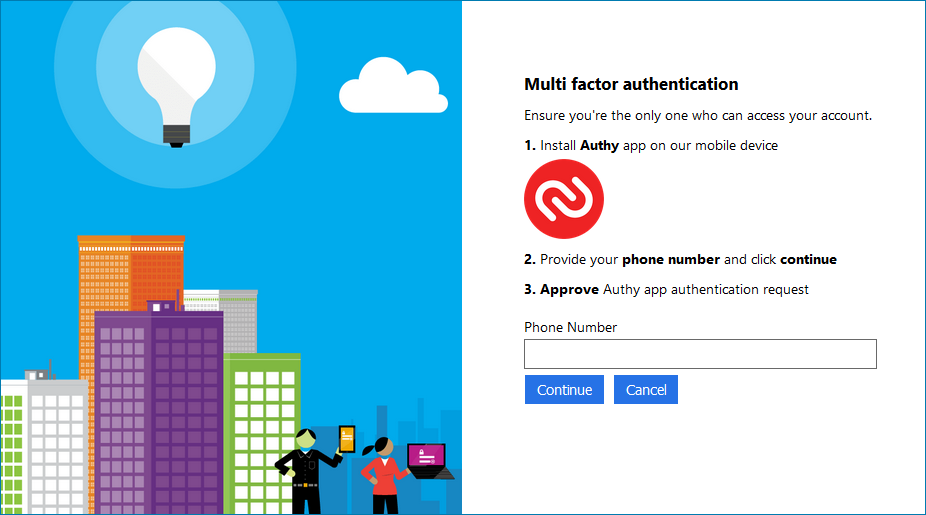
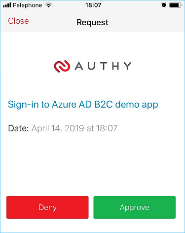

# Azure AD B2C: Auth App multi-factor authentication

With Azure Active Directory (Azure AD) B2C, you can integrate Twilio auth app Multi-Factor Authentication so that you can add a second layer of security to sign-up and sign-in experiences in your consumer-facing applications. This requires using custom policy and custom REST API endpoint. If you already created sign-up and sign-in policies, you can still enable Multi-Factor Authentication.

Following component are involved in the Azure AD B2C Authy App multi-factor authentication solution code sample:
1.	**Azure AD B2C** - The authorization server, responsible for verifying the user's identity, granting (and revoking) access to resources, and issuing tokens. It is also known as the identity provider. 
1.	**Web or mobile application** – also known as relying party application. An application that relies on identity provider (Azure AD B2C) for authentication. 
1.	**Custom Rest API** - With the Identity Experience Framework, which underlies AD B2C, you can integrate with a RESTful API in a user journey. Adding your own business logic. The Identity Experience Framework sends data to the RESTful service in an Input claims collection and receives data back from RESTful in an Output claims collection. The call to the REST API secure by client certificate. We use custom REST API to register a user’s phone number, and verify the authentication request.
1.	**Authy App** – Authy brings the future of strong authentication to the convenience of your iOS or Android device. The Authy app generates secure two-step verification tokens on your device. It helps you protect your account from hackers and hijackers by adding an additional layer of security. For more information and to create an account, see: [https://authy.com/](https://authy.com/)

## Perquisites
- You have an Authy app account. All the components motioned above up, running, and well configured
- The solution is based on an extension attribute. Read here how to [configure extension attributes](https://docs.microsoft.com/en-us/azure/active-directory-b2c/active-directory-b2c-create-custom-attributes-profile-edit-custom). 

## 1. Sign-up or sign in flow
- During the sign-up or sign-in flow, orchestration step #6 reads the AppCode MFA attributes. 
- If AppCode attribute exists, step #7 runs the MFA validation
- If AppCode attribute doesn't exist, step #8 enrolls and validates the phone number.

### Enroll new phone number
Before you can secure a user with the Twilio Authy API, you need to create a user. The API requires you set an email, phone number, and country code for each user.

When a user is first created, Authy API returns an **authyid** (AppCode) which you must then store with the user's profile in Azure AD B2C account. Do not lose this ID - you will use it every time you wish to authenticate a user. Read more [https://www.twilio.com/docs/authy/api/users](https://www.twilio.com/docs/authy/api/users)  

The .Net core solution **identity** controller **Register** POST endpoint runs some input validations and then calls the Authy API new user endpoint. After the user is enrolled (no approval required) the **Register** endpoint returns the  **authyid** (AppCode). 

As part of the registration process, Azure AD B2C custom policy also calls the **Identity** POST **WaitForAuthyApproval** endpoint to validate the phone number and then stores **authyid** (AppCode) value in the user's Azure AD B2C account for later use.

Orchestration step 8 asks the user to provide the phone number (with the country code).

When user clicks continue, the **SelfAsserted-AppFactor-Register** technical profile runs following validation technical profiles:
- **AppFactor-RegisterWebHook**  - Register the user in Authy service 
- **AppFactor-WaitForAuthyApprovalWebHook** - Sends push notification to the Authy App and wait for Authy app approval (default timeout is set to 2 minutes)
- **AAD-WriteUserAppCodeByObjectId** -  Stores the **authyid** (AppCode) value in the user's account.

### Validate the phone number
Both the registration and the sign-in flow run the verification flow. The **SelfAsserted-AppFactor-WaitForAuthyApproval** technical profile calls the **Identity** POST **WaitForAuthyApproval** endpoint. This endpoint runs some input validation and then makes two calls the Auth API
- [Create an Approval Request](https://www.twilio.com/docs/authy/api/push-authentications#create-an-approval-request) This will create a new approval request for the given Authy ID and send it to the end user along with a push notification to the Authy Mobile app. At this point Authy sends push notification to the Auth mobile App. User has to approve or deny the request.
    
    
    
- [Check Approval Request Status](https://www.twilio.com/docs/authy/api/push-authentications#check-approval-request-status) repeatedly calls this endpoint until the user approves the request, or until the **Identity** endpoint reaches the timeout.

## Community Help and Support
Use [Stack Overflow](https://stackoverflow.com/questions/tagged/azure-ad-b2c) to get support from the community. Ask your questions on Stack Overflow first and browse existing issues to see if someone has asked your question before. Make sure that your questions or comments are tagged with [azure-ad-b2c].
If you find a bug in the sample, please raise the issue on [GitHub Issues](https://github.com/azure-ad-b2c/samples/issues).
To provide product feedback, visit the Azure Active Directory B2C [Feedback page](https://feedback.azure.com/forums/169401-azure-active-directory?category_id=160596).

> Note:  This sample policy is based on [SocialAndLocalAccounts starter pack](https://github.com/Azure-Samples/active-directory-b2c-custom-policy-starterpack/tree/master/SocialAndLocalAccounts). All changes are marked with **Demo:** comment inside the policy XML files. Make the necessary changes in the **Demo action required** sections.
