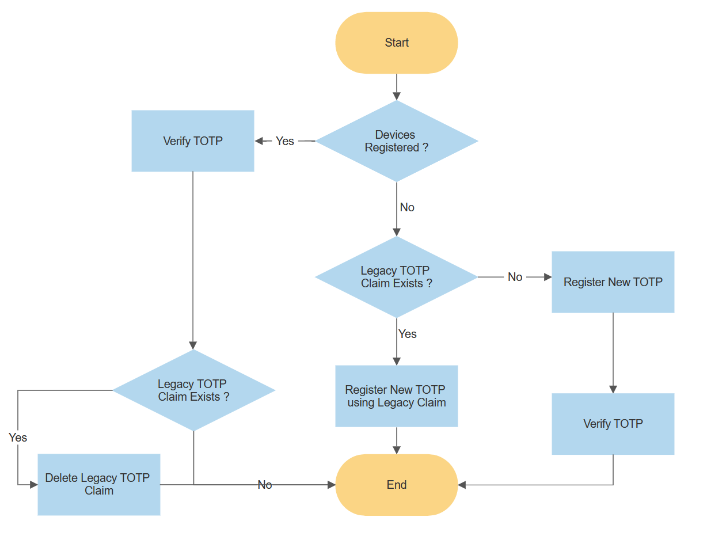

# Azure AD B2C: TOTP multi-factor authentication

This solution is deprecated. Use the new Azure AD B2C TOTP feature. For more information, see [Public Preview: Azure AD B2C MFA with TOTP using any Authenticator app](https://github.com/azure-ad-b2c/samples/tree/master/policies/totp).

## TOTP Migration

If you were previously using this sample to implement TOTP, then your users' secrets will be stored in the `extension_StrongAuthenticationAppSecretKey` extension attribute.

To migrate these to the new method you can implement the [TOTP Migration Extension](../totp/policy/TrustFrameworkExtensionsTOTP_JIT.xml) policy as the parent policy for either [SignUpOrSigninWithTOTP](../totp/policy/SignUpOrSigninWithTOTP.xml#L9) or [PaswordResetWithTOTP.xml](../totp/policy/PaswordResetWithTOTP.xml#L9) 

The below diagram depicts how the Just In Time TOTP migration works:

