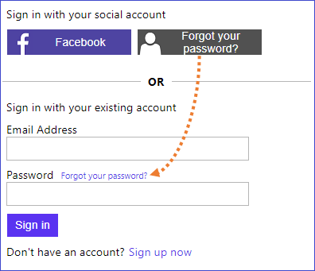

# Sign-up and Sign-in with embedded password reset

By default when you create a sign-up or sign-in policy (with local accounts), you see a Forgot password? link on the first page of the experience. Clicking this link doesn't automatically trigger a password reset policy. Instead, the error code AADB2C90118 is returned to your app. Your app needs to handle this error code by invoking a specific password reset policy. 

This policy demonstrates how to embed the password reset flow a part of the sign-up or sign-in policy. So, Azure AD B2C will not return the AADB2C90118 error message.

## Policy artifacts
1. The `isPasswordResetFlow` claim type indicates whether user resetting the password
1. The `LocalAccountDiscoveryUsingEmailAddress` technical profile is overwritten by setting the display name. The display name controls the button text that renders to the user. Also, setting the value of the `isPasswordResetFlow` output claim to `ture`. As indicator that user is running the password reset flow (in the same policy).
1. In the first orchestration step, we add a new `LocalAccountSigninEmailExchange` claims provider selection.
1. In the second orchestration step, we add the action for the password reset button that added in the previous step. This is the first step of the password reset flow, where the user validates the email address. The technical profile also set the `isPasswordResetFlow` as an indicator that user is resetting the password
1. The third orchestration step is the second step of the password rest flow, that actually resets the password.

##  Fix the user interface
In this solution, the password reset is added as an identity provider selection button. You may want to move the button to the proper location and set the UI to looks like a link.



In your custom UI, you can use following JavaScript. For more information, see: [how to enable JavaScript on your custom HTML page](https://docs.microsoft.com/en-us/azure/active-directory-b2c/javascript-samples)
and [Customize the user interface of your application using a custom policy](https://docs.microsoft.com/en-us/azure/active-directory-b2c/active-directory-b2c-ui-customization-custom)

```JavaScript
// Remove the provided password reset link
$("#forgotPassword").remove()

// Move the new password reset button to the right position
$("#PasswordResetUsingEmailAddressExchange").detach().appendTo("label[for='password']");

// Set the style of the passwrod reset button to look like a link
$("#PasswordResetUsingEmailAddressExchange").attr("style", "background: none!important; color:#2872DD; border:none;  padding:0!important; font-size: .75em;  height: auto; width: auto;  margin-left: 5px")
```

## Disclaimer
The sample is developed and managed by the open-source community in GitHub. The application is not part of Azure AD B2C product and it's not supported under any Microsoft standard support program or service. The sample (Azure AD B2C policy and any companion code) is provided AS IS without warranty of any kind.

> Note:  This sample policy is based on [SocialAndLocalAccounts starter pack](https://github.com/Azure-Samples/active-directory-b2c-custom-policy-starterpack/tree/master/SocialAndLocalAccounts). All changes are marked with **Demo:** comment inside the policy XML files. Make the nessacery changes in the **Demo action required** sections.
