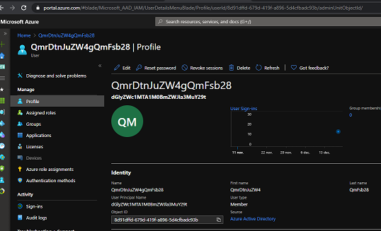
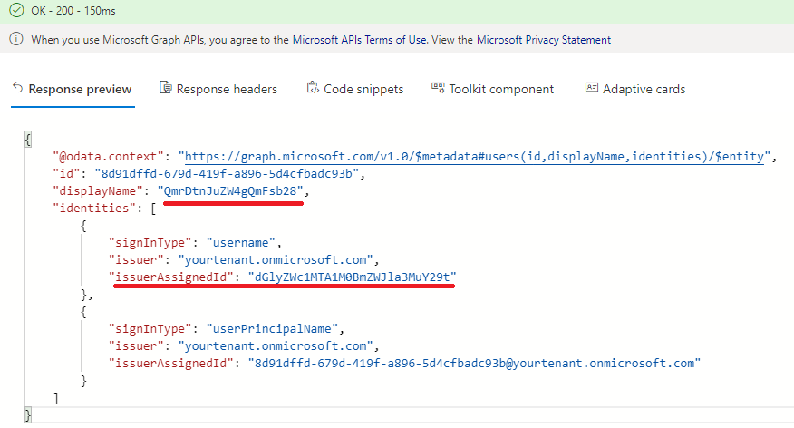
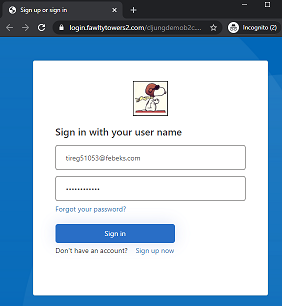
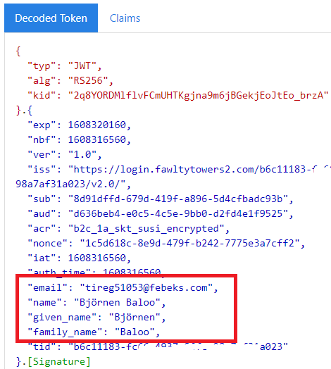

# Encrypted profile
This sample demonstrates a way to encrypt the attributes stored on a user object in Azure AD B2C, inlcuding the `signInName`.

## Scenario
In some applications data residency is an issue which requires a user's profile to be stored in a certain country or in a dedicated data center. For this, you have the [remote profile](https://github.com/azure-ad-b2c/samples/tree/master/policies/remote-profile) samples. But in other applications, with tough security requirements, the question is that what you store can not be in clear text. For instance, it can not be readable like in portal.azure.com for IT Admins regardless the appropriate permissions. It must be anonymous and encrypted.

This sample will encrypt a user's profile attributes, like displayName, givenName, etc, so that it is unreadable. A user would look like this in portal.azure.com.


If you use [Microsoft Graph Explorer](https://developer.microsoft.com/en-us/graph/graph-explorer) to query the user object, the the `signInName` attribute will also be encrypted in order not to reveal the user's the email. 

  

## Encrypting the attributes
The encryption in this sample is done in an Azure Function where the [run.csx](/source-code/run.csx) file contains the implementation. During **signup**, the B2C policy calls it as an REST API to encrypt attrributes like `email, displayName, givenName and surname`. The encrypted values are then written to the user object. The `email` value is persisted as a `username` and not as an `emailAddress`, since the encrypted result does not follow the email syntax anymore. 

What happens during **signin** is that the user enters the email in clear text in the user interface, since that is what he/she knows. The B2C policy then calls the Azure Function to encrypt the email before validating the userid/password.


To decrypt the additional attributes so they can appear in clear text in the JWT token, the Azure Function is called again at the end of the signin user journey to decrypt attributes like displayName, etc. 


## B2C Custom Policy explained

### Signup encryption
During **signup** there are two steps in the UserJourney that first calls the REST API to encrypt the attributes and then (re)writes them. The reason this is not done in a `ValidationTechnicalProfile` step is that if you plan to extend this and capture more info in secondary UX pages, you need to do it after all user input is captured. It is also worth noting that the (re)write is responsible for removing the `signInNAmes.emailAddress` and replacing it with `signInNames.username`. 

```xml
<!-- next 2 steps are only executed during SignUp. It calls the REST API to encrypt and rewrites the persisted values -->
<OrchestrationStep Order="3" Type="ClaimsExchange">
    <Preconditions>
    <Precondition Type="ClaimsExist" ExecuteActionsIf="false">
        <Value>newUser</Value>
        <Action>SkipThisOrchestrationStep</Action>
    </Precondition>
    </Preconditions>
    <ClaimsExchanges>
    <ClaimsExchange Id="REST-Encrypt" TechnicalProfileReferenceId="REST-API-EncodeClaims" />
    </ClaimsExchanges>
</OrchestrationStep>        
<OrchestrationStep Order="4" Type="ClaimsExchange">
    <Preconditions>
    <Precondition Type="ClaimsExist" ExecuteActionsIf="false">
        <Value>newUser</Value>
        <Action>SkipThisOrchestrationStep</Action>
    </Precondition>
    </Preconditions>
    <ClaimsExchanges>
    <ClaimsExchange Id="Write-Encrypt" TechnicalProfileReferenceId="AAD-UserWriteEncryptedUsingObjectId" />
    </ClaimsExchanges>
</OrchestrationStep>
```

### Signin encryption / decryption
During **signin** we must take what the user typed in the UX and encrypt it before attepting to authenticate the local account.
Therefor, the TechinalProfile `SelfAsserted-LocalAccountSignin-Email` is modified in the [TrustFrameworkExtensions.xml](policies/TrustFrameworkExtensions.xml) file to include a call to the REST API. It will pass what the user typed in the `signInName` and get back a claim called `emailEncrypted`.

```xml
<!-- before validating the userid/password, encrypt what the user entered and use that -->
<TechnicalProfile Id="SelfAsserted-LocalAccountSignin-Email">
    <Metadata>
    <Item Key="setting.operatingMode">username</Item>
    </Metadata>
    <ValidationTechnicalProfiles>
    <ValidationTechnicalProfile ReferenceId="REST-API-EncodeClaims" />
    <ValidationTechnicalProfile ReferenceId="login-NonInteractive" />
    </ValidationTechnicalProfiles>
</TechnicalProfile>
```

Then, we must modify `login-NonInteractive` to use `emailEncrypted` as the username. ***Note*** that you must also edit the [TrustFrameworkBase.xml](policies/TrustFrameworkBase.xml) file to remove the similar line where is sends `signInName` as username as it otherwise will not work. 

```xml
<TechnicalProfile Id="login-NonInteractive">
    <Metadata>
    <Item Key="client_id">...guid...</Item>
    <Item Key="IdTokenAudience">...guid...</Item>
    </Metadata>
    <InputClaims>
    <InputClaim ClaimTypeReferenceId="client_id" DefaultValue="...guid..." />
    <InputClaim ClaimTypeReferenceId="resource_id" PartnerClaimType="resource" DefaultValue="...guid..." />
    <InputClaim ClaimTypeReferenceId="emailEncrypted" PartnerClaimType="username" Required="true" />
    </InputClaims>
</TechnicalProfile>
```

At the end of the signin UserJourney, there is a orchestration step that decrypts the additional attributes, like displayName, since you want these attributes in clear text in the JWT token. To keep it simple in this sample, it is the same Azure Function that has the responsibility of also decrypting values and the REST API is passed a flag `restApiOperation` to signal if it is encryption or decryption it should perform. Also note that the Azure Function doesn't really implement any encryption worth mentioning. It only transforms strings to base64 and back. You have to implement real encryption.

```xml
<!-- the next step is only executed during Signin. It decrypts displayName, etc, so you can get them in clear text in the JWT -->
<OrchestrationStep Order="6" Type="ClaimsExchange">
    <Preconditions>
    <Precondition Type="ClaimsExist" ExecuteActionsIf="true">
        <Value>newUser</Value>
        <Action>SkipThisOrchestrationStep</Action>
    </Precondition>
    </Preconditions>
    <ClaimsExchanges>
    <ClaimsExchange Id="Decrypt-at-Signin" TechnicalProfileReferenceId="REST-API-DecodeClaims" />
    </ClaimsExchanges>
</OrchestrationStep>
```

## Community Help and Support
Use [Stack Overflow](https://stackoverflow.com/questions/tagged/azure-ad-b2c) to get support from the community. Ask your questions on Stack Overflow first and browse existing issues to see if someone has asked your question before. Make sure that your questions or comments are tagged with [azure-ad-b2c].
If you find a bug in the sample, please raise the issue on [GitHub Issues](https://github.com/azure-ad-b2c/samples/issues).
To provide product feedback, visit the Azure Active Directory B2C [Feedback page](https://feedback.azure.com/forums/169401-azure-active-directory?category_id=160596).

## Notes
This sample policy is based on [SocialAndLocalAccounts starter pack](https://github.com/Azure-Samples/active-directory-b2c-custom-policy-starterpack/tree/master/SocialAndLocalAccounts). All changes are marked with **Demo:** comment inside the policy XML files. Make the necessary changes in the **Demo action required** sections. 