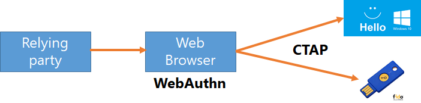
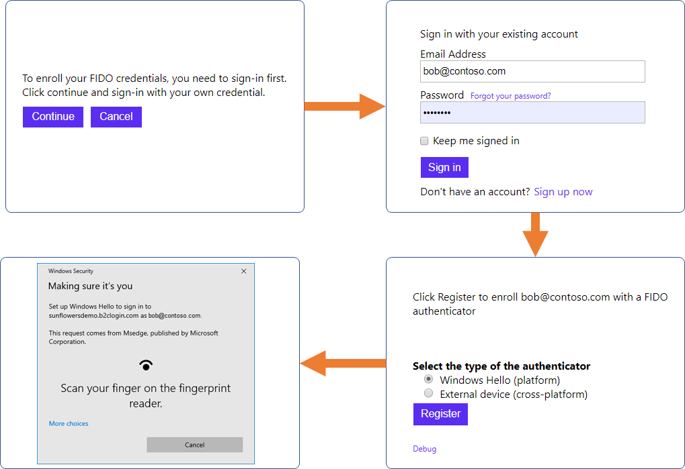
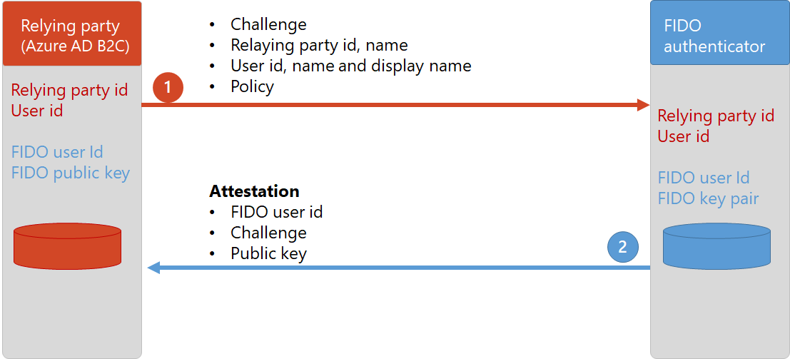
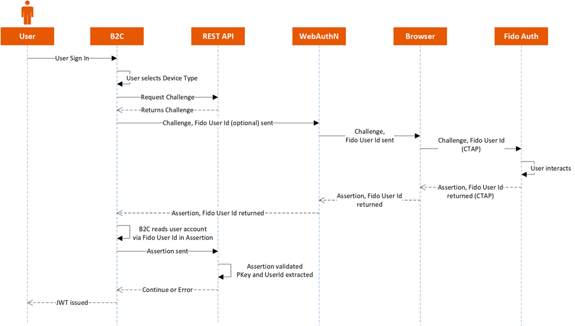
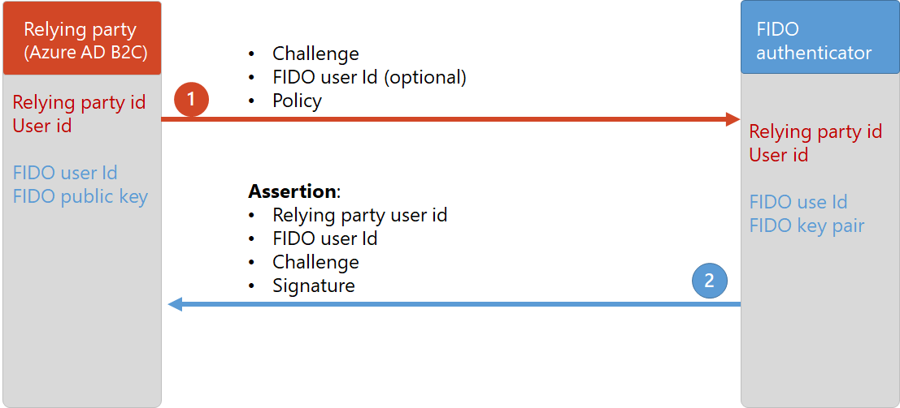

# Sign-in with FIDO authenticator
Demonstrates how to sign-in with FIDO authenticator (as a first factor authentication.) This policy use the WebAuthn standard to register new credential and sign-in with FIDO credential.

## 1. FIDO Standard 
- FIDO  - **F**ast **ID**entity **O**nline, is a founded by FIDO Alliance and World Wide Web Consortium (W3C). In March 2019, the World Wide Web Consortium (W3C) announced that WebAuthn is now the official web standard for password-less sign-in.
- FIDO enables strong authentication with public key cryptography, supporting password-less authentication and/or secure second-factor authentication without SMS texts. This resolves significant security problems related to phishing, data breaches, and attacks against SMS texts or other second-factor authentication methods while at the same time significantly increasing ease of use.
- Users can choose sign-in with roaming authenticator (a.k.a. FIDO device) or platform authenticator, such as Windows Hello
- FIDO is composed of two standardized components:
    - [Web Authentication API](https://w3c.github.io/webauthn), also referred to as **WebAuthn**. The WebAuthn standard enables online services, such as a web app, to use FIDO Authentication through a standard web API that can be built into browsers and related web platform infrastructure. In this sample, we focus on the WebAuthn. 
    - **CTAP** - [Client to Authenticator Protocol](https://fidoalliance.org/specs/fido-v2.0-id-20180227/fido-client-to-authenticator-protocol-v2.0-id-20180227.html).  A set of low-level protocols to the browser to communicate with FIDO authenticators. 

## 2. FIDO Authenticators
- **Platform authenticator** - is usually resident on a client device.  Examples of platform authenticators including [Windows Hello](https://fidoalliance.org/microsoft-achieves-fido2-certification-for-windows-hello/) for PC, or facial recognition using smartphone cameras.  
- **Cross-platform authenticator** a.k.a. roaming authenticator - is portable authenticator that can connect to multiple devices (usually desktop, such as Mac or Windows), and interaction must be negotiated over a supported transport protocol.  Examples of roaming authenticators might include USB security keys, BLE-enabled smartphone applications, or NFC-enabled proximity cards.  Authenticators may support CTAP1, CTAP2, or both protocols. Common examples of roaming authenticators include [YubiKeys](https://www.yubico.com/), [BioPass](https://www.ftsafe.com/Products/FIDO2), Bluetooth-enabled smartphone applications

## 3. Registration flow

Before registering a new FIDO credential to Azure AD B2C, you will need to confirm the identity of the user. This can be done by sign-in or sign-up with local account. Then, you run the FIDO registration Azure AD B2C policy. 

In the registration welcome page, user clicks on continue button. Then user needs to sign-up or sign-in with local account. After user sign-in, the FIDO registration starts. User should select the type of FIDO authenticator to use (platform or cross platform), and click **Register** to identity to the FIDO authenticator and create new FIDO credentials. 

### 3.1 Registration flow

1. Azure AD B2C registration policy
    1. Generates a FIDO challenge
    1. Reads the user profile, and returns the **User**: id (user objectId), username (signInName email address), and display name as output claims 
    1. Provides the **Relying Party**: id and name (set via JavaScript)
    1. Provides the registration policy. This is set via JavaScript, by reading the claims return from Azure AD B2C

1. User selects which FIDO authenticator to use, platform, or cross platform. Then click on the register button, to trigger the WebAuthn's navigator.credentials.**create** command. The web browser will ask the user to identify himself to the FIDO authenticator. For example, type the PIN code, or scan the fingerprint. After user complete the authentication to the FIDO authenticator, the web browser returns back some information to be send back to B2C. Including:
    1. The newly generated FIDO user Id
    1. The original challenge that generated by Azure AD B2C earlier
    1. The public key generated by the FIDO authenticator 
1. Azure AD B2C registration policy, extracts, and validates the data, by calling a REST API. Then the REST API returns back the **Public key**, and **FIDO authenticator user id**. This information is stored in extension attribute for later use

### 3.1 Registration JavaScript
The JavaScript code can be found under the `html-templates` folder. In the Self-Asserted technical profile has a reference to the content definitions that loads the HTML page with the `navigator.credentials.create` JavaScript command:

- **challenge** - In order to prevent replay attacks, the value should be randomly generated and can be validated by the Azure AD B2C (relying party)
- **rp** -  Contains information about the relying party 
    - **rp.name** -  Friendly name (mandatory)
    - **rp.icon** - Link to the relying party icon to be display 
    - **rp.id** - A replying party identifier
- **user** - Contains information about the user
    - **user.id** -  The user id (mandatory). This id is the Azure AD B2C user objectId. 
    - **user.name** - The user primary user identifier (mandatory). This is the user's signInName (email address)
    - **user.displayName** - The user's display name (mandatory)
    - **user.icon** - Link to a user icon (optional)
- **authenticatorSelection** -  The appropriate authenticators to participate in the create() operation.
    - **authenticatorSelection.requireResidentKey** - If true, select authenticators that support username-less flows.
    - **authenticatorSelection.userVerification** - Specify whether to for authenticators that have a second factor (e.g. PIN, Bio)
    - **authenticatorSelection.authenticatorAttachment** - Specify the eligible authenticators are filtered to only authenticators attached with the specified. Use platform if you want only built-in authenticators such as windows hello. Or cross-platform if you want only external, roaming authenticators 
- **attestation** - This value indicates whether (and how) the relying party wants to receive the attestation statement as generated by the authenticator
- **pubKeyCredParams** - contains information about the desired properties of the credential to be created, such as RS256 or ES256 algorithm
- **timeout** - Since the browser shows UI, it is better to select larger timeout values

### 3.2 The registration policy
The **B2C_1A_fido_registration** policy contains following components:
1. This policy runs the `FIDO-Registration` user journey
1. First orchestration step, renders the welcome page (SelfAsserted-FIDOEnrollmentWelcome self-asserted technical profile)
1. Next orchestration steps deal with user sign-up or sign-in regular flow.
1. The fifth orchestration step generates the challenge (REST-FIDOGetChallenge REST API technical profile)
1. The sixth orchestration step renders the registration page (`SelfAsserted-FIDOEnrollment` self-asserted technical profile)
    1. The `REST-FIDOMakeCredential` validation technical profile, sends the data return by the FIDO authenticator to validate and extract the necessary data.
1. The seventh orchestration step stores the FIDO userId and the public key to the user profile, using `AAD-UserWriteFidoUsingObjectId` technical profile. 

## 4. Authentication flow

To sign-in, user clicks on the FIDO button. Then clicks on the **Authenticate** button. This will trigger the FIDO authenticator sign-in JavaScript.

### 4.1 Authentication flow

To sign-in with FIDO authenticator. 
1. Azure AD B2C sign-up or sign-in policy
    1. Generates a FIDO challenge
    1. JavaScript may provide the FIDO user id.
    1. Provides the authentication policy. This is set via JavaScript, by reading the claims return from Azure AD B2C.

1. If JavaScript provides the FIDO user ID. The user will ask to identity to this specific ID. For example if the user has both Windows Hello and also a FIDO USB device. And the last time user registered with the USB. The browser will ask the user to provide the USB credentials. Otherwise the browser will ask the user to choose the authentication method and then authenticate. After successful authentication to the FIDO authenticator, the web browser returns the assertion containing:
    1. The Azure AD B2C user id (this ID is stored on the device)
    1. The FIDO user id
    1. The original challenge generated by Azure AD B2C
    1. And the signature of the challenge
1. Azure AD B2C sign-up or sign-in policy, extracts, and validates the data, by calling a REST API. Then the REST API returns back HTTP `Ok` message, or HTTP error message (in case the user doesn't found or invalid signature)

### 4.2 Authentication JavaScript
The JavaScript code can be found under the `html-templates` folder. In the Self-Asserted technical profile has a reference to the content definitions that loads the HTML page with the `navigator.credentials.get` JavaScript command:

- **challenge** - In order to prevent replay attacks, the value should be randomly generated and can be validated by the Azure AD B2C (relying party)
- **allowCredentials** - Specifies which credential IDs are allowed to authenticate the user. If empty, any credential can authenticate the users.
- **timeout** - Since the browser shows UI, it is better to select larger timeout values

### 4.3 The registration policy
The **B2C_1A_fido_signup_signin** policy runs the **SignUpOrSignInWithFido** user journey, with following orchestration steps:
1. Sign-up or sign-in identity provider selection. User can choose to sign-in with FIDO.
1. If FIDO identity provider is selected, the `FidoExchange` claims exchange is executed. This step generates the challenge and  also sets the identity provider name to `identityProvider`. In the next orchestration step, we check this claim value.
1. In the third orchestration step, we call the `SelfAsserted-FIDOSignIn` technical profile. This technical profile renders the FIDO sing-in page with the challenge.
    1. The `AAD-FidoUserReadUsingObjectId` validation technical profile, try to find the account in the directory (by the B2C user id return by the FIDO authenticator)
    1. The `REST-FIDOAssertion` check the signature that returns by the FIDO authenticator

## 5. The REST API
The REST API is a simple NodeJS app, based on following sample https://github.com/MicrosoftEdge/webauthnsample. You can find the REST API under the `source-code` folder.

## Disclaimer
The sample app is developed and managed by the open-source community in GitHub. The application is not part of Azure AD B2C product and it's not supported under any Microsoft standard support program or service. 
The app is provided AS IS without warranty of any kind.

## Notes
This sample policy is based on [SocialAndLocalAccounts starter pack](https://github.com/Azure-Samples/active-directory-b2c-custom-policy-starterpack/tree/master/SocialAndLocalAccounts). All changes are marked with **Sample:** comment inside the policy XML files. Make the necessary changes in the **Sample action required** sections. 
