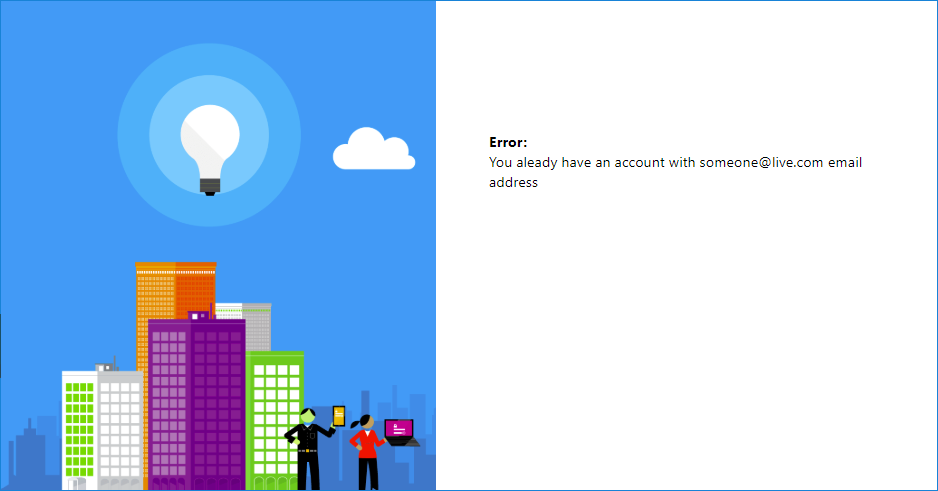

# Sign-in with social identity provider and force email uniqueness

When sign-in with social account, in some scenarios,  the identity provider doesn't share the email address. This sample demonstrates how to force the user to provide and validate email address, and also checks there is no other account with the same email address.

Examples when identity provider may not share the user's email address:
* A user sign-in with facebook account via phone number (instead of email address)
* During the sign-in (on the consent page), user choose not to share the email address with Azure AD B2C
* Some of the social identity providers don't share the email address

In those scenarios, the policy checks if the email address is empty. If yes, user is asked to provide and validate the email address.

> Note: You can remove the orchestration step's precondition, and force the user to validate the email address, even if the social identity provider shares the email address.

After the email is provided or verified, the policy checks if there is such a local with the same email address. If yes, the policy presents an error message.

## Community Help and Support
Use [Stack Overflow](https://stackoverflow.com/questions/tagged/azure-ad-b2c) to get support from the community. Ask your questions on Stack Overflow first and browse existing issues to see if someone has asked your question before. Make sure that your questions or comments are tagged with [azure-ad-b2c].
If you find a bug in the sample, please raise the issue on [GitHub Issues](https://github.com/azure-ad-b2c/samples/issues).
To provide product feedback, visit the Azure Active Directory B2C [Feedback page](https://feedback.azure.com/forums/169401-azure-active-directory?category_id=160596).

> Note:  This sample policy is based on [SocialAndLocalAccounts starter pack](https://github.com/Azure-Samples/active-directory-b2c-custom-policy-starterpack/tree/master/SocialAndLocalAccounts). All changes are marked with **Demo:** comment inside the policy XML files. Make the necessary changes in the **Demo action required** sections.