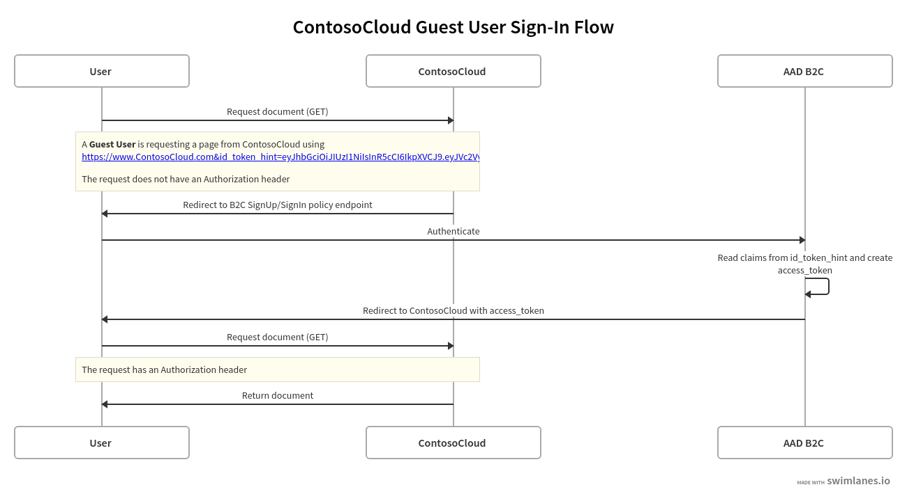

# Granting "guest user" access over existing user's directory

A guest user in an application will usually have the following attributes:
* They are invited to the application.
* They will have a single interaction/session with the application.
* They will not return.

We will use a key to identify that specific guest user. 
For instance, an objectId by which we can declare that once they are signed in, they will have access to a specific data set or location in the application. 

### Example:

A cloud storage service for consumers who are mainly interested in easy, yet secure and audited, sharing of access to specific files in their private cloud storage 
with just about anyone who has a phone or mail account.

The flow required a ContosoCloud user which uses a standard sign-up policy. 
That user will generate an invite link for a guest user to a ContosoCloud hosted document.
Once the link is activated, the invited user will encounter this flow:

[See this post if you want to read more about 'Guest Access using Azure Active Directory B2C custom policies']()