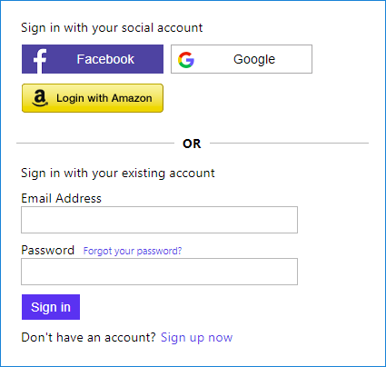

# Azure AD B2C: Dynamic identity provider selection

This sample policy demonstrates how to dynamically filter the list of social identity providers render to the user based on application ID. In the following screenshot user can select from the list of identity prviders, such as Facebook, Google+ and Amazon. With Azure AD B2C custom policies, you can configure the technical profiles to be displayed based a claim's value. The  claim value contains the list of identity provider to be rendered.



By default Azure AD B2C displays every identity provider that appears in the `ClaimsProviderSelections` element. 

```XML
<OrchestrationStep Order="1" Type="CombinedSignInAndSignUp" ContentDefinitionReferenceId="api.signuporsignin">
  <ClaimsProviderSelections>
    <ClaimsProviderSelection TargetClaimsExchangeId="FacebookExchange" />
    <ClaimsProviderSelection TargetClaimsExchangeId="GoogleExchange" />
    <ClaimsProviderSelection ValidationClaimsExchangeId="LocalAccountSigninEmailExchange" />
  </ClaimsProviderSelections>
  <ClaimsExchanges>
   <ClaimsExchange Id="LocalAccountSigninEmailExchange" TechnicalProfileReferenceId="SelfAsserted-LocalAccountSignin-Email" />
  </ClaimsExchanges>
</OrchestrationStep>
```

 To filter the list of identity providers, you first create a string collection claim, for example `IdentityProviders`. This claim contains the list of identity providers to be displayed. In each technical profile, you add the `EnabledForUserJourneys` element set to `OnItemExistenceInStringCollectionClaim`. This element controls if the technical profile is executed in a user journey. The value of the tels B2C to execute only when an item exists in a string collection claim.

You also need to add two metadata elements:
- `ClaimTypeOnWhichToEnable` specifies the claim's type that is to be evaluated. In this case the string collection claim `identityProviders`
- `ClaimValueOnWhichToEnable` specifies the value that is to be compared. The name of the identity provider.


```XML
<ClaimsProvider>
  <DisplayName>Facebook</DisplayName>
  <TechnicalProfiles>
    <TechnicalProfile Id="Facebook-OAUTH">
      <Metadata>
        ...
        <Item Key="ClaimTypeOnWhichToEnable">identityProviders</Item>
        <Item Key="ClaimValueOnWhichToEnable">facebook.com</Item>
      </Metadata>
      ...
      <EnabledForUserJourneys>OnItemExistenceInStringCollectionClaim</EnabledForUserJourneys>
    </TechnicalProfile>
  </TechnicalProfiles>
</ClaimsProvider>

<ClaimsProvider>
  <DisplayName>Google</DisplayName>
  <TechnicalProfiles>
    <TechnicalProfile Id="Google-OAUTH">
      <Metadata>
        ...
        <Item Key="ClaimTypeOnWhichToEnable">identityProviders</Item>
        <Item Key="ClaimValueOnWhichToEnable">google.com</Item>
      </Metadata>
      ...
      <EnabledForUserJourneys>OnItemExistenceInStringCollectionClaim</EnabledForUserJourneys>
    </TechnicalProfile>
  </TechnicalProfiles>
</ClaimsProvider>
```

In this example, the first orchestration step makes a call to a REST API (Azure functions) that receives the application ID that initiates the authorization request. Based on the application ID the REST API rerutns back the list of identity providers that are relevant to the application. 

If the application ID is:
```JSON
{
  "appId" : "999919a0-c6b0-4e74-a76f-01684b821780"
}
```

The REST API returns the `identityProviders` claim, which contains only facebook.com.
```JSON
{
  "version": "1.0.0",
  "status": 200,
  "userMessage": "List of identity providers",
  "identityProviders": ["facebook.com" ]
}
```

Otherwise the `identityProviders` claim contains facebook.com and google.com.
```JSON
{
  "version": "1.0.0",
  "status": 200,
  "userMessage": "List of identity providers",
  "identityProviders": ["facebook.com", "google.com"]
}
```

You can use this apporch to filter the identity providers based on IP range, input parameters you send to Azure AD B2C, localization. Some of the conditions can be done be using claims tranfomrtion. So, you don't need to develop any RESTfull services.

## Disclaimer
The sample is developed and managed by the open-source community in GitHub. The application is not part of Azure AD B2C product and it's not supported under any Microsoft standard support program or service. The sample (Azure AD B2C policy and any companion code) is provided AS IS without warranty of any kind.

> Note:  This sample policy is based on [SocialAndLocalAccounts starter pack](https://github.com/Azure-Samples/active-directory-b2c-custom-policy-starterpack/tree/master/SocialAndLocalAccounts). All changes are marked with **Demo:** comment inside the policy XML files. Make the necessary changes in the **Demo action required** sections.
