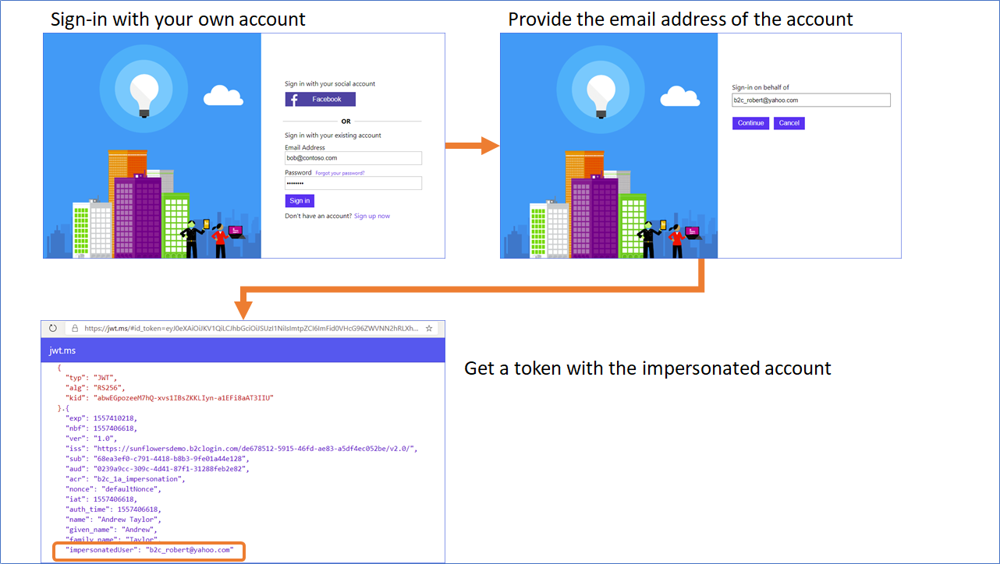

# Impersonation Flow for Azure AD B2C
Impersonation flows are common for many business needs. We see this for users that manage other users either through functions within an application or services such as customer support. Whatever the reason may be, it can be easily achieved using Azure AD B2C flexible Identity Experience Framework with a few simple changes. Below are the minimum items required for this scenario. 

## Common Scenarios
1. **Customer Service Representative** requires assisting a user and requires to log into the application on the behalf of the user. The CSR wants to see exactly what the user sees.
2. **Financial Investor** manages on the behalf of their customers. As such, a bank or an investment firm may require these individuals to log into their service/application to manage their customers information.

### Impersonation flow
When you run the impersonation policy, you first need to sign-in with your own credentials. On the second page, provide the email address of the user you want to impersonate. B2C checks whether the user exists in the directory. If yes, B2C issues and access token with the email address of the impersonated user `impersonatedUser`.

## Core Policy components

### Claim Schema
* ***targetEmail*** - this string claim represents as a textbox in the UX. This claim to interactive with the privileged user allowing them to pass a value to Azure AD B2C backend service. This value is sent to look up email from **signInNames**.

* ***impersonatedUser*** - this is a string claim that is solely to take the return from the **signInNames** (A collection that contains username & email) and pass it to the application/service. This is done through the Validation Profile **AAD-ImpersonatedUserRead** that pulls the **signInNames.email** variable and pass it to the Relying Party **SignUpOrSignin.xml**.

### Relying Party
* SignUpOrSignin - This is a typical sign-up sign-in policy that adds the varilable ***impersonatedUser*** as an output claim to the application.

### Technical Profile
* SelfAsserted-TargetEmailExchange - This profile prompts user a text box and captures the ***targetEmail***. Within the policy, it triggers the **AAD-ImpersonatedUserRead** Validation Technical Profile to read the user information in the Azure AD B2C directory

### Validation Technical Profile
* AAD-ImpersonatedUserRead - This Validation Technical Profile looks up the user object and returns claims. If user does not exists, it handles a successful error. It returns an output claim ***impersonatedUser*** for the Relying Party **SignUpOrSignin**. 

## Disclaimer
The sample is developed and managed by the open-source community in GitHub. The application is not part of Azure AD B2C product and it's not supported under any Microsoft standard support program or service. The sample (Azure AD B2C policy and any companion code) is provided AS IS without warranty of any kind.

## Notes
This sample policy is based on [SocialAndLocalAccounts starter pack](https://github.com/Azure-Samples/active-directory-b2c-custom-policy-starterpack/tree/master/SocialAndLocalAccounts). All changes are marked with **Sample:** comment inside the policy XML files. Make the nessacery changes in the **Sample action required** sections. 

A standard to manage impersonation flows is currently in development and has not been finalized. This sample does not reflect the final product or guidance. You should monitor on this progress and plan to make changes to your design as standards of the industry changes. You can read more [here](https://tools.ietf.org/html/draft-ietf-oauth-token-exchange-10 "OAuth 2.0 Token Exchange draft-ietf-oauth-token-exchange-10").