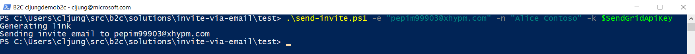
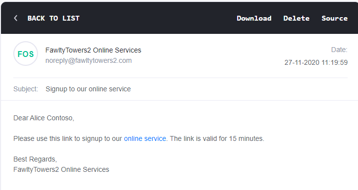
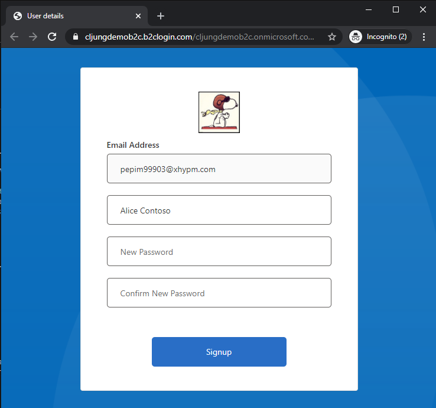

# Signup with email invitation
This sample demonstrates an email based invite to signup to a B2C Local Account. It uses a signed B2C JWT token as a magic link in the email.

## User flow


This sample uses a [powershell script](test/send-invite.ps1) for testing the flow. This functionality should be integrated with your app and that it is powershell here is just a simple way test drive the sample. The below picture illustrates how the sample works.

1. A powershell script calls a Azure Function REST API, passing `email` and `displayName` as parameters, to generate a link that can be embedded in an email.

1. The Azure Function constructs an Auth Code flow url and makes a HTTP GET request to Azure AD B2C for PolicyId `B2C_1A_genlink`. It passes the email as `login_hint` and the displayName as an extra query string parameter that B2C can pick up as a [Claims Resolver](https://docs.microsoft.com/en-us/azure/active-directory-b2c/claim-resolver-overview#oauth2-key-value-parameters). B2C uses a UserJourney consisting of just one step, which is to generate a JWT token. There is no UX involved here and the Azure Function picks up the generated `id_token` from the HTTP Location Header on the 302 redirect response from B2C.
1. The powershell script formats the email message and uses SendGrid's REST API to send the email invite. 
1. The user receives the message in the inbox and clicks on the link which makes a new HTTP GET call to the same Azure Function asking to redeem the invite. It passes the signed JWT token from step 2, which contains the `email` and the `displayName` claims.


1. The Azure Function constructs yet another Auth Code flow url, this time with PolicyId `B2C_1A_redeem`, and returns a HTTP 302 Redirect to the user. The url contains the query string parameter `id_token_hint` with the signed token passed from the email link.
1. The user is redirected to B2C's policy `B2C_1A_redeem`, which is designed to accept an `id_token_hint` issued by the B2C tenant itself (step 2). It extracts the `email` and `displayName` claims and prepopulates those values before showing the signup UX to the user, asking the user to create a password and signup.


## B2C_1A_genlink
The B2C policy that generates the link that is sent in the email has a very short UserJourney that only consists of one step - to generate the JWT Token. 

```xml
<UserJourney Id="GenerateInviteToken">    
    <OrchestrationSteps>
    <OrchestrationStep Order="1" Type="SendClaims" CpimIssuerTechnicalProfileReferenceId="JwtIssuerInvite" />
    </OrchestrationSteps>
    <ClientDefinition ReferenceId="DefaultWeb" />
</UserJourney>
```

The Technical Profile for generating the token is customized so that the lifetime is shortened to 15 minutes. This means the link in the email must be used within 15 minutes or the redeem process will reject it. If you prefer another lifetime, here is where you change that.

```xml
<TechnicalProfile Id="JwtIssuerInvite">
    <DisplayName>JWT Issuer Invite</DisplayName>
    <Metadata>
    <Item Key="id_token_lifetime_secs">900</Item> <!-- 900 secs = 15 min -->
    <Item Key="token_lifetime_secs">900</Item>
    <Item Key="refresh_token_lifetime_secs">86400</Item>
    </Metadata>
    <InputClaims />
    <OutputClaims />
    <IncludeTechnicalProfile ReferenceId="JwtIssuer" />
```

The RelyingParty definition for `B2C_1A_genlink` has these two OutputClaims which is how the token gets its claims for the user details.

```xml
<OutputClaim ClaimTypeReferenceId="email" DefaultValue="{OIDC:LoginHint}" />
<OutputClaim ClaimTypeReferenceId="displayName" DefaultValue="{OAUTH-KV:displayName}" AlwaysUseDefaultValue="true" />
```

## B2C_1A_redeem
The policy `B2C_1A_redeem` is a little more complex as it does the heavy lifting of the work. The first step is a reference to a Technical Profile that accepts the `id_token_hint` being passed.

```xml
<OrchestrationStep Order="1" Type="GetClaims" CpimIssuerTechnicalProfileReferenceId="IdTokenHint_ExtractClaims" />
```

It contains a self referenced Technical Profile that points to B2C's own metadata endpoint. This means that we will accept an id_token that is issued by ourselves. The claims we care about are captured in the OutputClaims section.

Before you upload these policies to your tenant, you need to change `yourtenant` in the METADATA reference to the name of your B2C tenant.

```xml
    <ClaimsProvider>
      <DisplayName>Self Referenced ID Token Hint ClaimsProvider</DisplayName>
      <TechnicalProfiles>
        <TechnicalProfile Id="IdTokenHint_ExtractClaims">
          <DisplayName>Self referenced ID Token Hint TechnicalProfile</DisplayName>
          <Protocol Name="None" />
          <Metadata>          
            <Item Key="METADATA">https://yourtenant.b2clogin.com/yourtenant.onmicrosoft.com/B2C_1A_INV_redeem/v2.0/.well-known/openid-configuration</Item>
          </Metadata>
          <OutputClaims>
            <!-- claims to read from the id_token_hint-->
            <OutputClaim ClaimTypeReferenceId="email" PartnerClaimType="sub"/>  
            <OutputClaim ClaimTypeReferenceId="displayName" PartnerClaimType="name"/>  
          </OutputClaims>
        </TechnicalProfile>
      </TechnicalProfiles>
    </ClaimsProvider>
```

The rest of the UserJourney is about making sure the email isn't already registered, displaying an error in that case, and asking the user to select a password.

## The Azure Function
The Azure Function code in [run.csx](source-code/run.csx) serves two purposes. First, if you pass a query string parameter with the name of `email`, it will generate the invite link, and second, if you pass in a query string parameter with the name of `t` it will redirect to policy `B2C_1A_redeem`. You could eliminate step two and have the emal link point directly to B2C, but that means you expose you B2C deployment in an email, and it is for this reason the email link points back to the Azure Function. In a real world app, you might consider adding this functionality as part of your webapp and not using an Azure Function as it would make the link in the email more trustworthy if it pointed to your real app.

To deploy this Azure Function, create an Azure Function App and then create a function called `invite` that is a `HttpTrigger` with access level `anonymous`. Then paste over the code with [run.csx](source-code/run.csx), make the changes required and save the file. If you decide to call your Azure Function anything else, you need to change the name in the code as it references the Azure Function when it generates the link (see `/api/invite` in code below).

### Common changes
Change `yourtenant` in the hostname and the tenant name to your B2C tenant name.

```csharp
string hostName = "yourtenant.b2clogin.com";
string tenantName = "yourtenant.onmicrosoft.com";
```

### Generate link code
The generate link code first starts with building the url which we will call B2C with. The `client_id` in this request should be an App that you have registered in the B2C tenant just for this purpose as it must allow a `redirectUri` that is `https://jwt.ms`. In dev/test, you can just add https://jwt.ms to as a valid redirectUri to your existing test app.

```csharp
    // if we got an email, this is the generate link request. Call B2C and build the link to send in th e email
    if ( email != null ) {
        string displayName = req.Query["displayName"];
        displayName = string.IsNullOrEmpty(displayName) ? " " : displayName;
        log.LogInformation("email=" + email + ", displayName: " + displayName);        
        string clientId = "...guid...";                             // this can be a client_id you set up just for getting this JWT
        string redirectUri = "https%3A%2F%2Fjwt.ms";                // this should be a redirect to http://jwt.ms so we know what we get from B2C
        string url = string.Format("https://{0}/{1}/B2C_1A_INV_genlink/oauth2/v2.0/authorize?client_id={2}&nonce={3}" 
                    + "&redirect_uri={4}&scope=openid&response_type=id_token&disable_cache=true&login_hint={5}&displayName={6}"
                     , hostName, tenantName, clientId, nonce, redirectUri, email, displayName );
        log.LogInformation("url=" + url);        
```

The second part of the code invokes the B2C policy and captures the `id_token` that is placed in the HTTP Header `Location`.  

```csharp
        // invoke B2C and get the JWT token back automatically (no UX)
        HttpClientHandler httpClientHandler = new HttpClientHandler();
        httpClientHandler.AllowAutoRedirect = false;
        HttpClient client = new HttpClient(httpClientHandler);
        HttpResponseMessage res = client.GetAsync(url).Result;
        var contents = await res.Content.ReadAsStringAsync();
        client.Dispose();
        log.LogInformation("HttpStatusCode=" + res.StatusCode.ToString());
        log.LogInformation("Location=" + res.Headers.Location);
        log.LogInformation("Content=" + contents);

        string location = res.Headers.Location.ToString();
        string expectedRedirect = "https://jwt.ms/#id_token=";

        if ( res.StatusCode == HttpStatusCode.Redirect && location.StartsWith(expectedRedirect) ) {
            string id_token = location.Substring("https://jwt.ms/#id_token=".Length); 
            url = $"{req.Scheme}://{req.Host}{req.PathBase.Value}/api/invite?t=" + id_token;
            return (ActionResult)new OkObjectResult( url );
        } else {
            return new BadRequestObjectResult("Technical error. Please notify admin");
        }
    }
```

### Redeem code
The redeem code part is much simpler and just creates the redirect url. Here you should use the `client_id` of your real webapp and the `redirectUri` should be where you want to land in your webapp after signup is completed. For a AspNet core app, this would be `signin-oidc` as that is the path that process a signin request for the OIDC protocol. If you're using a different technology stack, this may vary. For debugging purposes, you can use https://jwt.ms here to see that you deployment is working.
 
```csharp
    // if we got a token, this is the redeem call. Build a B2C url and redirect
    if ( token != null ) {
        log.LogInformation("token=" + token);
        string clientId = "...guid...";                                     // this should be the client_id or your real webapp
        string redirectUri = "https%3A%2F%2Fwww.yourapp.com%2Fsignin-oidc";    // this should be the url of your real webapp
        string url = string.Format("https://{0}/{1}/B2C_1A_INV_redeem/oauth2/v2.0/authorize?client_id={2}&nonce={3}" 
                    + "&redirect_uri={4}&scope=openid&response_type=id_token&disable_cache=true&id_token_hint={5}"
                    , hostName, tenantName, clientId, nonce, redirectUri, token );
        log.LogInformation("redirectUri=" + url);
        return new RedirectResult( url, true);
    }
```

## Community Help and Support
Use [Stack Overflow](https://stackoverflow.com/questions/tagged/azure-ad-b2c) to get support from the community. Ask your questions on Stack Overflow first and browse existing issues to see if someone has asked your question before. Make sure that your questions or comments are tagged with [azure-ad-b2c].
If you find a bug in the sample, please raise the issue on [GitHub Issues](https://github.com/azure-ad-b2c/samples/issues).
To provide product feedback, visit the Azure Active Directory B2C [Feedback page](https://feedback.azure.com/forums/169401-azure-active-directory?category_id=160596).

## Notes
This sample policy is based on [SocialAndLocalAccounts starter pack](https://github.com/Azure-Samples/active-directory-b2c-custom-policy-starterpack/tree/master/SocialAndLocalAccounts). All changes are marked with **Demo:** comment inside the policy XML files. Make the necessary changes in the **Demo action required** sections. 