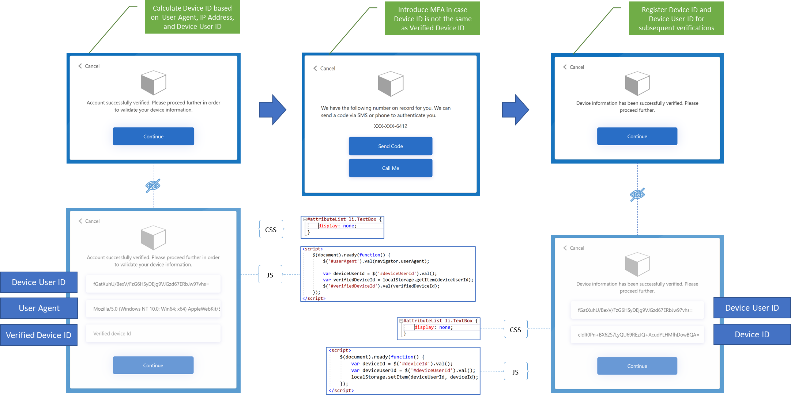
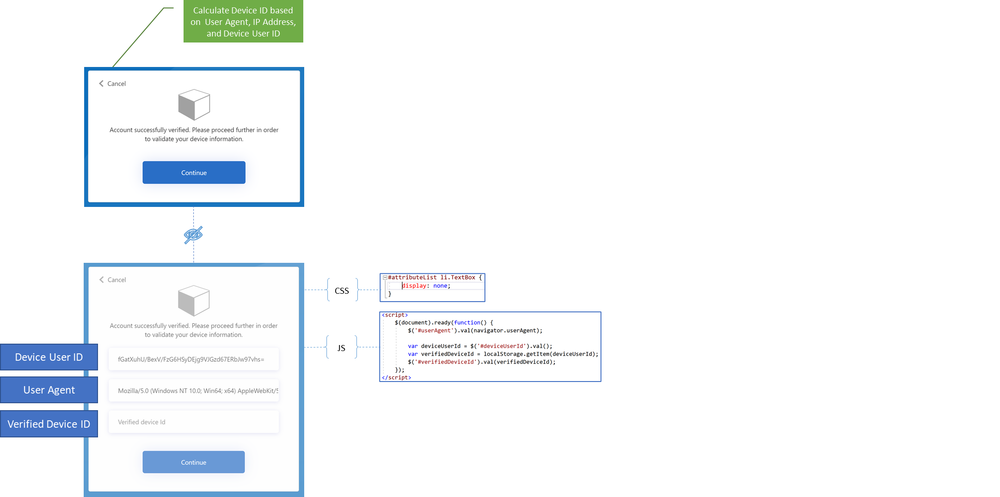
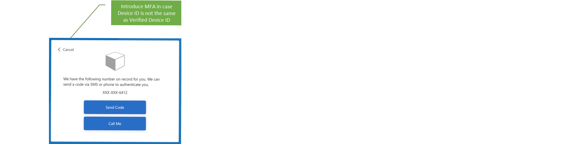
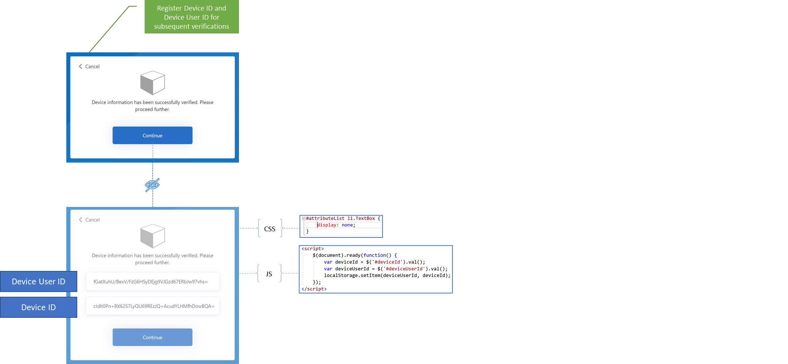

# Unknown Devices MFA
With Azure AD B2C you can detect unknown devices which might be required to prompt MFA as illustrated in this particular sample or send email to the user signing in from unknown device.

Custom policy is using such information as User Agent and IP Address to uniquely calcualte a Device ID for particular Device User ID. Information is stored in user's browser Web Storage and used in subsequent verificaitons to detect unknown device and prompt MFA.

Custom policy logic is primarily defined in following orchestration steps:
- [Unknown Devices MFA](#unknown-devices-mfa)
  - [Prerequisites](#prerequisites)
  - [Collect Device Information](#collect-device-information)
  - [MFA Prompt for Unknown Devices](#mfa-prompt-for-unknown-devices)
  - [Register Device Information](#register-device-information)
  - [Community Help and Support](#community-help-and-support)

The diagram below depicts the user flow and how different components interact together.

  
   
## Prerequisites
 > **Note:** This sample is based on [SocialAndLocalAccountsWithMfa starter pack](https://github.com/Azure-Samples/active-directory-b2c-custom-policy-starterpack/tree/master/SocialAndLocalAccountsWithMfa) and [page layout contract](https://docs.microsoft.com/en-us/azure/active-directory-b2c/contentdefinitions#select-a-page-layout). All changes are marked with **Sample** comment inside the policy XML files and source code. Make the necessary changes in the **Sample action required** sections.

 > **Note:** This sample is based on [Ocean Blue](https://github.com/Azure-Samples/Azure-AD-B2C-page-templates) page template. Please, upload [assets](https://github.com/Azure-Samples/Azure-AD-B2C-page-templates/tree/master/assets) folder and cusomization files in [page-template](source-code/page-template) folder to storage account as described in [custom page content walkthrough](https://docs.microsoft.com/en-us/azure/active-directory-b2c/custom-policy-ui-customization#custom-page-content-walkthrough). Change absolute URL for external resources like media, CSS, and JavaScript in HTML files.

 > **Note:** This sample is optimized for [Visual Studio Code](https://code.visualstudio.com/download) and [Azure AD B2C Extension](https://marketplace.visualstudio.com/items?itemName=AzureADB2CTools.aadb2c). Please, open **vs.code-workspace**, install recommended extension, change **appsettings.json** values, and build policies as described in [policy settings](https://marketplace.visualstudio.com/items?itemName=AzureADB2CTools.aadb2c) section. Upload built policies from **Environments\Samples** folder to run them in the Azure Portal.

 Generate a policy key with name **DeviceInformationSecret**, key type **Secret** and key usage **Signature**. Generated key will be used to hash such device information as Device User ID and Device ID.

## Collect Device Information
Such information as User Agent, IP Address, and Device User ID is collected in this orchestration step. Moreover, previously recorded Verified Device ID is collected as well.

JavaScript is used to collect User Agent and Verified Device ID. CSS is used to hide inputs.

Device ID is calculated based on User Agent, IP Address, and Device User ID. Orchestration step validates Device ID against previosly recorded Verified Device ID and produces isVerifiedDevice claim.



CSS
```css
#attributeList li.TextBox {
    display: none;
}
```

JavaScript
```javascript
$(document).ready(function() {
    $('#userAgent').val(navigator.userAgent);

    var deviceUserId = $('#deviceUserId').val();
    var verifiedDeviceId = localStorage.getItem(deviceUserId);
    $('#verifiedDeviceId').val(verifiedDeviceId);
});
```

## MFA Prompt for Unknown Devices
Orchestration step prompts MFA for unknown devices using precondition with previously produced isVerifiedDevice claim.  



Precondition
```xml
<Precondition Type="ClaimEquals" ExecuteActionsIf="true">
    <Value>isVerifiedDevice</Value>
    <Value>True</Value>
    <Action>SkipThisOrchestrationStep</Action>
</Precondition>
```

## Register Device Information
Such information as Device User ID and Device ID is produced in this orchestration step.

JavaScript is used to collect that information and register for subsequent verificaitons. CSS is used to hide inputs.



CSS
```css
#attributeList li.TextBox {
    display: none;
}
```

JavaScript
```javascript
$(document).ready(function() {
    var deviceUserId = $('#deviceUserId').val();
    var deviceId = $('#deviceId').val();
    localStorage.setItem(deviceUserId, deviceId);
});
```

## Community Help and Support
Use [Stack Overflow](https://stackoverflow.com/questions/tagged/azure-ad-b2c) to get support from the community. Ask your questions on Stack Overflow first and browse existing issues to see if someone has asked your question before. Make sure that your questions or comments are tagged with [azure-ad-b2c].
If you find a bug in the sample, please raise the issue on [GitHub Issues](https://github.com/azure-ad-b2c/samples/issues).
To provide product feedback, visit the Azure Active Directory B2C [Feedback page](https://feedback.azure.com/forums/169401-azure-active-directory?category_id=160596).