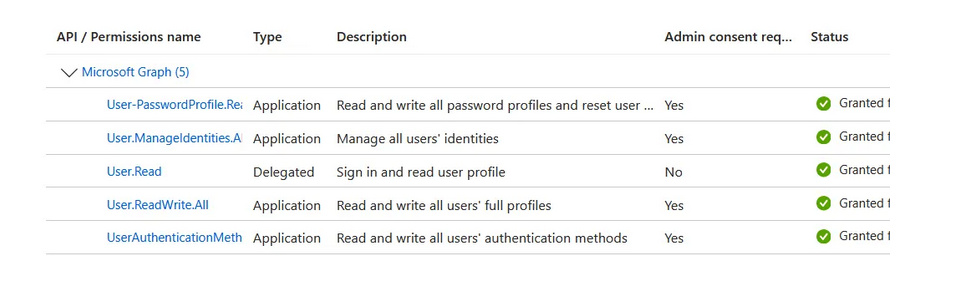
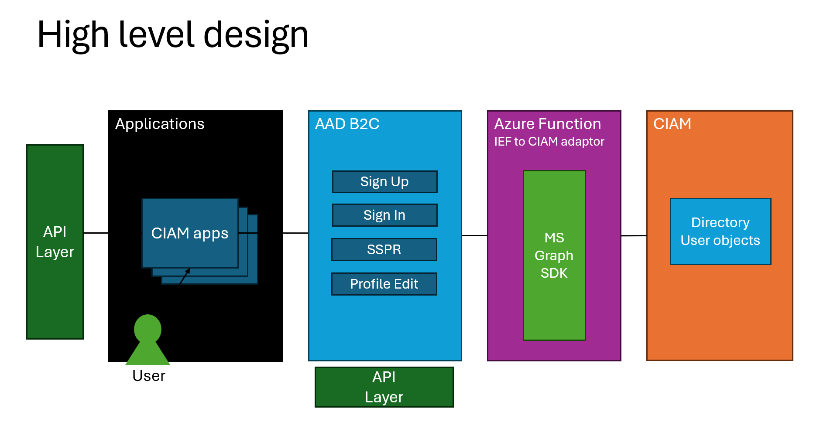
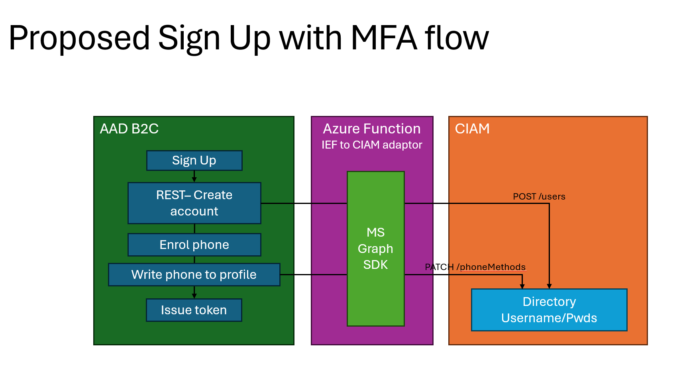
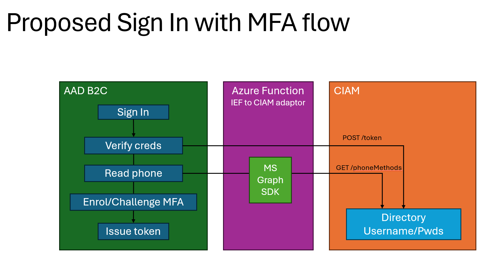

# Azure AD B2C Interface for Entra External ID migration

Please log any issues or questions in the repo.

## Summary

This sample will use AAD B2C as the journey orchestrator, whilst creating and authenticating users in the Entra External Id tenant. This makes it easier in the future to move apps to Entra External Id without disruption to your users. This sample performs sign up/in with MFA using Azure AD B2C, whilst maintaining user profiles in the Entra External Id tenant.

This allows you to use B2C custom policies with the user data residing on an Entra External ID tenant

This repo. was cloned from this [sample](https://github.com/azure-ad-b2c/samples/tree/master/policies/migrate-to-entra-external-id-for-customers)

The original sample implemented a subset of the API calls. This repo. implements them all. 

This repo. also implements authentication using native auth. rather than ROPC.

The code also includes RP for "Profile Edit" and "Password Reset".

## REST API

There are REST API for:

* "REST-CIAM-UserReadUsingObjectIdOrEmail"
* "REST-CIAM-UserReadUsingAlternativeSecurityId"
* "REST-CIAM-UserWriteUsingLogonEmail"
* "REST-CIAM-UserWriteUsingAlternativeSecurityId"
* "REST-login-NonInteractive-CIAM"
* "REST-fetchUserProfile-CIAM"
* "REST-CIAM-UserUpdateUsingLogonEmail"

The source for the REST AI is an an Azure function but the repo. uses ngrok so those calls 
need to be replaced with the actual function URL. 

Use "ngrok http 7257" if you want to use ngrok. (This allows you to run on localhost rather  then using an Azure function).

## Functionality

The code handles:

* Local account signup via link on the login page
* Local account sign-in via login page using native authentication, not ROPC
* Social account logins via federation buttons on the login page
* MFA via SMS
* Password reset via embedded link on the login page
* Password reset via RP
* Profile edit via RP

## Setup ##

The “GraphCallsFromB2CTenant” application registration needs the following permissions:

## Original set up instructions - How it works

Users are sent to the AAD B2C authentication endpoint. An Azure function orchestrates all Read/Write operations to the Entra External Id directory.

## How to set it up

### Create application registrations
1. Create an Application registration in the Entra External Id tenant, named **RopcFromB2C**. Choose Native App. Copy the AppId/ClientId
1. In the Authentication menu, enable **Allow public client**
1. In the manifest, set

1. Create an Application registration in the Entra External Id tenant, named **GraphCallsFromB2CTenant**. Choose Web App. Copy the AppId/ClientId
1. Under API permissions, add MS Graph API **Application** permissions: `User.ReadWrite.All` and `UserAuthenticationMethod.ReadWrite.All`
1. Under **Certificates & secrets**, generate a new secret. Copy this secret to be placed in the Azure function code

### Modifications in Azure Function
1. Change all instances of `your-tenant-id-guid` to your tenant guid or name eg `contoso.onmicrosoft.com`
1. Change all instances of `your-clientId-RopcFromB2C` to the AppId of the **RopcFromB2C** App registration
1. Change all instances of `your-client-id-to-call-graph` to the AppId of the **GraphCallsFromB2CTenant** App registration
1. Change all instances of `your-client-secret` to the secret generated on the **GraphCallsFromB2CTenant** App registration

### Host the Azure function
1. In any production scenario, enable authentication in the Azure function. Eg, OAuth.

### Quick Deploy
You can quick deploy the sample into your tenant, and then make the changes in the next section.
Use this [link to quick deploy](https://b2ciefsetupapp.azurewebsites.net/Home/Experimental?sampleFolderName=migrate-to-entra-external-id-for-customers) into your tenant.

#### Required modifications in policy file
1. Change all instances of `your-tenant` to your tenant name, eg: `contoso.onmicrosoft.com`
1. Change all instances of `your-api-endpoint` to your Azure function endpoint.
1. In any production scenario, enable authentication in the REST API technical profiles.

## Testing
Scenarios to test:
1. Sign up via this AAD B2C custom policy with an account that does not already exist
1. Sign in via this AAD B2C custom policy with an account that does exist
1. Sign up via this AAD B2C custom policy with an account that does already exist
1. Sign in via this AAD B2C custom policy with an account that does not exist
1. Assign the user to a group/role in Entra External Id tenant, then perform a sign in
1. Create a User Flow in Entra External Id tenant, and perform a Sign In via Entra External Id tenant with an account that was created via this AAD B2C custom policy
1. Sign in via this AAD B2C custom policy with an account that was created using the User Flow from Entra External Id tenant
1. View the User Profile after Sign Up in the Entra External Id tenant. Ensure the `Authentication Methods` menu is correctly populated with the users phone number visible, after sign up via this AAD B2C custom policy