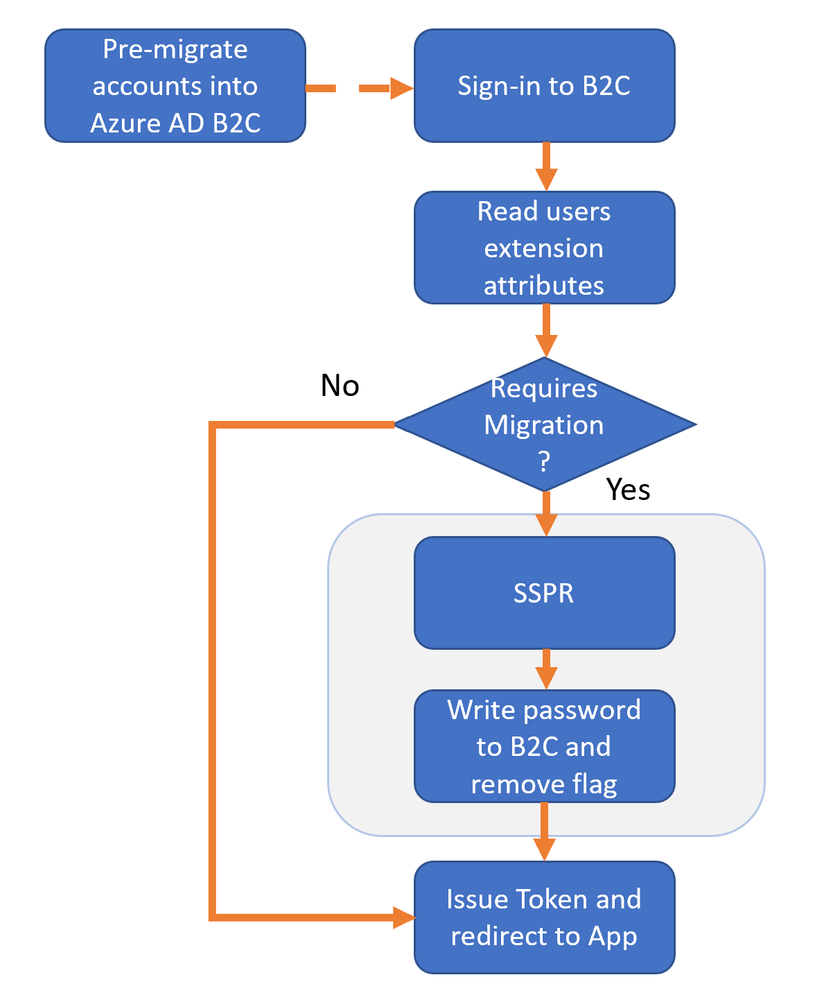
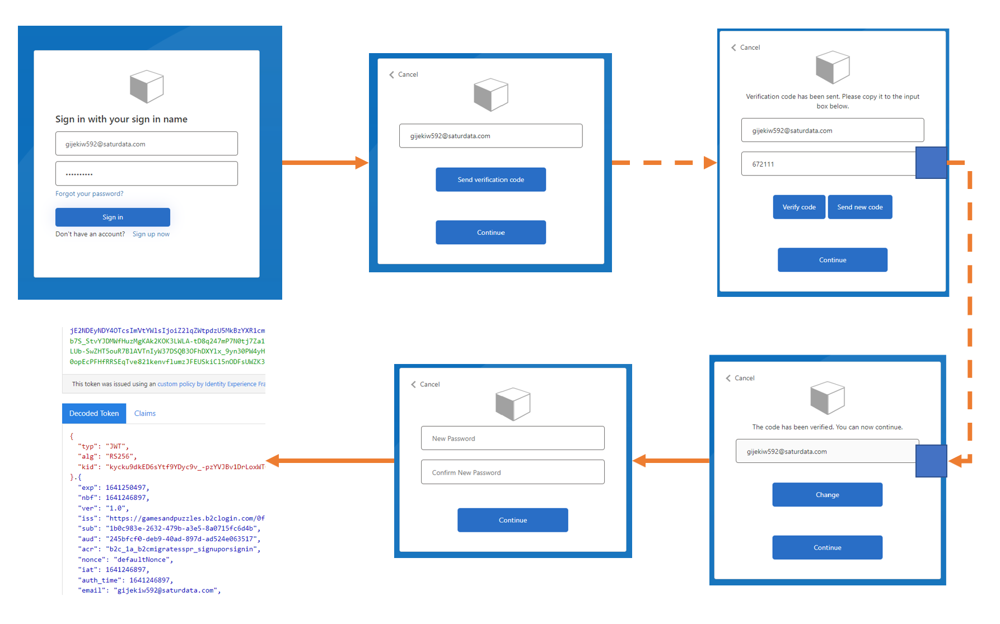

# Dynamically migrate users with forced SSPR

This sample allows dynamically detecting whether a user has been migrated or not. While migrated users will automatically be logged in with valid credentials, required migrated users will be forced to perform a self-service password reset (SSPR). This allows a seemless migration while securely capturing passwords into Azure AD B2C; this scenario is required because you either do not have access to the passwords or you want to force users to reset the passwords during migration. The email provided during login is carried over and prepopulated for required migrated users to provide the best migration experience.

Please note this is controlled by an attribute stored into the Azure AD B2C directory that can be written to called **extension_mustResetPassword**.

## Prerequisites


- You will be required to [create an Azure AD B2C directory](https://docs.microsoft.com/en-us/azure/active-directory-b2c/tutorial-create-tenant).

- To use the sample policies in this repo, follow [the setup instructions for Custom Policies](https://docs.microsoft.com/en-us/azure/active-directory-b2c/active-directory-b2c-get-started-custom).

- Using Extension attributes requires expanding the schema by [defining custom attributes in the directory](https://docs.microsoft.com/en-us/azure/active-directory-b2c/active-directory-b2c-create-custom-attributes-profile-edit-custom#create-a-new-application-to-store-the-extension-properties). Please note that `AAD-Common` Technical profile will always need to be[ modified to use your `ApplicationId` and `ObjectId`](https://docs.microsoft.com/en-us/azure/active-directory-b2c/user-flow-custom-attributes?pivots=b2c-custom-policy#modify-your-custom-policy).

- This sample is based on the [Display Controls SocialAndLocalAccount starter pack](https://github.com/Azure-Samples/active-directory-b2c-custom-policy-starterpack/tree/master/Display%20Controls%20Starterpack/SocialAndLocalAccounts).

## Seamless migration flow during Sign In

This demostrates the end-to-end business logic for this scenario:
<a


1. Users are pre-migrated into the directory.
2. User attempts to sign-in to Azure AD B2C.
3. Azure AD B2C reads the user's object in the directory and determines whether user has been migrated or not.
4. If users has already been migrated, B2C will attempt to authenticate and if successful, issue a token to the application.
5. If user requires migration, B2C will prompt user for a required self-service password reset (SSPR).
6. Upon successful SSPR validation, the user will be redirected to the application with a valid token.

## Walkthrough UX flow

This is the expected end user experience in which can be [customized by using Cross-Origin Resource Sharing (CORS)](https://docs.microsoft.com/en-us/azure/active-directory-b2c/customize-ui-with-html?pivots=b2c-custom-policy):




## Test Policy
1. Write value into extension attribute using MS Explorer
   - Add schema to the directory
   - Create test user by running the policy (User ObjectId can be retrieved in [Azure AD Admin Portal](https://portal.azure.com) under Users blade)
   - PATCH user object with mustRestPassword attribute using an API. You can use MS Graph Explorer to do this as well. 
  ```
  POST https://graph.microsoft.com/beta/users/<objectGUID>
    {
        "extension_<appID>_mustResetPassword": true
    }
  ```
- Example
  ```
  PATCH https://graph.microsoft.com/beta/users/a5c9a04a-97aa-41ad-9700-729a579d1e4b
    {
        "extension_32e5499906bd4352b65a5edd7ee3c3a1_mustResetPassword": true
    }
  ```
2. Verify attribute was written in directory by reading user object
  ```
  GET https://graph.microsoft.com/beta/users/{user-id}
  ```
- Example:
  ```
   GET https://graph.microsoft.com/beta/users/a5c9a04a-97aa-41ad-9700-729a579d1e4b
  ```
3. Run Policy and test flow

## Notes

This sample policy is based on [Display Controls SocialAndLocalAccount starter pack](https://github.com/Azure-Samples/active-directory-b2c-custom-policy-starterpack/tree/master/Display%20Controls%20Starterpack/SocialAndLocalAccounts). All changes are marked with **Sample:** comment inside the policy XML files. Make the necessary changes in the **Sample action required** sections.
