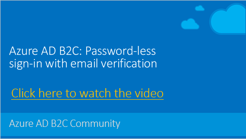

# Azure AD B2C: Password-less sign-in with email verification

Passwordless authentication is a type of authentication where user doesn't need to sign-in with their password. This is commonly used in B2C scenarios where users use your application infrequently and tend to forget their password. This sample policy demonstrates how to allow user to sign-in, simply by providing and verifying the sign-in email address using OTP code (one time password). 

[](https://youtu.be/bzqMDPnV5G0)

## Solution flow


The [TrustFrameworkExtensions_passwordless.xml](policy/TrustFrameworkExtensions_passwordless.xml) sample policy includes following user journey:

* Sign-in with a local account with password
* Social account
* Sign-in with email verification (passwordless)

The [TrustFrameworkExtensions_passwordless_only.xml](policy/TrustFrameworkExtensions_passwordless_only.xml) sample policy includes following user journey:

* Social account
* Sign-in with email verification (passwordless)
* Sign-up with email verification (passwordless)

## Adding this functionality to your policy

In your extension policy:

1.	Add the **LocalAccountDiscoveryUsingEmailAddress-SignIn** technical profile. The technical profile is based on the password reset technical profile (LocalAccountDiscoveryUsingEmailAddress) that asks the user to provide and verify the email address, and returns the user object id. If the account doesn't exist, the technical profile return following error message "An account could not be found for the provided user ID." The technical profile sets the display name to "Sign-In with Email" that is shown on the sign-up or sign-in page.
    ```XML
    <ClaimsProvider>
      <DisplayName>Local Account</DisplayName>
      <TechnicalProfiles>
        <TechnicalProfile Id="LocalAccountDiscoveryUsingEmailAddress-SignIn">
          <DisplayName>Sign-In with Email</DisplayName>
          <IncludeTechnicalProfile ReferenceId="LocalAccountDiscoveryUsingEmailAddress" />
        </TechnicalProfile>
      </TechnicalProfiles>
    </ClaimsProvider>
    ```

1. Add the sign-in with email button. The ClaimsProviderSelection element is analogous to an identity provider button on a sign-up/sign-in screen. If you add a ClaimsProviderSelection element for sign-in with email, a new button shows up when a user lands on the page. Find the OrchestrationStep element that includes `Order="1"` in the user journey that you created. Under ClaimsProviderSelects, add the following element. Set the value of TargetClaimsExchangeId to an appropriate value, for example `SignIn-WithEmail`.
    ```XML
    <ClaimsProviderSelection TargetClaimsExchangeId="SignIn-WithEmail" />
    ```

1. Link the button to an action. Find the OrchestrationStep that includes `Order="2"` in the user journey. Add the following ClaimsExchange element making sure that you use the same value for Id that you used for TargetClaimsExchangeId:
    ```XML
    <ClaimsExchange Id="SignIn-WithEmail" TechnicalProfileReferenceId="LocalAccountDiscoveryUsingEmailAddress-SignIn" />
    ```

## Tests

You should run at least following acceptance tests:

- Create new local account
- Sign-in with account you created using username and password
- **Sign-in with email** - try to sign-in with the account you create, using email verification
- **Sign-in with email** - try to sign-in with an email address that doesn't exists in the directory. You should see an error message: _An account could not be found for the provided user ID._

> Note:  This sample policy is based on [SocialAndLocalAccounts starter pack](../../../SocialAndLocalAccounts). All changes are marked with **Sample:** comment inside the policy XML files. Make the necessary changes in the **Sample action required** sections.

## Community Help and Support

Use [Stack Overflow](https://stackoverflow.com/questions/tagged/azure-ad-b2c) to get support from the community. Ask your questions on Stack Overflow first and browse existing issues to see if someone has asked your question before. Make sure that your questions or comments are tagged with [azure-ad-b2c].
If you find a bug in the sample, please raise the issue on [GitHub Issues](https://github.com/azure-ad-b2c/samples/issues).
To provide product feedback, visit the Azure Active Directory B2C [Feedback page](https://feedback.azure.com/forums/169401-azure-active-directory?category_id=160596).


\\