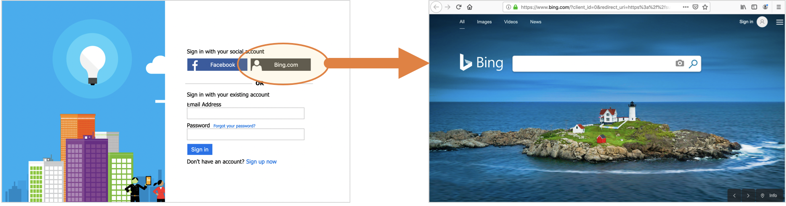

# Redirection sample

Demonstrate how to redirect the user to a particular web address, using OpenID connect protocol.



## Note

The redirection to the specified URI includes OpenID connect parameters, such as `redirect_uri`, `response_type`, `response_mode`, `nonce` and `state`. The web page you redirect the user to, can ignore those parameters.

```
https://www.bing.com/?client_id=0&redirect_uri=https%3a%2f%2fsunflowersdemo.b2clogin.com%2fsunflowersdemo.onmicrosoft.com%2foauth2%2fauthresp&response_type=id_token&response_mode=form_post&nonce=gvdO58Df%2bupXPVhQf%2bifNw%3d%3d&state=StateProperties%3deyJTSUQiOiJ4LW1zLWNwaW0tcmM6ZDYzN2Y0NGYtZDhmNS00ZTM3LTlmYjgtOTVhODg4MGNlYTc4IiwiVElEIjoiNzE2ZDg2MWUtOGE4Yy00MGNlLWEwODMtYjA4NjE4ZDY5ZDIwIn0
```


## Community Help and Support
Use [Stack Overflow](https://stackoverflow.com/questions/tagged/azure-ad-b2c) to get support from the community. Ask your questions on Stack Overflow first and browse existing issues to see if someone has asked your question before. Make sure that your questions or comments are tagged with [azure-ad-b2c].
If you find a bug in the sample, please raise the issue on [GitHub Issues](https://github.com/azure-ad-b2c/samples/issues).
To provide product feedback, visit the Azure Active Directory B2C [Feedback page](https://feedback.azure.com/forums/169401-azure-active-directory?category_id=160596).

## Notes
This sample policy is based on [SocialAndLocalAccounts starter pack](https://github.com/Azure-Samples/active-directory-b2c-custom-policy-starterpack/tree/master/SocialAndLocalAccounts). All changes are marked with **Sample:** comment inside the policy XML files. Make the necessary changes in the **Sample action required** sections. 
