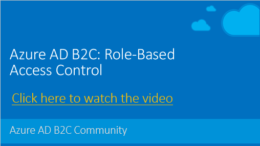

# Azure AD B2C: Role-Based Access Control
Role-Based Access Control (RBAC) enables fine-grained access management for your relying party applications. Using RBAC, you can grant only the amount of access that users need to perform their jobs in your application. This sample policy (along with the REST API service) demonstrates how to read user's groups, add the groups to JTW token and also prevent users from sign-in if they aren't members of one of predefined security groups.

## Solution flow
After user account has been created in Azure AD B2C directory. Administrator, from Azure portal, can add users as a member of to Azure AD security groups.

During sign-in (with local account), IEF invokes REST API, sending the user `objectId` as input claim. The Rest API queries Azure AD Graph API to retrieve the list of group user is member of. The user's group list return back to B2C, as an output claim.

Optionally, you can also send the `onlyMembersOf` claim type with a list of groups a user MUST be member of to the REST API. If a user is not member of one of the groups specified in `onlyMembersOf`, The REST API returns a user friendly error will present to the user.

> Note:  This sample policy is based on [LocalAccounts starter pack](../../../LocalAccounts). All changes are marked with **Demo:** comment inside the policy XML files.

## Run the solution
To run the visual studio solution, you need:
1. Create Azure AD application and set read permissions. For more information, see [Azure Active Directory B2C: User migration](https://docs.microsoft.com/en-us/azure/active-directory-b2c/active-directory-b2c-user-migration) section 1.1, 1.2 and 1.3. Note: you don't need write permissions.
2. Deploy this web app to Azure App Services. For more information, see [Create and publish the web app](https://docs.microsoft.com/en-us/azure/app-service/app-service-web-get-started-dotnet#create-and-publish-the-web-app).
3. Set the application settings. You can set the app settings directly from `launchSettings.json` file. Or use the better solution, from Azure portal. For more information, see: [Configure web apps in Azure App Service](https://docs.microsoft.com/en-us/azure/app-service/web-sites-configure#application-settings)
4. Open the policies files, change the tenant name, client_id and IdTokenAudience for Local Account SignIn, and upload the policies to Azure portal.

## Important notes:
Secure the communication between Azure AD B2C to your Rest API. For more information, see: [Secure your RESTful service by using client certificates](https://docs.microsoft.com/en-us/azure/active-directory-b2c/active-directory-b2c-custom-rest-api-netfw-secure-cert) OR [Secure your RESTful services by using HTTP basic authentication](https://docs.microsoft.com/en-us/azure/active-directory-b2c/active-directory-b2c-custom-rest-api-netfw-secure-basic).

## Artifacts
### Azure AD custom policy
All changes are located in `TrustFrameworkExtensions.xml` and `SignUpOrSignin.xml` files. For more information, search for `Demo:` comments.
1. **groups** Claim type.
1. **onlyMembersOf** Claim type.
1. **RESTAddUserGroups** technical profile, points to the Rest API services. 
1. **SelfAsserted-LocalAccountSignin-Email** technical profile - Adding `REST-RBAC` validation technical profile.

### Visual studio solution
1. **IdentityController** The custom policy calls this REST API.

## App Settings
* **b2c:Tenant** Your Azure AD B2C tenant name
* **b2c:ClientId** Your Azure AD application ID
* **b2c:ClientSecret** Your Azure AD application secret 

