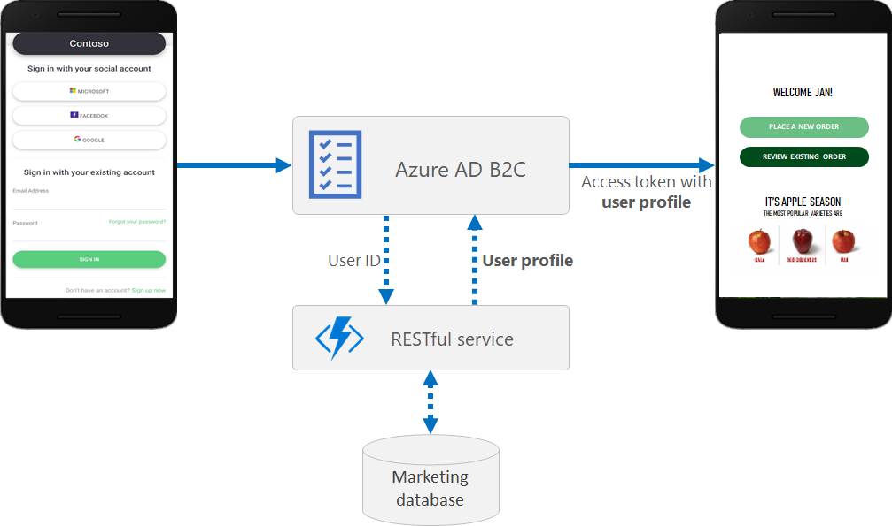

# Azure AD B2C: Remote profile

This sample solution, demonstrates how to store and read user profile in a remote database. The sample uses Azure Blob Storage as a data source for the user profile. 

During the **sign-up** and **profile editing** flow, Azure AD B2C calls a REST API to persist the user profile to the remote data source (a marketing database, CRM system, or any line of business application). On **sign-in**, with local or social account, Azure AD B2C invokes the REST API, sending the user unique identifier as a user primary key (email address, or user objectId). The REST API reads the data from the remote database and return the user profile. Then Azure AD B2C includes the user profile in the access token that returns back to the application.  



## User flow
-  **Sign-up with local account** the LocalAccountSignUpWithLogonEmail technical profile invokes the REST-SignUpOrEditProfile validation technical profile. This technical profile reads the user objectId (return by the AAD-UserWriteUsingLogonEmail validation technical profile) and persist the profile to Azure Blob Table.
- **Sign in with local or social account** Additional orchestration step RESTSignIn invokes the REST-SignIn technical profile, which reads the user profile from the Azure Blob Table and return the profile back to Azure AD B2C.
- **Edit Profile** 
    - Read the profile: Additional orchestration step RESTSignIn invokes the REST-SignIn technical profile, which reads the user profile from the Azure Blob Table and return the profile back to Azure AD B2C. 
    - Update the profile:  The SelfAsserted-ProfileUpdate technical profile invokes the REST-SignUpOrEditProfile validation technical profile that updates the user profile in Azure Blob TAble

Policy files stored in [Remote-profile-policies directory](Remote-profile-policies)

## User flow with email in HASH format
In this flow, Azure AD B2C stores the email in HASH format. For example: `575E8926D4894C7057C6052357FE51B8C82C5E3C@b2c.com`. To support such flow, the policy needs to HASH the email before persisting or reading the account in the directory. This policy runs the flow mentioned above and also adding following functionality:
- **Sign-in with local account** and edit profile with local account
    - SelfAsserted-LocalAccountSignin-Email technical profile, calls the REST-HashSignInName technical profile to HASH the signInName
    - login-NonInteractive technical profile validates the account with the `emailHash` claim 
- **Sign-up with local account**
    - LocalAccountSignUpWithLogonEmail technical profile, calls the REST-HashEmail technical profile to HASH the eamil before creating the new account
    - AAD-UserWriteUsingLogonEmail technical profiles create the account with the `emailHash` claim 
- **Password reset (local account)**
    - LocalAccountDiscoveryUsingEmailAddress technical profile, calls the REST-HashEmail technical profile to HASH the eamil before reading the account
    - AAD-UserReadUsingEmailAddress technical profile reads the account with the `emailHash` claim 

Policy files stored in [Remote-profile-with-hash-policies](Remote-profile-with-hash-policies)

## REST API
Deploy your the REST API and update the the Azure Blob storage connection string in the appsettings.json file.
```JSON
  "AppSettings": {
    "BlobStorageConnectionString": "You Azure Blob storage account connection string"
  }
``` 

## Community Help and Support
Use [Stack Overflow](https://stackoverflow.com/questions/tagged/azure-ad-b2c) to get support from the community. Ask your questions on Stack Overflow first and browse existing issues to see if someone has asked your question before. Make sure that your questions or comments are tagged with [azure-ad-b2c].
If you find a bug in the sample, please raise the issue on [GitHub Issues](https://github.com/azure-ad-b2c/samples/issues).
To provide product feedback, visit the Azure Active Directory B2C [Feedback page](https://feedback.azure.com/forums/169401-azure-active-directory?category_id=160596).

> Note:  This sample policy is based on [SocialAndLocalAccounts starter pack](https://github.com/Azure-Samples/active-directory-b2c-custom-policy-starterpack/tree/master/SocialAndLocalAccounts). All changes are marked with **Demo:** comment inside the policy XML files. Make the necessary changes in the **Demo action required** sections.
