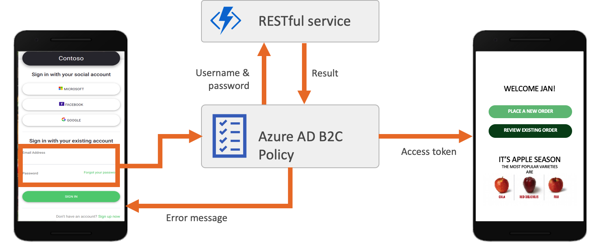
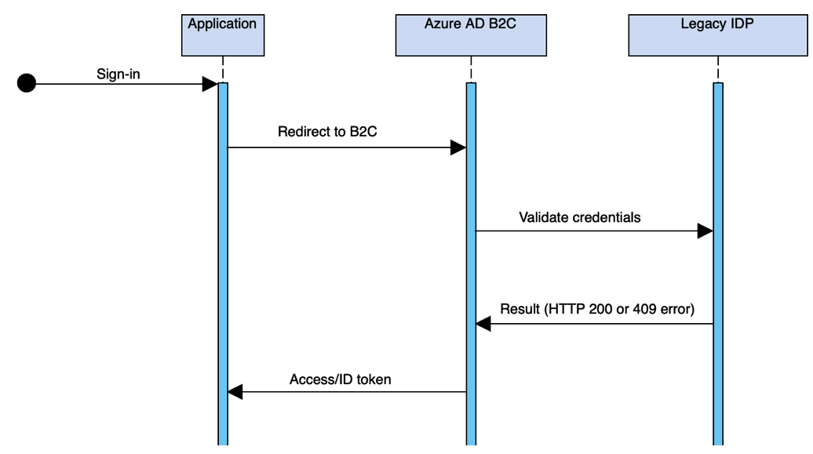

# Sign-in with REST API identity provider

Allows users to sign-in with credentials stored legacy identity provider using REST API services. 

The idea that a user can provide a username and password, while B2C makes a call to a REST API to validate the credentials. On the first time user sign-in, Azure AD B2C creates such a social account in the directory (similar to Facebook account)

- **SelfAsserted-RestAPISignin-Email** Self-Asserted technical profile, provide functionality for a user to Sign in with username and password. This is achieved using a Self-Asserted technical profile and connected validation technical profile. The  The technical profile to launch to validate the data the user provided, in this case to validate their credentials by calling a remote REST API service.

- **REST-Login** REST Restful technical profile, sends the username and password to the remote REST API to validate the credentials.

