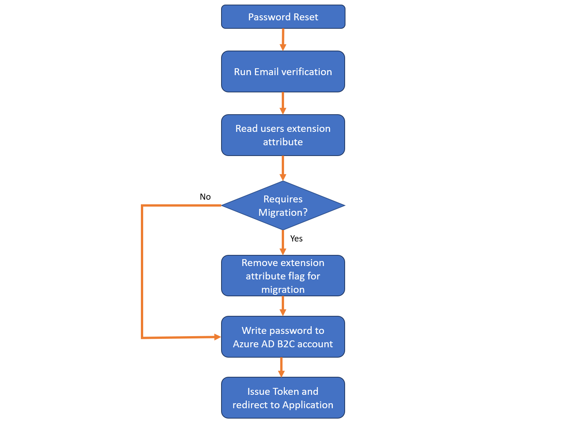

# A B2C IEF Custom Policy which seamlessly migrates user accounts

## Disclaimer
The sample policy is developed and managed by the open-source community in GitHub. This policy is not part of Azure AD B2C product and it's not supported under any Microsoft standard support program or service. The policy is provided AS IS without warranty of any kind.

# Azure Active Directory B2C: Seamless user  migration from a Legacy Identity Provider
When you plan to migrate your users identities to Azure AD B2C, you may also want to migrate the user accounts as well. This article explains how to migrate existing user accounts from a legacy Identity Provider into Azure AD B2C and seamlessly validating and migrating user passwords at initial logon to a Azure AD B2C protected application. This scenario is applicable when passwords in the legacy Identity Provider are stored in a hashed or non-recoverable state.

## Pre migrating user accounts
Azure AD B2C allows you to pre-create user accounts by using the [Graph API](https://docs.microsoft.com/en-us/azure/active-directory-b2c/active-directory-b2c-devquickstarts-graph-dotnet).

Using the tools above, read the user accounts from the legacy identity provider and pre-create accounts into Azure AD B2C with random passwords.

### Seamless migration flow during Sign In
Once the application has been migrated to use Azure AD B2C as the Identity Provider, users who had their accounts migrated will undergo a seamless migration flow with the following logic:

1. Read the Azure AD B2C account which corresponds with the email address the user has attempted to login with.
2. Check whether the account is flagged for migration on initial logon by evaluating a boolean extension attribute.
3. If the boolean returns `True`, call a REST API to validate the password against the legacy Identity Provider.
4. If the REST API determines the password is incorrect, return a friendly error to the user.
5. If the REST API determines the password is correct, write the password into the Azure AD B2C account and change the boolean extension attribute to `False`.
6. If the boolean extension attribute returns `False`, continue the logon process as normal.


> [!NOTE]
> This flow requires using Azure AD B2C [Custom policy](https://docs.microsoft.com/en-us/azure/active-directory-b2c/active-directory-b2c-overview-custom)
>

The following diagram illustrates the seamless migration flow:


## Using Azure AD Graph API to migrate users
This section describes the process on how to create user accounts in Azure AD B2C via Azure AD Graph API for the pre-migration stage.

### Register your application in your tenant
To communicate with the Azure AD Graph API, you first need to have service account with administrative privileges. In Azure AD, you can do this by registering an application and authenticating to Azure AD. The application credentials are: **Application ID** and **Application Secret**. The application acts as itself, not as a user, to call the Graph API.

In this step, you register your migration application in Azure AD. Create application key (Application secret) and set the application with right privileges (write, set password, and delete users).

1. Sign in to the [Azure portal](https://portal.azure.com/).
2. Choose your Azure AD B2C tenant by selecting your account in the top right corner of the page.
3. From left panel, open the **Azure Active Directory** (not the Azure AD B2C). You might need to select **More Services** to find it.
4. Select **App registrations**.
5. Select **New application registration**.

6. Follow the prompts and create a new application
    * For **Name**, use **B2CUserMigration**.
    * For **Application type**, use **Web app/API**.
    * For **Sign-on URL**, use https://localhost (as it's not relevant for this application).
    * Click **Create**
7. Once it is created, select the newly created application **B2CUserMigration**.
Select **Properties**, copy the **Application ID**, and save it for later.

### Create an application secret
8. Click on **Keys** and add a new key (also known as client secret). Also, copy the key for later.


### Grant administrative permission to your application
1. Continuing in the Azure portal's **Registered App**
2. Click on **Required permissions**.
3. Click on **Windows Azure Active Directory**.
4. In the **Enable Access**, under **Application Permissions**, select the **Read and write directory data** permission and click **Save**.
4. Finally, back in the **Required permissions**, click on the **Grant Permissions** button.


You now have an application that has permission to create, read, and update users from your B2C tenant.

## Sample PowerShell script to pre-migrate a user
The following PowerShell script demonstrates how to: 
1. Obtain an Access Token to Azure AD Graph API
2. Register the extension attribute named `requiresMigration` into Azure AD B2C - This is later referenced as `extension_requiresMigration` within the Azure AD B2C Custom Policy.
3. Create a user object in Azure AD B2C

```PowerShell
#Part 1 - Obtain an Access Token to Azure AD Graph API
#AAD B2C tenant
$tenant = "contoso.onmicrosoft.com"
#B2CUserMigration Application Registration Application Id
$ClientID = ""
#B2CUserMigration Application Registration generated key (client secret)
$ClientSecret = ""         
$loginURL = "https://login.microsoftonline.com"
$resource = "https://graph.windows.net"

# Get an OAuth 2 access token based on client id, secret and tenant
$body = @{grant_type="client_credentials";client_id=$ClientID;client_secret=$ClientSecret;resource=$resource}
$oauth = Invoke-RestMethod -Method Post -Uri $loginURL/$tenant/oauth2/token?api-version=1.0 -Body $body
```
```PowerShell
#Part 2 - Register the extension attribute named "requiresMigration" into Azure AD B2C
#ObjectID of the B2CUserMigration App Registration
$AppObjectID = ""

#Set the endpoint to register extension attributes
$url = "https://graph.windows.net/$tenant/applications/$AppObjectID/extensionProperties?api-version=1.6"

#Define the extension attribute
$body = @"
{ 
 "name": "requiresMigration", 
 "dataType": "Boolean", 
 "targetObjects": ["User"]
}
"@

#Generate the authentication header and make the request
$authHeader = @{"Authorization"= $oauth.access_token;"Content-Type"="application/json";"ContentLength"=$body.length }
$result = Invoke-WebRequest -Headers $authHeader -Uri $url -Method Post -Body $body

#Print the full attribute Name
($result.Content | Convertfrom-Json).name
```
```PowerShell
#Part 3 - Create a user object in Azure AD B2C
#Populate the user properties
#Insert the Application Id of the B2CUserMigration App Registration used in Part 2 to register the extension property in the extension name without the dashes in the GUID
$body = @"
{
  "accountEnabled": true,
  "creationType": "LocalAccount",
  "displayName": "John Smith",
  "passwordProfile": {
    "password": "Test*1234RANDOM!",
    "forceChangePasswordNextLogin": false
  },
  "signInNames": [
    {
      "type": "emailAddress",
      "value": "j.smith@contoso.com"
    }
  ],
  "extension_<B2CUserMigration App Id without dashes>_requiresMigration": true
}
"@

#Build the authentication header
$authHeader = @{"Authorization"= $oauth.access_token;"Content-Type"="application/json";"ContentLength"=$body.length }

#Set the endpoint to make the POST request to
$url = "https://graph.windows.net/$tenant/users?api-version=1.6"

#Make the POST request with the body to create the user
Invoke-WebRequest -Headers $authHeader -Uri $url -Method Post -Body $body
```

## Configuring the Azure AD B2C Custom Policy
The Azure AD B2C custom policy must be reconfigured such that upon sign-in, it can make the necessary validations against data to execute the logic described in the seamless migration flow during sign in.

### Enable your Custom Policy to read and write custom attributes
Follow the steps in the following links to allow your custom policy to read and write custom attributes:
1. [Create an Application Registration to store the extension properties](https://docs.microsoft.com/en-us/azure/active-directory-b2c/active-directory-b2c-create-custom-attributes-profile-edit-custom#create-a-new-application-to-store-the-extension-properties)
2. [Modify the Custom Policy to reference the Application Registration](https://docs.microsoft.com/en-us/azure/active-directory-b2c/active-directory-b2c-create-custom-attributes-profile-edit-custom#modify-your-custom-policy-to-add-the-applicationobjectid)

### Define claims required to seamlessly migrate accounts
The following claims are added such that the Azure AD B2C policy can read and write to the extension attribute containing the users migration status, and also parse the result from the REST API.

1. Open the extension policy file (TrustFrameworkExtensions.xml) from your working directory. 
2. Find the `<BuildingBlocks>` section
3. Add following XML snippet under the `ClaimsSchema` element. If the `ClaimsSchema` element does not exist, create this under the `<BuildingBlocks>` section
```XML
<!-- Holds the value of the migration status on the Azure AD B2C account -->
<ClaimType Id="extension_requiresMigration">
    <DisplayName>extension_requiresMigration</DisplayName>
    <DataType>boolean</DataType>
    <AdminHelpText>extension_requiresMigration</AdminHelpText>
    <UserHelpText>extension_requiresMigration</UserHelpText>
</ClaimType>
<!-- Holds the value of whether the authentication succeeded at the legacy IdP -->
<ClaimType Id="tokenSuccess">
    <DisplayName>tokenSuccess</DisplayName>
    <DataType>boolean</DataType>
    <AdminHelpText>tokenSuccess</AdminHelpText>
    <UserHelpText>tokenSuccess</UserHelpText>
</ClaimType>
<!-- Holds the value 'false' when the legacy IdP authentication succeeded -->
<ClaimType Id="migrationRequired">
    <DisplayName>migrationRequired</DisplayName>
    <DataType>boolean</DataType>
    <AdminHelpText>migrationRequired</AdminHelpText>
    <UserHelpText>migrationRequired</UserHelpText>
</ClaimType>
```

### Add a Technical Profile to retrieve the extension attribute value
We must read the value of the extension attribute to determine if the account requires migration.
1.  Open the extension policy file (TrustFrameworkExtensions.xml) from your working directory. 
2. Find the `<ClaimsProviders>` section
3. Add following XML snippet under the `ClaimsProviders` element
```XML
<ClaimsProvider>
  <DisplayName>Local Account SignIn - Read migration status</DisplayName>
  <TechnicalProfiles>
    <TechnicalProfile Id="Get-requiresMigration-status-signin">
      <Metadata>
        <Item Key="Operation">Read</Item>
        <Item Key="RaiseErrorIfClaimsPrincipalDoesNotExist">true</Item>
        <Item Key="UserMessageIfClaimsPrincipalDoesNotExist">An account could not be found for the provided user ID.</Item>
      </Metadata>
      <IncludeInSso>false</IncludeInSso>
      <InputClaims>
        <InputClaim ClaimTypeReferenceId="signInName" PartnerClaimType="signInNames.emailAddress" Required="true" />
      </InputClaims>
      <OutputClaims>
        <OutputClaim ClaimTypeReferenceId="objectId" />
        <!-- Set a default value (false) in the case the account does not have this attribute defined -->
        <OutputClaim ClaimTypeReferenceId="extension_requiresMigration" DefaultValue="false" />
      </OutputClaims>
      <IncludeTechnicalProfile ReferenceId="AAD-Common" />
    </TechnicalProfile>
  </TechnicalProfiles>
</ClaimsProvider>
```

### Add a Technical Profile to configure the REST API call
1. Open the extension policy file (TrustFrameworkExtensions.xml) from your working directory. 
2. Find the `<ClaimsProviders>` section
3. Add following XML snippet under the `ClaimsProviders` element
4. Change the value of `ServiceUrl` to point to your API endpoint URL 
```XML
<ClaimsProvider>
  <DisplayName>REST API to communicate with Legacy IdP</DisplayName>
  <TechnicalProfiles>
    <TechnicalProfile Id="UserMigrationViaLegacyIdp">
      <DisplayName>REST API call to communicate with Legacy IdP</DisplayName>
      <Protocol Name="Proprietary" Handler="Web.TPEngine.Providers.RestfulProvider, Web.TPEngine, Version=1.0.0.0, Culture=neutral, PublicKeyToken=null" />
      <Metadata>
        <Item Key="ServiceUrl">https://<your-api-endpoint></Item>
        <Item Key="AuthenticationType">None</Item>
        <Item Key="SendClaimsIn">Body</Item>
      </Metadata>
      <InputClaims>
        <InputClaim ClaimTypeReferenceId="signInName" PartnerClaimType="email" />
        <InputClaim ClaimTypeReferenceId="password" />
      </InputClaims>
      <OutputClaims>
        <OutputClaim ClaimTypeReferenceId="tokenSuccess" DefaultValue="false"/>
        <OutputClaim ClaimTypeReferenceId="migrationRequired"/>
      </OutputClaims> 
      <UseTechnicalProfileForSessionManagement ReferenceId="SM-Noop" />
    </TechnicalProfile>
  </TechnicalProfiles>
</ClaimsProvider>
```
The Technical Profile above defines two input claims: `signInName` (sent as email) and `password`. When a user sign's in, these claims are sent to your Restful endpoint in a JSON payload within the body. The `password` is sent over a HTTPS connection to the REST API.

```JSON
{
    "email" : "user@contoso.com",
    "password" : "value"
}
```

### Add a Technical Profile which allows writing the password and changing the migration status
Once the REST API has confirmed the username and password successfully authenticated at the legacy Identity Provider, we must write the new password into the account and also change the extension attribute such that it no longer follows this migration path on subsequent logons.

1. Open the extension policy file (TrustFrameworkExtensions.xml) from your working directory. 
2. Find the `<ClaimsProviders>` section
3. Add following XML snippet under the `ClaimsProviders` element

```XML
<ClaimsProvider>
  <DisplayName>Local Account SignIn - Write new password and unmark for migration</DisplayName>
  <TechnicalProfiles>
    <TechnicalProfile Id="AAD-WritePasswordAndFlipMigratedFlag">
      <Metadata>
        <Item Key="Operation">Write</Item>
        <Item Key="RaiseErrorIfClaimsPrincipalAlreadyExists">false</Item>
      </Metadata>
      <IncludeInSso>false</IncludeInSso>
      <InputClaims>
        <InputClaim ClaimTypeReferenceId="objectId" Required="true" />
      </InputClaims>
      <PersistedClaims>
        <PersistedClaim ClaimTypeReferenceId="objectId" />
        <PersistedClaim ClaimTypeReferenceId="password" PartnerClaimType="password"/>
        <PersistedClaim ClaimTypeReferenceId="migrationRequired" PartnerClaimType="extension_requiresMigration"/>
      </PersistedClaims>
      <IncludeTechnicalProfile ReferenceId="AAD-Common" />
      <UseTechnicalProfileForSessionManagement ReferenceId="SM-AAD" />
    </TechnicalProfile>
  </TechnicalProfiles>
</ClaimsProvider>
```

### Add Validation Technical Profile steps to execute the seamless migration
During the Sign In step of the user journey, we must add validation technical profiles to process the logic to migrate an account. These are executed based on `Preconditions` to control the logic.

The following XML snippet overrides the `SelfAsserted-LocalAccountSignin-Email`, which is defined in the base policy. The XML snippet adds multiple `ValidationTechnicalProfiles` with ReferenceIds pointing to the Technical Profiles defined in the previous steps.

1.  Open the extension policy file (TrustFrameworkExtensions.xml) from your working directory. 
2. Find the `<ClaimsProviders>` section
3. Add following XML snippet under the `ClaimsProviders` element

```XML
<ClaimsProvider>
  <DisplayName>Local Account Sign In</DisplayName>
  <TechnicalProfiles>
    <TechnicalProfile Id="SelfAsserted-LocalAccountSignin-Email">
      <OutputClaims>
        <OutputClaim ClaimTypeReferenceId="extension_requiresMigration" />
      </OutputClaims>
      <ValidationTechnicalProfiles>
        <!--Add user migration validation technical profiles before login-NonInteractive -->

        <!-- Populate extension_requireMigration into the claims pipeline -->
        <ValidationTechnicalProfile ReferenceId="Get-requiresMigration-status-signin" ContinueOnError="false" />

        <!-- If extension_requireMigration is true, call the legacy IdP via the REST API -->
        <ValidationTechnicalProfile ReferenceId="UserMigrationViaLegacyIdp" ContinueOnError="false">
          <Preconditions>
            <Precondition Type="ClaimEquals" ExecuteActionsIf="true">
              <Value>extension_requiresMigration</Value>
              <Value>False</Value>
              <Action>SkipThisValidationTechnicalProfile</Action>
            </Precondition>
          </Preconditions>
        </ValidationTechnicalProfile>

        <!-- If the API returned 'tokensuccess', write the new password and unmark the account for migration -->
        <ValidationTechnicalProfile ReferenceId="AAD-WritePasswordAndFlipMigratedFlag" ContinueOnError="false">
          <Preconditions>
            <Precondition Type="ClaimsExist" ExecuteActionsIf="false">
              <Value>tokenSuccess</Value>
              <Action>SkipThisValidationTechnicalProfile</Action>
            </Precondition>
          </Preconditions>
        </ValidationTechnicalProfile>

        <!-- Initiate a normal logon against Azure AD B2C -->
        <ValidationTechnicalProfile ReferenceId="login-NonInteractive" />
      </ValidationTechnicalProfiles>
    </TechnicalProfile>
  </TechnicalProfiles>
</ClaimsProvider>
```

### Configuring the REST API response to Azure AD B2C
The REST API should only return two sets of results indicating the user authentication succeeded or failed against the legacy Identity Provider.
For a successful authentication against the legacy Identity Provider, this would look as follows:
```JSON
{
    "tokenSuccess" : True,
    "migrationRequired" : False
}
```

For a failed authentication against the legacy Identity Provider, the REST API should return a non HTTP 200 response code with a friendly error message. This is demonstrated in the `AADtoB2CUserMigration` sample folder.

The migrationRequired key-value pair is used to write the new value into the `extension_requiresMigration` attribute when the legacy Identity Provider authentication is successful as part of the `AAD-WritePasswordAndFlipMigratedFlag` Technical Profile. This will unmark the account for migration at subsequent logons since it will return 'false'.

## Seamless migration flow during Password Reset

Potentially a user may return to the site and forget their password after their account was already pre migrated. We must handle accounts that are created only in Azure AD B2C, already migrated accounts and accounts that still need migrating.

In such a case, we must always check the migration status of the account via the extension attribute. Once the user resets the password, unflag the account for migration via the extension attribute if it was due to be migrated at initial sign in.

The following diagram illustrates the seamless migration flow during password reset:


### Preparing the Password Reset journey
The password reset journey must be modified such that when a user resets a password on an account that is due migration, then the extension attribute is unmarked such that subsequent logons do not go via the legacy Identity Provider validation.

### Create a Technical Profile to read the migration status

1. Open the extension policy file (TrustFrameworkExtensions.xml) from your working directory. 
2. Find the `<ClaimsProviders>` section
3. Add following XML snippet under the `ClaimsProviders` element

```XML
<ClaimsProvider>
  <DisplayName>Local Account Password Reset - Read migration flag</DisplayName>
  <TechnicalProfiles>
    <TechnicalProfile Id="Get-requiresMigration-status-password-reset">
      <Metadata>
        <Item Key="Operation">Read</Item>
        <Item Key="RaiseErrorIfClaimsPrincipalDoesNotExist">true</Item>
        <Item Key="UserMessageIfClaimsPrincipalDoesNotExist">An account could not be found for the provided user ID.</Item>
      </Metadata>
      <IncludeInSso>false</IncludeInSso>
      <InputClaims>
        <InputClaim ClaimTypeReferenceId="objectId" Required="true" />
      </InputClaims>
      <OutputClaims>
        <OutputClaim ClaimTypeReferenceId="extension_requiresMigration" DefaultValue="false" />
      </OutputClaims>
      <IncludeTechnicalProfile ReferenceId="AAD-Common" />
    </TechnicalProfile>
  </TechnicalProfiles>
</ClaimsProvider>
```
The above Technical Profile will read the `extension_requiresMigration` extension attribute to determine whether the account is due migration.

### Create a Technical Profile to change the migration flag on an account to False

1. Open the extension policy file (TrustFrameworkExtensions.xml) from your working directory. 
2. Find the `<ClaimsProviders>` section
3. Add following XML snippet under the `ClaimsProviders` element
```XML
<ClaimsProvider>
  <DisplayName>Local Account Password Reset - Flip migration flag</DisplayName>
  <TechnicalProfiles>
    <TechnicalProfile Id="AAD-FlipMigratedFlag">
      <Metadata>
        <Item Key="Operation">Write</Item>
        <Item Key="RaiseErrorIfClaimsPrincipalAlreadyExists">false</Item>
      </Metadata>
      <IncludeInSso>false</IncludeInSso>
      <InputClaims>
        <InputClaim ClaimTypeReferenceId="objectId" Required="true" />
      </InputClaims>
      <PersistedClaims>
        <PersistedClaim ClaimTypeReferenceId="objectId" />
        <PersistedClaim ClaimTypeReferenceId="migrationRequired" PartnerClaimType="extension_requiresMigration" DefaultValue="False" AlwaysUseDefaultValue="true"/>
      </PersistedClaims>
      <IncludeTechnicalProfile ReferenceId="AAD-Common" />
      <UseTechnicalProfileForSessionManagement ReferenceId="SM-AAD" />
    </TechnicalProfile>
  </TechnicalProfiles>
</ClaimsProvider>
```
When `AAD-FlipMigratedFlag` is called, the `objectId` is used to locate the user account and then write the value of `migrationRequired` into `extension_requiresMigration`. Since `migrationRequired` is not populated into the claims-bag during this journey, it will use the `DefaultValue` of `False` in all occasions.


Override the `LocalAccountWritePasswordUsingObjectId` Technical Profile as follows:
1.  Open the extension policy file (TrustFrameworkExtensions.xml) from your working directory. 
2. Find the `<ClaimsProviders>` section
3. Add following XML snippet under the `ClaimsProviders` element

```XML
<ClaimsProvider>
  <DisplayName>Local Account Password Reset - Write Password</DisplayName>
  <TechnicalProfiles>
    <TechnicalProfile Id="LocalAccountWritePasswordUsingObjectId">
      <ValidationTechnicalProfiles>
        <ValidationTechnicalProfile ReferenceId="Get-requiresMigration-status-password-reset" ContinueOnError="false" />
        <ValidationTechnicalProfile ReferenceId="AAD-FlipMigratedFlag" ContinueOnError="false" />
        <Preconditions>
          <Precondition Type="ClaimEquals" ExecuteActionsIf="true">
            <Value>extension_requiresMigration</Value>
            <Value>False</Value>
            <Action>SkipThisValidationTechnicalProfile</Action>
          </Precondition>
        </Preconditions>
        <ValidationTechnicalProfile ReferenceId="AAD-UserWritePasswordUsingObjectId" />
      </ValidationTechnicalProfiles>
    </TechnicalProfile>
  </TechnicalProfiles>
</ClaimsProvider>
```

When the orchestration step executes `LocalAccountWritePasswordUsingObjectId` as part of the password reset user journey, it will first obtain the `extension_requiresMigration` value from the user object.
If the `extension_requiresMigration` value is not `false` (default), then `AAD-FlipMigratedFlag` Technical Profile will execute. This will change `extension_requiresMigration` to `false`. Finally the password is written as normal via the `AAD-UserWritePasswordUsingObjectId` Technical Profile.

## Upload the policy to your tenant
1.  In the [Azure portal](https://portal.azure.com), switch into the context of your Azure AD B2C tenant, and click on the  **Azure AD B2C** blade.
2.  Select **Identity Experience Framework**.
3.  Click on **All Policies**.
4.  Select **Upload Policy**
5.  Check **Overwrite the policy if it exists** box.
6.  **Upload** SeamlessMigration_TrustFrameworkBase.xml and ensure that it does not fail the validation
7.  Repeat last step to upload the SeamlessMigration_TrustFrameworkExtensions.xml, SeamlessMigration_SignUpOrSignin.xml and SeamlessMigration_PasswordReset.xml policy files.

### Test the custom policy by using Run Now
1.  Open **Azure AD B2C Settings** and go to **Identity Experience Framework**.
2.  Open **B2C_1A_SeamlessMigration_signuporsignin**, the relying party (RP) custom policy that you uploaded. Select **Run now**.
3. Login with an email address of an account which has extension_requiresMigration = true.

## Troubleshooting
Find guidance [here](https://docs.microsoft.com/en-us/azure/active-directory-b2c/active-directory-b2c-troubleshoot-custom) to help troubleshoot your policies.

## Miscellaneous
Use the VSCode Extension to help develop your policies [here](https://marketplace.visualstudio.com/items?itemName=AzureADB2CTools.aadb2c).