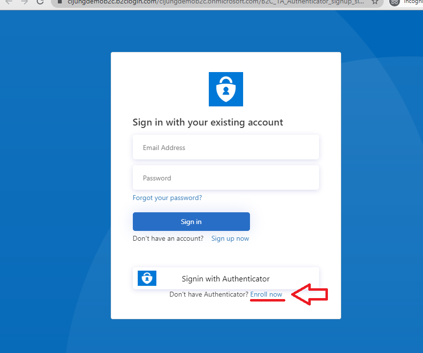
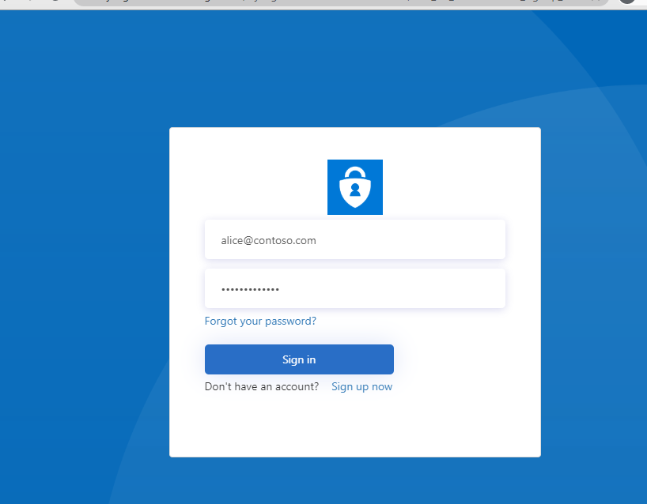
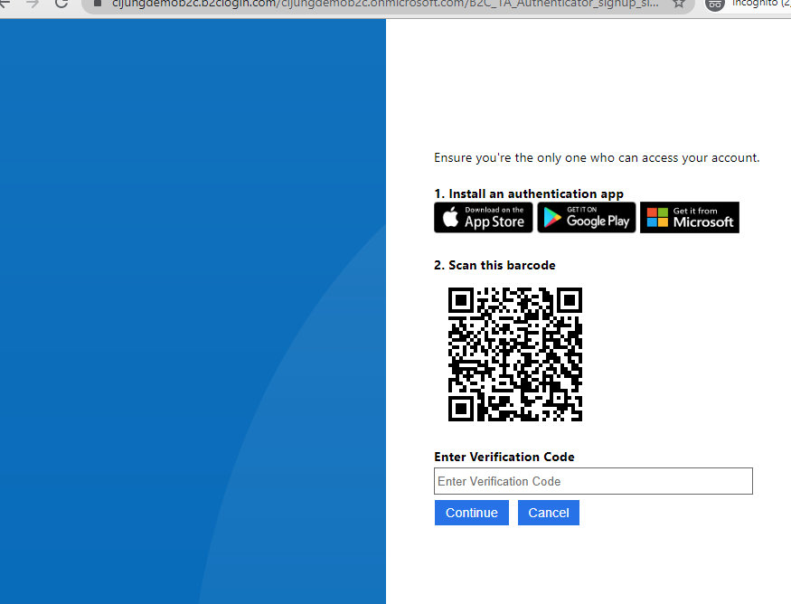
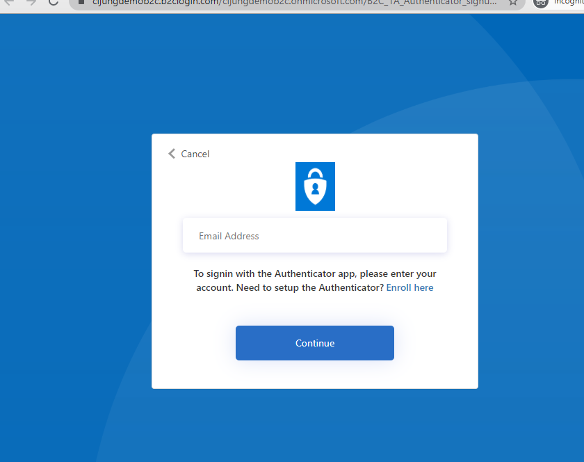
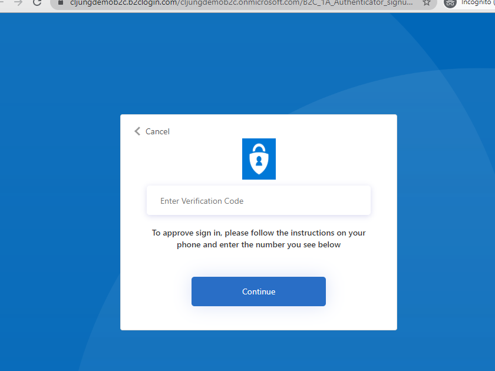
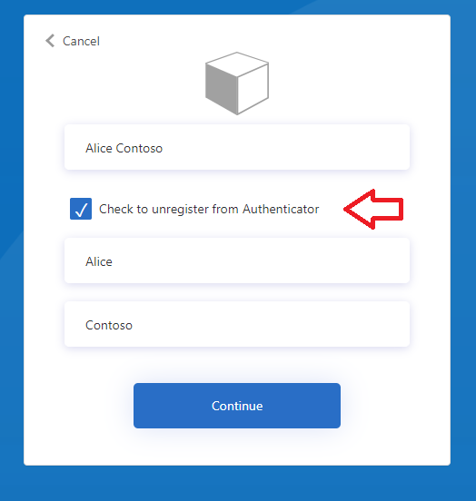

# Sign-in with Authenticator App

This is a sample to show how you can create a B2C Custom Policy to signin with Authenticator Apps to B2C. It is related to the ***custom-mfa-totp*** sample, which shows how to use the Authenticator app as MFA. It uses the same technique for enrolling a B2C account with Authenticator and shares the backend REST API. The difference is that it allows you to sign in to B2C using the Authenticator.

## Repo structure
This repository contains 
- [policy](policy) - the B2C Custom Policy files
- [policy/html](policy/html) - html UX customization files

This sample makes use of a backend REST API that is located in the [custom-mfa-totp](https://github.com/azure-ad-b2c/samples/tree/master/policies/custom-mfa-totp) sample. 

## Deploying the sample

There are three overall steps to deploy this sample

1. Build and deploy the source code to an Azure AppService 
2. Edit and upload the B2C Custom Policy files to your B2C tenant
3. Edit the html files and upload them to a storage account with public access and CORS configured

### Build and deploy the REST API 

There is a Deploy-To-Azure button on the related sample [custom-mfa-totp](https://github.com/azure-ad-b2c/samples/tree/master/policies/custom-mfa-totp) that will help you deploy it. If you rather download the code, you can compile it with Visual Studio 2019 and publish it to Azure App Services.

### Edit the B2C Custom Policy files

You need to edit the following
- yourtenant.onmicrosoft -> ***yourtenantname***.onmicrosoft.com (all xml files)
- yourstorageaccount -> The name of your ***storage account*** in TrustFrameworkExtensions.xml
- Edit <TechnicalProfile Id="login-NonInteractive"> in TrustFrameworkExtensions.xml and add your AppId's for IdentityExperienceFramework/ProxyIdentityExperienceFramework
- Edit <TechnicalProfile Id="AAD-Common"> in TrustFrameworkExtensions.xml to add your AppId and ObjectId for b2c-extensions app
- Search-n-replace the two instances of ***https://yourwebsite.azurewebsites.net*** to reference your deployment in Azure App Services

### Edit the html files

- search-n-replace ***yourtenant*** with your-tenant-name
- search-n-replace ***yourstorageaccount*** with your-storage-account-name (only in selfasserted.authenticator.registration.html)

Your storage account must be [configured for CORS](https://docs.microsoft.com/en-us/azure/active-directory-b2c/custom-policy-ui-customization#3-configure-cors) to allow B2C to access the pages.

## Signup / Signin with Authenticator flow

First, if you haven't got an account in the B2C tenant, use the ***Sign up now***  link to create an account using email/password.

Then, next time you want to sign in, use click on the ***Enroll*** link under the ***Signin with Authenticator*** button to enroll your B2C account for using Authenticator.

 

You will then be asked to sign in.

 

If you're B2C account isn't setup for using the Authenticator, you will be presented with this page to that instructs you to first install the app on your smartphone, then scan the QR code with your Authenticator app and finally read the code in the Authenticator app and enter it in the page.

 

Next time you want to signin and click on the ***Signin with Authenticator*** button, you will have to pick your account via entering your email.

 

To complete the signin, open your Authenticator app on your smartphone, read the OTP code and enter it in the page.

 

## How to unregister

If you want to test enrolling a B2C account with the Authenticator multiple times, the ProfileEdit user journey has been designed with a checkbox that if you check it, it will remove the attributes that associate the B2C account with the Authenticator. Please remember to remove the account from your Authenticator app too. 

 

## Live version
See a live version [here](https://cljungdemob2c.b2clogin.com/cljungdemob2c.onmicrosoft.com/B2C_1A_Authenticator_signup_signin/oauth2/v2.0/authorize?client_id=d636beb4-e0c5-4c5e-9bb0-d2fd4e1f9525&nonce=defaultNounce&redirect_uri=https%3A%2F%2Fjwt.ms&scope=openid&response_type=id_token&prompt=login&disable_cache=true).

The live version of ProfileEdit is [here](https://cljungdemob2c.b2clogin.com/cljungdemob2c.onmicrosoft.com/B2C_1A_Authenticator_ProfileEdit/oauth2/v2.0/authorize?client_id=d636beb4-e0c5-4c5e-9bb0-d2fd4e1f9525&nonce=defaultNounce&redirect_uri=https%3A%2F%2Fjwt.ms&scope=openid&response_type=id_token&prompt=login&disable_cache=true).

## Community Help and Support
Use [Stack Overflow](https://stackoverflow.com/questions/tagged/azure-ad-b2c) to get support from the community. Ask your questions on Stack Overflow first and browse existing issues to see if someone has asked your question before. Make sure that your questions or comments are tagged with [azure-ad-b2c].
If you find a bug in the sample, please raise the issue on [GitHub Issues](https://github.com/azure-ad-b2c/samples/issues).
To provide product feedback, visit the Azure Active Directory B2C [Feedback page](https://feedback.azure.com/forums/169401-azure-active-directory?category_id=160596).
