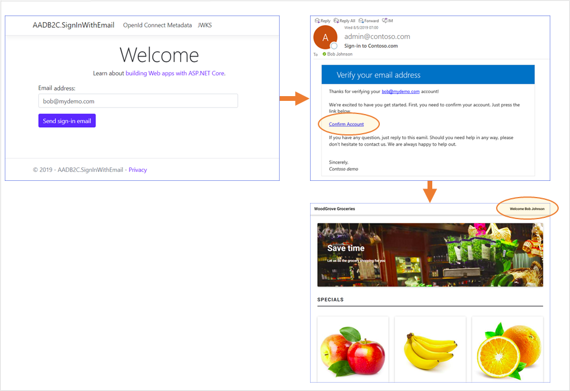

# Email delivered account redemption link
This sample demonstrates how to sign-in to a web application by sending a sign-in link. The web application sends an email to the end user with a link to sign-in policy. The link to the sign-in policy contains the email address, which is encapsulated inside a JWT token ([id_token_hint](https://docs.microsoft.com/azure/active-directory-b2c/id-token-hint)). When a user clicks on that link, Azure AD B2C validates the JWT token signature, reads the information from the token, extracts the email address and issues an access token back to the application.

## User flow
To sign-in, from the application, type the user's **email address** and click **Send sign-in email**. The application sends a sign-in link (with a id_token_hint). User clicks on the link, that takes to user to Azure AD B2C policy. Azure AD B2C validate the input id_token_hint, issues an access token, and redirect the user back to the application. 



## Sending Application Data
The key of sending data to Azure AD B2C custom policy is to package the data into a JWT token as claims (id_token_hint). In this case, we send the user's email address to Azure B2C. Sending JWT token requires to host the necessary metadata endpoints required to use the "id_token_hint" parameter in Azure AD B2C.

ID tokens are JSON Web Tokens (JWTs) and, in this application, are signed using RSA certificates. This application hosts an Open ID Connect metatdata endpoint and JSON Web Keys (JWKs) endpoint which are used by Azure AD B2C to validate the signature of the ID token.

The web app has following endpoints:
* **/.well-known/openid-configuration**, set this URL in the **IdTokenHint_ExtractClaims** technical profile
* **/.well-known/keys**

## Community Help and Support
Use [Stack Overflow](https://stackoverflow.com/questions/tagged/azure-ad-b2c) to get support from the community. Ask your questions on Stack Overflow first and browse existing issues to see if someone has asked your question before. Make sure that your questions or comments are tagged with [azure-ad-b2c].
If you find a bug in the sample, please raise the issue on [GitHub Issues](https://github.com/azure-ad-b2c/samples/issues).
To provide product feedback, visit the Azure Active Directory B2C [Feedback page](https://feedback.azure.com/forums/169401-azure-active-directory?category_id=160596).

## Sample Options
The sample provides two implementations for signing the ID tokens. The first option uses a local certificate installed in the current user's private certificate store (Cert:\CurrentUser\My) and loads the certificate into memory to sign the token within the app itself. The second option leverages the [Azure Key Vault](https://docs.microsoft.com/azure/key-vault/general/) service to both manage the certificate and to actually sign the ID Token data, which aligns better to [best practices for the management of sensitive information like certificates](https://docs.microsoft.com/azure/architecture/framework/security/design-storage-keys#key-storage).

## Option 1: Use a local certificate for token signing

### Creating a signing certificate
The sample application uses a self-signed certificate to sign the ID tokens. You can generate a valid self-signed certificate for this purpose and get the thumbprint using PowerShell *(note: Run as Administrator)*:
```Powershell
$cert = New-SelfSignedCertificate -Type Custom -Subject "CN=MySelfSignedCertificate" -TextExtension @("2.5.29.37={text}1.3.6.1.5.5.7.3.3") -KeyUsage DigitalSignature -KeyAlgorithm RSA -KeyLength 2048 -NotAfter (Get-Date).AddYears(2) -CertStoreLocation "Cert:\CurrentUser\My"
$cert.Thumbprint
```

### Configuring the application
Update the *appSettings* values in **appsettings.json** with the information for your Azure AD B2C tenant and the signing certificate you just created.
* **B2CTenant**: Your Azure AD B2C tenant name (without *.onmicrosoft.com*)
* **B2CPolicy**: The policy which you'd like to send the id_token_hint
* **B2CClientId**: The application ID for the Azure AD B2C app you'd like to redirect to
* **B2CRedirectUri**: The target redirect URI for your application
* **B2CSignUpUrl** the link to B2C format
* **SigningCertThumbprint**: The thumbprint for the signing certificate you just created
* **SigningCertAlgorithm**: The certificate algorithm (must be an RSA algorithm)
* **LinkExpiresAfterMinutes**: Link expiration (in minutes) 
* **SMTPServer**: Your SMTP server
* **SMTPPort**: Your SMTP server port number
* **SMTPUsername**: SMTP user name, if necessary
* **SMTPPassword**: SMTP password, if necessary
* **SMTPUseSSL**: SMTP use SSL, true of false
* **SMTPFromAddress**: Send from email address
* **SMTPSubject**: The invitation email's subject

### Hosting the application in Azure App Service
If you publish the application to Azure App Service, you'll need to configure a valid certificate with a private key in Azure App Service.
1. First, export your certificate as a PFX file using the User Certificates management tool (or create a new one)
2. Upload your certificate in the **Private Certificates** tab of the **SSL Settings** blade of your Azure App Service
3. Follow [these instructions](https://docs.microsoft.com/azure/app-service/app-service-web-ssl-cert-load#load-your-certificates) to ensure App Service loads the certificate when the app runs

## Option 2: Use Azure Key Vault for token signing

The Azure Key Vault service provides secure storage and access control for tokens, passwords, certificates, API keys, and other secrets. The service includes support for the provisioning, management, and deployment of both public and private certificates that can be used for resources that run both inside of and external to an Azure subscription. In this sample, Azure Key Vault is used to:
* generate the certificate used to sign the Identity Token that will be included as part of the sign-in link that will be sent to the user
* read the certificate public data that is provided via the `.well-known/keys` OpenID Connect endpoint that the Azure AD B2C policy will use to validate the incoming Identity Token assertion
* sign the Identity Token that will be sent to the user without having to load the private certificate information into the application

The sample code that uses Azure Key Vault can be found in the `AADB2C.SignInWithEmailUsingKeyVault` project in the code that accompanies this sample.

Note: The Azure Key Vault service does leverage throttling to prevent overuse of the service resources. Consideration should be given to the amount of expected rate of authentication requests and how that compares to the [Azure Key Vault service limits](https://docs.microsoft.com/azure/key-vault/general/service-limits) before an implementation using this approach is deployed to Production. Please review the [Azure Key Vault throttling guidance](https://docs.microsoft.com/azure/key-vault/general/overview-throttling) for more information.

### Creating a signing certificate

The sample application uses a named certificate in Azure Key Vault to sign the ID tokens. Azure Key Vault can generate a valid certificate for this purpose. The following steps describe a process for doing so using the Azure portal. Similar results can be achieved using PowerShell or the Azure CLI.

1. Create an instance of the Azure Key Vault service in your Azure subscription. Navigate to the Azure Key Vault instance in the Azure portal.
1. Select **Certificates** from the **Settings** menu.
1. Click **Generate/Import**
1. Complete the *Create a certificate* form as follows, then click *Create*:

    * Method of Certificate Creation: Select **Generate**
    * Certificate Name: Enter a name to use to identify the certificate
    * Type of Certificate Authority (CA): Select **Self-signed certificate**
    * Subject: **CN=MySelfSignedCertificate**
    * Validity Period (in months): **12**
    * Content Type: Select **PKCS #12**
    * Lifetime Action Type: Select **Automatically renew at a given percentage lifetime**
    * Percentage Lifetime: **80**
    
### Configuring access to the certificate in Azure Key Vault

Azure Key Vault provides two mechanisms to govern authorized access to the secrets it is managing - [Key Vault access policies](https://docs.microsoft.com/azure/key-vault/general/assign-access-policy) and [Azure RBAC](https://docs.microsoft.com/azure/key-vault/general/rbac-guide). 

This sample discusses configuring an Azure App Service Web App to access the Azure Key Vault via Azure RBAC, but Azure Key Vault access policies can also be used if desired. 

1. Create an [Azure App Service Web Application](https://docs.microsoft.com/azure/app-service/overview) instance.
1. [Provision a Managed Identity for your App Service instance](https://docs.microsoft.com/azure/app-service/overview-managed-identity).
1. Navigate to your Azure Key Vault instance in the Azure portal.
1. Select **Access Control (IAM)** from the service instance's menu.
1. Click **Role Assignments**.
1. Click **+ Add** and select **Add role assignment**.
1. Complete the *Add role assignment* form as follows, then click *Save*.
    
    * Role: Select **Key Vault Reader**.
    * Assign access to: Select **App Service**.
    * Select the Managed Identity entry that corresponds to your Azure App Service instance.
    * Repeat the preceding steps, selecting the **Key Vault Crypto User** Role.
    
*Note - It can take several minutes for the role assignments to fully propagate.*

### Configuring the application

Update the application configuration with the information for your Azure AD B2C tenant and the signing certificate you just created. These updates can be made in the project's **appsettings.json** file or in the **Configuration** panel of your web application's **Settings** menu.

* AppSettings section
    * **B2CTenant**: Your Azure AD B2C tenant name (without *.onmicrosoft.com*)
    * **B2CPolicy**: The policy which you'd like to send the id_token_hint
    * **B2CClientId**: The application ID for the Azure AD B2C app you'd like to redirect to
    * **B2CRedirectUri**: The target redirect URI for your application
    * **B2CSignUpUrl** the link to B2C format
    * **LinkExpiresAfterMinutes**: Link expiration (in minutes) 
    * **SMTPServer**: Your SMTP server
    * **SMTPPort**: Your SMTP server port number
    * **SMTPUsername**: SMTP user name, if necessary
    * **SMTPPassword**: SMTP password, if necessary
    * **SMTPUseSSL**: SMTP use SSL, true of false
    * **SMTPFromAddress**: Send from email address
    * **SMTPSubject**: The invitation email's subject
    * **CertificateName**: The name of the Certificate in Azure Key Vault that will be used to sign the ID Token assertion

* KeyVault section
    * **VaultUri**: The Vault URI value that corresponds to your Azure Key Vault instance.
    
### The code

The bulk of the work related to working with the certificate has been abstracted into the `KeyVaultCertificateHelper` class. This class is configured in the ASP.NET Core application's `Startup` class and is consumed by the ASP.NET Core application's controller classes via [dependency injection](https://docs.microsoft.com/aspnet/core/fundamentals/dependency-injection). The class is instantiated with a [singleton lifetime](https://docs.microsoft.com/dotnet/core/extensions/dependency-injection#singleton) to minimize the number of times the application has to communicate with the Azure Key Vault service to address both performance and throttling concerns. 

Within the `KeyVaultCertificateHelper` class, the named certificate is read from Azure Key Vault the first time it is accessed and any values from the certificate that will be needed are cached for later use. This includes creating an instance of the `CryptographyClient` class from the [Azure Key Vault SDK](https://docs.microsoft.com/dotnet/api/overview/azure/key-vault). This class requires the identifier for the certificate's cryptography key, which is obtained when reading the certificate from Azure Key Vault. This client instance is then used to make requests for Azure Key Vault to use the certificate to sign the ID token data.

## Running the application
When you run the application, you'll be able to enter the email of a user. When you click on **Send sign-in email**, the app sends a sign-in email to the account you specified.

To inspect the generated token, copy and paste it into a tool like [JWT.ms](htttps://jwt.ms).

## Notes
This sample policy is based on [SocialAndLocalAccounts starter pack](https://github.com/Azure-Samples/active-directory-b2c-custom-policy-starterpack/tree/master/SocialAndLocalAccounts). All changes are marked with **Sample:** comment inside the policy XML files. Make the necessary changes in the **Sample action required** sections. 

The Azure Key Vault example is configured to use the SendGrid SDK to send email. There is also an implementation that illustrates how to use the .NET SMTPClient API. However, [there are problems that can arise when making SMTP calls directly from services running in certain Azure subscription types](https://docs.microsoft.com/azure/virtual-network/troubleshoot-outbound-smtp-connectivity). Also, the SMTP Client API is now considered obsolete, and [new development should consider alternate tooling for the delivery of email messages](https://docs.microsoft.com/dotnet/api/system.net.mail.smtpclient). To switch between implementations, use the dependency injection configuration that specifies an `IEmailSender` implementation in the application's `Startup` class. Additional email implementations can be used by providing different implementations of the `IEmailSender` interface.