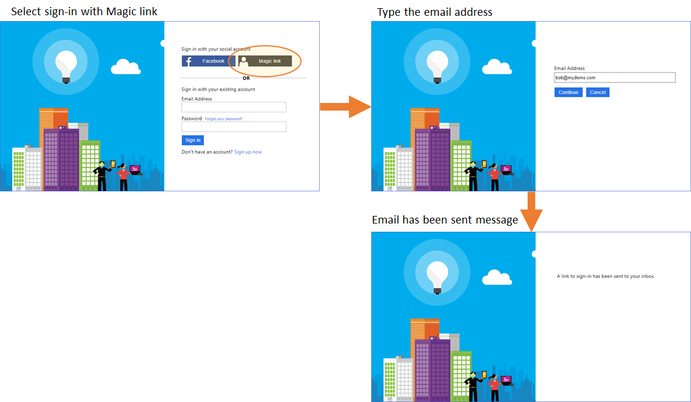
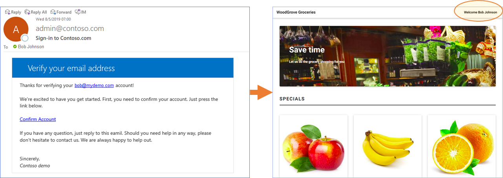

# Sign-in with a magic link
This sample demonstrates how to sign-in to a web application by sending a sign-in link. On the sign-up or sign-in page, user click on sign-in wiht **magic link**. Azure AD B2C calls a REST API that sends an email to the end user with a link to sign-in policy. The link to the sign-in policy contains the email address, which is encapsulated inside a JWT token (id_token_hint). When a user clicks on that link, Azure AD B2C validates the JWT token signature, reads the information from the token, extracts the email address and issues an access token back to the application.

## User flow
To sign-in, from Azure AD B2C sign-up or sign-in page, user select to sign-in with **Magic link**. Then user types an **email address** and click **Continue**. Azure AD B2C sends a sign-in link (with a id_token_hint) and present a message *A link to sign-in has been sent to your inbox.*. 



At this point user needs to open the email and click on the link, that takes to user to Azure AD B2C policy. Azure AD B2C validate the input id_token_hint, issues an access token, and redirect the user back to the application. 



## Sending Application Data
The key of sending data to Azure AD B2C custom policy is to package the data into a JWT token as claims (id_token_hint). In this case, we send the user's email address to Azure B2C. Sending JWT token requires to host the necessary metadata endpoints required to use the "id_token_hint" parameter in Azure AD B2C.

ID tokens are JSON Web Tokens (JWTs) and, in this application, are signed using RSA certificates. This application hosts an Open ID Connect metatdata endpoint and JSON Web Keys (JWKs) endpoint which are used by Azure AD B2C to validate the signature of the ID token.

The web app has following endpoints:
* **/.well-known/openid-configuration**, set this URL in the **IdTokenHint_ExtractClaims** technical profile
* **/.well-known/keys**

## Community Help and Support
Use [Stack Overflow](https://stackoverflow.com/questions/tagged/azure-ad-b2c) to get support from the community. Ask your questions on Stack Overflow first and browse existing issues to see if someone has asked your question before. Make sure that your questions or comments are tagged with [azure-ad-b2c].
If you find a bug in the sample, please raise the issue on [GitHub Issues](https://github.com/azure-ad-b2c/samples/issues).
To provide product feedback, visit the Azure Active Directory B2C [Feedback page](https://feedback.azure.com/forums/169401-azure-active-directory?category_id=160596).

### Creating a signing certificate
The sample application uses a self-signed certificate to sign the ID tokens. You can generate a valid self-signed certificate for this purpose and get the thumbprint using PowerShell *(note: Run as Administrator)*:
```Powershell
$cert = New-SelfSignedCertificate -Type Custom -Subject "CN=MySelfSignedCertificate" -TextExtension @("2.5.29.37={text}1.3.6.1.5.5.7.3.3") -KeyUsage DigitalSignature -KeyAlgorithm RSA -KeyLength 2048 -NotAfter (Get-Date).AddYears(2) -CertStoreLocation "Cert:\CurrentUser\My"
$cert.Thumbprint
```

### Configuring the application
Update the *appSettings* values in **appsettings.json** with the information for your Azure AD B2C tenant and the signing certificate you just created.
* **B2CTenant**: Your Azure AD B2C tenant name (without *.onmicrosoft.com*)
* **B2CPolicy**: The policy which you'd like to send the id_token_hint
* **B2CClientId**: The application ID for the Azure AD B2C app you'd like to redirect to
* **B2CRedirectUri**: The target redirect URI for your application
* **B2CSignUpUrl** the link to B2C format
* **SigningCertThumbprint**: The thumbprint for the signing certificate you just created
* **SigningCertAlgorithm**: The certificate algorithm (must be an RSA algorithm)
* **LinkExpiresAfterMinutes**: Link expiration (in minutes) 
* **SMTPServer**: Your SMTP server
* **SMTPPort**: Your SMTP server port number
* **SMTPUsername**: SMTP user name, if necessary
* **SMTPPassword**: SMTP password, if necessary
* **SMTPUseSSL**: SMTP use SSL, true of false
* **SMTPFromAddress**: Send from email address
* **SMTPSubject**: The invitation email's subject


### Running the application
When you run the application, you'll be able to enter the email of a user. When you click on **Send sign-in email**, the app sends a sign-in email to the account you specified.

To inspect the generated token, copy and paste it into a tool like [JWT.ms](htttps://jwt.ms).

### Hosting the application in Azure App Service
If you publish the application to Azure App Service, you'll need to configure a valid certificate with a private key in Azure App Service.
1. Export your certificate as a PFX file using the User Certificates management tool (or create a new one).
2. Upload your certificate in the **Private Certificates** tab of the **SSL Settings** blade of your Azure App Service.
3. [Ensure App Service loads the certificate](https://docs.microsoft.com/en-us/azure/app-service/app-service-web-ssl-cert-load#load-your-certificates) when the app runs.

## Using this in your Production Application
The authentication libraries create a `state` when the authentication flow begins from your application. This sample creates a raw link to the Azure AD B2C Policy, also referred to as a "Run Now" link. This type of link is not suitable for your production application instance and should only be used to test the sample.

For a Production scenario, the link containing the the `id_token_hint` should point to your application, `https://myapp.com/redeem?hint=<id_token_hint value>`. The application should have a valid route to handle a query parameter contatining the `id_token_hint`. The App should then use the authentication library to start an authentication to the AAD B2C Policy Id for which this `id_token_hint` is due to be consumed at. The library will contain a method to add query parameters to the authentication request. See the docuementation for the library in use to implement this.

The authentication library will then build the final authentication link, with the `id_token_hint` appended as part of a query parameter. This will now be a valid authentication request and your user will be redirected to the Azure AD B2C policy from your Application. Your application will be able to handle the response from Azure AD B2C properly.

- For [Single Page Applications library guidance](https://docs.microsoft.com/en-us/azure/active-directory-b2c/enable-authentication-spa-app-options#pass-id-token-hint).

- For [.Net Applications library guidance](https://docs.microsoft.com/en-us/azure/active-directory-b2c/enable-authentication-web-application-options#pass-id-token-hint).

## Notes
This sample policy is based on [SocialAndLocalAccounts starter pack](https://github.com/Azure-Samples/active-directory-b2c-custom-policy-starterpack/tree/master/SocialAndLocalAccounts). All changes are marked with **Sample:** comment inside the policy XML files. Make the necessary changes in the **Sample action required** sections. 
