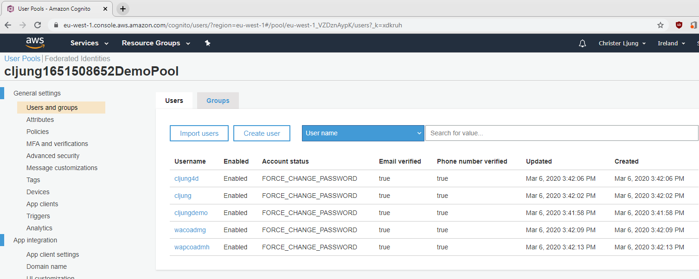

# Migrating CIAM solution from AWS Cognito to B2C - Setting up AWS Cognito

## AWS Account creation
You need to create an [AWS Account](https://aws.amazon.com/premiumsupport/knowledge-center/create-and-activate-aws-account/). The registration process currently requires you to register a credit card to cover any costs. AWS Cognito is free up to 50K users, so there shouldn't be any cost incured, but please check the latest [pricing](https://aws.amazon.com/cognito/pricing/).

## Install AWS CLI
This sample uses AWS CLI (Command Line Interface) to script the creation of AWS Cognito resources and also as part of the migration process. You therefor need to [install the AWS CLI](https://docs.aws.amazon.com/cli/latest/userguide/install-windows.html). Currently, the scripts are written in Powershell, so if you want to run this on a Mac, you need [Powershell for Mac](https://docs.microsoft.com/en-us/powershell/scripting/install/installing-powershell-core-on-macos?view=powershell-7).

In order to use AWS CLI, you need to configure it so it can access your AWS Account. The instructions for this configuration can be found [here](https://docs.aws.amazon.com/cli/latest/userguide/cli-chap-configure.html#cli-quick-configuration).

## Creating the AWS Cognito resources

The script [aws-cognito-idp-user-pool.ps1](scripts/aws-cognito-idp-user-pool.ps1) creates the AWS Cognito UserPool and the two App Registrations required. In order to run this script, you may need to edit it since there is a line at top that defines the unique prefix to name all resources which by default is the userid and a random sequence of numbers. If you prefer something else, then change it to your liking.

```Powershell
$uniquePrefix="$($env:USERNAME)$(Get-Random)".ToLower()
```

The script does the following:
1. Creates the [UserPool Resource](https://docs.aws.amazon.com/cognito/latest/developerguide/cognito-user-identity-pools.html)
2. Creates the scopes the websites uses for testing purposes
3. Creates the Domain so you get an OAuth endpoint for AWS Cognito
4. Creates two App Registrations. One for the website that uses OAuth and the other for ROPC that will be used by B2C during password migration

After the script is run, you need to do the following manually in the [AWS Console](https://aws.amazon.com/console/)

Go to ***App integration > App client settings*** and find the app that ***isn't*** the ROPC app. Do the following:
1. Under ***Enabled Identity Providers***, check ``Select All`` and ``Cognito User POol`` 
2. Add ***Callback URL(s)*** ``http://localhost:3000/callback, https://jwt.ms, https://www.getpostman.com/oauth2/callback`` 
3. Add ***Sign out URL(s)*** ``http://localhost:3000/signout`` 
4. Under ***OAuth 2.0 > Allowed OAuth Flows***, check ``Authorization code grant``
5. Under ***OAuth 2.0 > Allowed OAuth Scopes***, check ``email, openid and profile``
6. Under ***OAuth 2.0 > Allowed Custom Scopes***, check both ``demo.read`` and ``demo.write`` 
7. Press ***Save Changes***

The script ends with outputting details that we need for later stages, like to update the website's config with and config needed for the Azure Function. Copy and Paste this to Notepad or something.

## Importing users

The importing of users to AWS Cognito is quite straightforward and it only involves two steps:
1. Edit the file [users.csv](scripts/users.csv) to your liking
2. Run the script [import-user-to-aws-cognito.ps1](scripts/import-user-to-aws-cognito.ps1)

The CSV file contains fields that are to be imported and the key fields are username, email and phone_number + phone_number_verified. For rows with ``phone_number_verified`` set to ``true``, the ``phone_number`` field should be a phone in your posession as it will be migrated as your MFA phone, meaning when you test MFA you need the phone. The ``username`` and ``email`` fields need to be unique withing the file or you will have import failures.

```CSV
username;email;name;family_name;given_name;phone_number;phone_number_verified
alice;alice@contoso.com;Alice Smith(contoso);Smith;Alice;+46111222333;true
bob;bon@contoso.com;Bob Smith (contoso);Smith;Bob;+18001122;true
carol;carol@contoso.com;Carol Smith (contoso);Smith;Carol;+44111222333;true
dan;dan@contoso.com;Dan Smith (contoso);Smith;Dan;+46111222333;true
erin;erin@contoso.com;Erin Smith (contoso);Smith;Erin;+18001122;false
```

You then run the script with the below command. Note that the envvar AWS_UserPoolId was set by the previous script you ran.

```Powershell
.\import-user-to-aws-cognito.ps1 -f ".\users.csv" -d ";" -p $env:AWS_UserPoolId -t "Password-for-all-users-01!"
```

When you are done, the AWS Console should look something like this


## Verifying that a user can login

To verify that users can login you need to continue in the [website](../website/README.md) section

