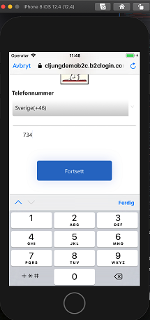
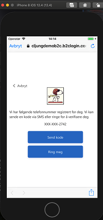
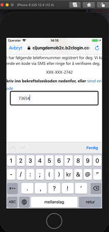

# A B2C IEF Custom Policy which allows login via Phone Number (OTP)

## Updated version notes
This sample has been updated. The previous version is in the zip file [phone_SUSI_old.zip](policy/phone_SUSI_old.zip) for your conveniance.

The sample still shows Phone Authentication where the user is asked to give their phone number and being challanges by a text mesage (SMS) or voice callback. If the phone number previously didn't exist in the B2C tenant, a user object is created, meaning SignUp is implicit during sign in.

The sample is based on the Base and Extension from the [SocialAndLocalAccountsWithMfa](https://github.com/Azure-Samples/active-directory-b2c-custom-policy-starterpack/tree/master/SocialAndLocalAccountsWithMfa) Starter Pack.
 
### Localization 
The file [TrustFrameworkLocalization.xml](policy/TrustFrameworkLocalization.xml) contains lanugage localizations to Swedish and Norweigan. If you append ``ui_locales=sv-se`` or ``ui_locales=nb-no`` as a query string parameter when you test the policy, the UX will be in Swedish or Norweigan. If you test this in the XCode Simulator for iOS, for example, you need to change ``General > Language & Region > iPhone Language`` in the simulator to switch language

### UX Customization
Since the signin page runs in the browser, styling the UX is something you may want to do to keep the visual style close to your smartphone app. For this purpose you may edit the [TrustFrameworkLocalization.xml](policy/TrustFrameworkLocalization.xml) file in the ContentDefinitions for ``api.selfasserted`` and ``api.phonefactor`` as indicated. This [documentation page](https://docs.microsoft.com/en-us/azure/active-directory-b2c/custom-policy-ui-customization#hosting-the-page-content) explains how to host UX content in Azure Blob Storage. Follow those instructions and upload the [selfAsserted.cshtml](policy/html/selfAsserted.cshtml) and the [multifactor-1.0.0.cshtml](policy/html/multifactor-1.0.0.cshtml) files. Before you upload them you need to edit them and replace ***yourtenant*** with your tenant name and ***yourstorageaccountname*** with your Azure Storage account name.

The CSS in the cshtml files are only modified to have a more visible border around the input fields and to add a custom logo.  

The cshtml files also make use of javascript. On the first page [selfAsserted.cshtml](policy/html/selfAsserted.cshtml) The javascript changes the input type of the national phone number field to ``<input type='tel'>`` so that the numeric only keyboard is displayed on the smartphone (see first screenshot). The javascript in the subsequent pages, served by [multifactor-1.0.0.cshtml](policy/html/multifactor-1.0.0.cshtml), we set the ``autocomplete='one-time-code'`` to enable autofill of the verifiaction code as described [here](https://developer.apple.com/documentation/security/password_autofill/enabling_password_autofill_on_an_html_input_element).

### Screenshots

   

## Phone Authentication Documentation

[Phone Authentication](https://docs.microsoft.com/en-us/azure/active-directory-b2c/phone-authentication) is in docs.microsoft.com and there you also find a different sample.

## Community Help and Support
Use [Stack Overflow](https://stackoverflow.com/questions/tagged/azure-ad-b2c) to get support from the community. Ask your questions on Stack Overflow first and browse existing issues to see if someone has asked your question before. Make sure that your questions or comments are tagged with [azure-ad-b2c].
If you find a bug in the sample, please raise the issue on [GitHub Issues](https://github.com/azure-ad-b2c/samples/issues).
To provide product feedback, visit the Azure Active Directory B2C [Feedback page](https://feedback.azure.com/forums/169401-azure-active-directory?category_id=160596).

## Scenario
Where you would like to login users solely on Phone Number and MFA via SMS or Phone Call.
This approach is passwordless.

## Notes
This sample policy is based on [SocialAndLocalAccountsWithMFA starter pack](https://github.com/Azure-Samples/active-directory-b2c-custom-policy-starterpack/tree/master/SocialAndLocalAccountsWithMfa). All changes are marked with **Sample:** comment inside the policy XML files. Make the necessary changes in the **Sample action required** sections. 
