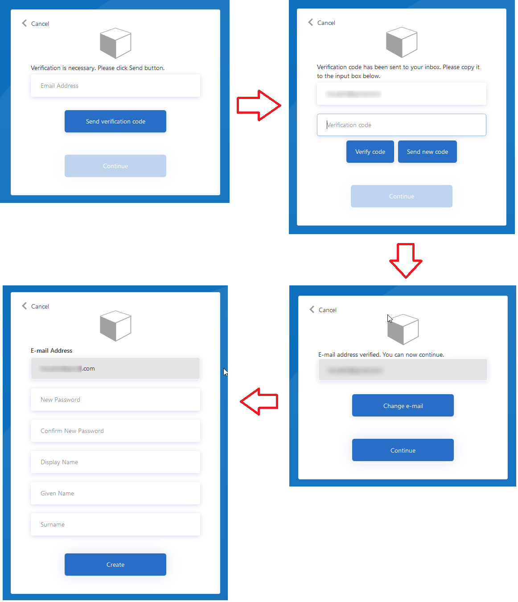

# Separate the Email Verification and User Registration into 2 separate screens

The AD B2C Sign-up requires users to verify their email first before they can create their accounts. The default Sign-up page on AD B2C clubs together the email verification controls, followed by user's First Name, Last Name and other fields. This may not be always desirable since the users cannot interact with these fields without verifying their email anyway. Ideal user experience would be to split the registration process into two separate screens, where the users only see the email verification related controls first, and not the entire set of Registration controls. When they complete the email verification, they should be taken to the next screen which asks for more user attributes (first-name, last-name, dob etc.).

## Live demo

To check out the user experience of this policy, follow these steps:

1. [Run](https://b2clivedemo.b2clogin.com/b2clivedemo.onmicrosoft.com/B2C_1A_Demo_SignUp_SignIn_SplitEmailVerificationAndSignUp/oauth2/v2.0/authorize?client_id=cfaf887b-a9db-4b44-ac47-5efff4e2902c&nonce=defaultNonce&redirect_uri=https%3A%2F%2Fjwt.ms&scope=openid&response_type=id_token&prompt=login) the *B2C_1A_Demo_SignUp_SignIn_SplitEmailVerificationAndSignUp* policy.
1. On the sign-up or sign-in page, select *Sign-up now*.
1. Provide and verify your email address, then select *Continue*.
1. To complete the sign-up process, fill out the sign-up form and select *Continue*.

## Prerequisites

- You can automate the pre requisites by visiting the [setup tool](https://aka.ms/iefsetup) if you already have an Azure AD B2C tenant. Some policies can be deployed directly through this app via the **Experimental** menu.

- You will require to [create an Azure AD B2C directory](https://docs.microsoft.com/azure/active-directory-b2c/tutorial-create-tenant).

- To use the sample policies in this repo, follow the instructions here to [setup your AAD B2C environment for Custom Policies](https://docs.microsoft.com/azure/active-directory-b2c/active-directory-b2c-get-started-custom).

## How it works

This policy splits the Sign up process into 2 steps:

- First step performs Email Verification only, skipping all other default fields related to users registration.
- Second step (if email verification was successful) takes the users to a new screen where they can actually create their accounts.
 

## Notes

This sample policy is based on [LocalAccounts starter pack](https://github.com/Azure-Samples/active-directory-b2c-custom-policy-starterpack/tree/master/LocalAccounts). All changes are marked with **Sample:** comment inside the policy XML files. Make the necessary changes in the **Sample action required** sections. 