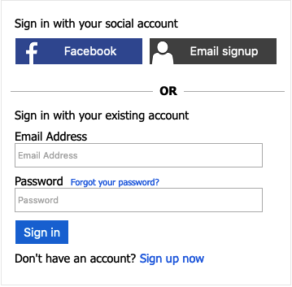

# Sign-in and Sign-up policy with direct link to sign-up

This sample adds a direct link to the sign-up page. A relying party application can include a query string parameter that takes the user directly  to the sign-up page.

The solution is based on the sign-up or sign-in policy. To allow the direct link to the sign-up page, in the first orchestration step (IDP selection), add the following claims provider selection.  

```xml
<ClaimsProviderSelection TargetClaimsExchangeId="SignUpWithLogonEmailExchange"/>
``` 

This adds a sign-up button to the IDP selection section. 



Use [HTML customization](https://docs.microsoft.com/azure/active-directory-b2c/custom-policy-ui-customization) with CSS to hide this button.

```css
#SignUpWithLogonEmailExchange {
  display: none;
}
```

Change the LocalAccountSignUpWithLogonEmail technical profile to include a domain name, such as `signup`.

```xml
<ClaimsProvider>
  <DisplayName>Local Account</DisplayName>
  <TechnicalProfiles>
    <TechnicalProfile Id="LocalAccountSignUpWithLogonEmail">
      <Domain>signup</Domain>
    </TechnicalProfile>
  </TechnicalProfiles>
</ClaimsProvider>
``` 

## Set the authorization request

To direct the user to the sign-up page, in the authorization request add the `domain_hit=signup` query string parameter. For more information, see [Redirect sign-in to a social provider](https://docs.microsoft.com/azure/active-directory-b2c/direct-signin#redirect-sign-in-to-a-social-provider). 

The following example takes the user to the landing page (sign-up or sign-in)

```http
https://yourtenant.b2clogin.com/yourtenant.onmicrosoft.com/oauth2/v2.0/authorize?p=B2C_1A_signup_signin_with_link_to_sign_up&client_id=63ba0d17-c4ba-47fd-89e9-31b3c2734339&nonce=defaultNonce&redirect_uri=https%3A%2F%2Fjwt.ms&scope=openid&response_type=id_token
```

If you add the login_hint paramter, the user is taken directly to the sign-up page.

```http
https://yourtenant.b2clogin.com/yourtenant.onmicrosoft.com/oauth2/v2.0/authorize?p=B2C_1A_signup_signin_with_link_to_sign_up&client_id=63ba0d17-c4ba-47fd-89e9-31b3c2734339&nonce=defaultNonce&redirect_uri=https%3A%2F%2Fjwt.ms&scope=openid&response_type=id_token&domain_hint=signup
```


## Community Help and Support
Use [Stack Overflow](https://stackoverflow.com/questions/tagged/azure-ad-b2c) to get support from the community. Ask your questions on Stack Overflow first and browse existing issues to see if someone has asked your question before. Make sure that your questions or comments are tagged with [azure-ad-b2c].
If you find a bug in the sample, please raise the issue on [GitHub Issues](https://github.com/azure-ad-b2c/samples/issues).
To provide product feedback, visit the Azure Active Directory B2C [Feedback page](https://feedback.azure.com/forums/169401-azure-active-directory?category_id=160596).

## Notes
This sample policy is based on [SocialAndLocalAccounts starter pack](https://github.com/Azure-Samples/active-directory-b2c-custom-policy-starterpack/tree/master/SocialAndLocalAccounts). All changes are marked with **Sample:** comment inside the policy XML files. Make the necessary changes in the **Sample action required** sections. 
