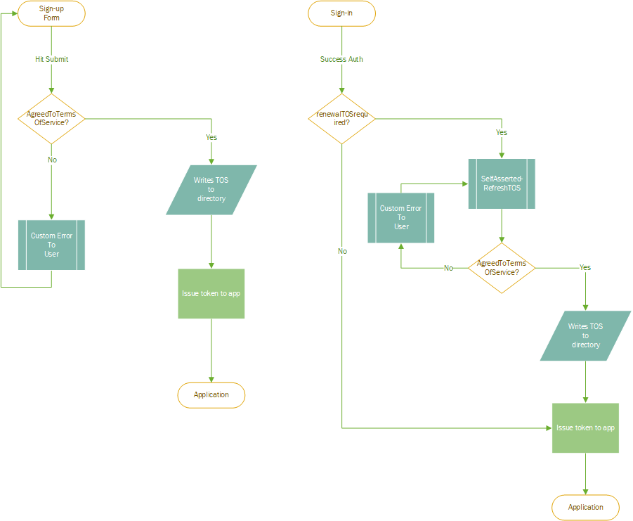

# Azure AD B2C: Terms of Service with SignUp or SignIn
Terms of service (TOS) cover the use of your company for consumer products, websites, and services listed as "Services". Providing this functionality allows users to "Accept" these terms using a click experience within the user login experience. 

<a href="https://youtu.be/Hog7ADL4L-s"></a>


## Solution flow
The sample policy includes following user journey:
* Sign-in with a local account with password
    * Reads the Azure AD B2C directory for the user's previously accepted TOS
    * Prompts user for a new TOS agreement if they are not current, then updates the new TOS to Azure AD B2C directory 
    * Allows customizable errors if TOS not accepted
* Sign-up with a local accout
    * Captures Terms of Service during Sign-Up
    * Allows customizable errors if TOS not accepted

## Adding this functionality to your policy
In your relying party policy:
1.	Add ClaimType(s) to **ClaimsSchema**:
    1. AgreedToTermsOfService
    1. extension_AgreedToTermsOfService
    1. policyTOSversion
    1. renewalTOSrequired
1. Add ClaimsTransformation(s) to **ClaimsTransformations**:
    1. IsTermsOfServiceRequired
    2. AssertTOSHasBeenSelected

1. Modify the following TechnicalProfiles based on sample:
    1. **LocalAccountSignUpWithLogonEmail** 
    1. **AAD-UserWriteUsingLogonEmail**
    1. **SelfAsserted-LocalAccountSignin-Email** 
    1. **AAD-Common** (enables extensionAttributes)

1. Add new TechnicalProfiles:
    1. **AAD-ReadTOS** - Reads the directory and puts the user's current TOS in the claim bag
    1. **SelfAsserted-RefreshTOS** - Prompts a screen to a user if TOS has changed during sign-in.
    1. **VerfiyTOSConsentedTo** - Validates the TOS button was selected and provides an error mechanism if not selected
    1. **AAD-UserWriteProfileUsingObjectIdUpdateTOU** - Writes the current TOS version to the directory in Azure AD B2C.
    1. **CheckTOSrequirement** - Verifies whether the company's TOS policy has changed by comparing the user's TOS attribute in the directory to what's been configured in the policy and returns a boolean.
1. Add **UserJourney** TermsOfServiceSignUpOrSignIn
1. Update "v16" to the *string* value of your TOS name. This can be any value. There are three locations within the XML file.




## Tests
You should run at least following acceptance tests:
- Create new local account and accept Terms of Service agreement
    -  Verify the correct TOS version is written in Azure AD B2C via graph on the user object on the *extension_AgreedToTermsOfService* attribute (this can be done through [Azure AD Graph Explorer](https://graphexplorer.azurewebsites.net/))
        ```HTP 
        GET https://graph.windows.net/contosob2c.com/users/<user-object-id>?api-version=1.6
        ```
- Create new local account and **do not** accept Terms of Service agreement (attempting to bypass the TOS box)
    -  Verify the correct ERROR mesage occurs on the screen
    -  Verify the TOS version is **not** writen on the user object via Graph for attribute *extension_AgreedToTermsOfService* (when calling graph,if the attribute is empty it will not return in the call)
-  Update your XML custom policy with a new VERSION# for both *AgreedToTermsOfService* and *policyTOSversion* default values THEN sign-in with a user that has the older TOS policy version on the user object
    -   After successful authentication, a new screen will appear to prompt user to accept the *new* TOS agreement
        -   Confirm TOS version is written and updated to the *extension_AgreedToTermsOfService* as defined in your policy


- **Sign-in with email** - try to sign-in with the account you create, using email verification
- **Sign-in with email** - try to sign-in with an email address that dosn't exists in the directory. You should see an error message: _An account could not be found for the provided user ID._

> Note:  This sample policy is based on [LocalAccounts starter pack](../../../SocialAndLocalAccounts). All changes are marked with **Sample:** comment inside the policy XML files. Make the necessary changes in the **Sample action required** sections. This can be modified to work with other starter packs.

## Community Help and Support
Use [Stack Overflow](https://stackoverflow.com/questions/tagged/azure-ad-b2c) to get support from the community. Ask your questions on Stack Overflow first and browse existing issues to see if someone has asked your question before. Make sure that your questions or comments are tagged with [azure-ad-b2c].
If you find a bug in the sample, please raise the issue on [GitHub Issues](https://github.com/azure-ad-b2c/samples/issues).
To provide product feedback, visit the Azure Active Directory B2C [Feedback page](https://feedback.azure.com/forums/169401-azure-active-directory?category_id=160596).
