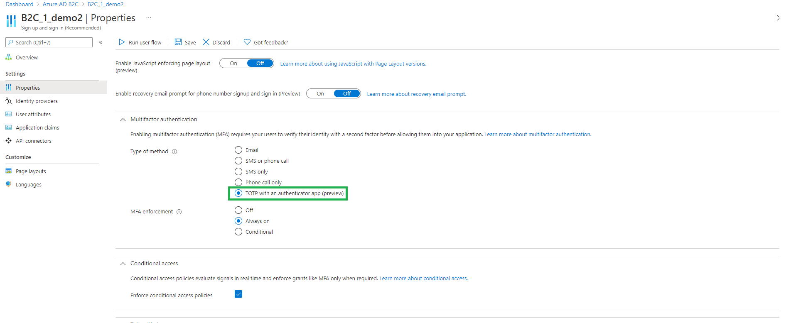
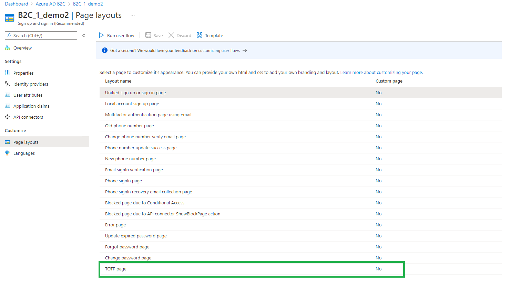
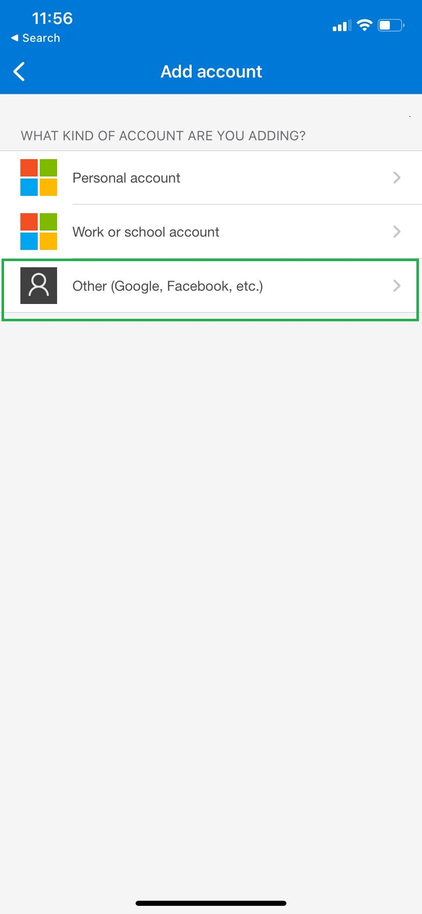

# Azure AD B2C MFA with TOTP using any Authenticator app

To provide an higher assurance multi-factor option we are enabling "time based one time pass-code" using Authenticator as an MFA choice for B2C customers. This option will allow customers  to save on the telephony charges associated with every step-up and still provide higher security than ever before for their end users accessing critical applications.

Users can download the Microsoft Authenticator app or any other authenticator app of their liking that supports the TOTP protocol.

## Live demo

To check out the user experience of the TOTP multi-factor authenticator, follow these steps:

1. [Sign-up or sign-in](https://b2clivedemo.b2clogin.com/b2clivedemo.onmicrosoft.com/B2C_1A_Demo_SignUp_SignIn_TOTP/oauth2/v2.0/authorize?client_id=cfaf887b-a9db-4b44-ac47-5efff4e2902c&nonce=defaultNonce&redirect_uri=https://jwt.ms&scope=openid&response_type=id_token&prompt=login) with the *B2C_1A_Demo_SignUp_SignIn_TOTP* policy. After you complete the sign-up (new account) or sign-in (with an existing account), the policy will take you to the multi-factor authentication registration. Follow the guidance on the screen to enroll your mobile device.
1. After the registration is completed, [sign-in](https://b2clivedemo.b2clogin.com/b2clivedemo.onmicrosoft.com/B2C_1A_Demo_SignUp_SignIn_TOTP/oauth2/v2.0/authorize?client_id=cfaf887b-a9db-4b44-ac47-5efff4e2902c&nonce=defaultNonce&redirect_uri=https://jwt.ms&scope=openid&response_type=id_token&prompt=login) again. This time you will be asked to verify the TOTP. Type the TOTP code that Microsoft Authenticator presents into the B2C page, and select *Verify*.

## Configure TOTP with user flows

- All V3 user flows (Recommended) wil have a new option for TOTP enabled under the "Type of Method" MFA section in the properties blade. 
- You can customize the TOTP screens by providing the branded HTML files like you do for other pages by going to the "Page Layouts" blade of the user flows. 

For more information, see [Enable multi-factor authentication in Azure AD B2C](https://docs.microsoft.com/azure/active-directory-b2c/multi-factor-authentication?pivots=b2c-user-flow).

## Configure TOTP with custom Policies

For custom policies see:

- Details below and the sample in the [Policy](policy) folder. The TOTP policy uses the starter-pack [B2C_1A_TrustFrameworkExtensions](https://github.com/Azure-Samples/active-directory-b2c-custom-policy-starterpack/blob/master/SocialAndLocalAccounts/TrustFrameworkExtensions.xml) as a base policy.
- Read the [Enable multi-factor authentication in Azure AD B2C](https://docs.microsoft.com/azure/active-directory-b2c/multi-factor-authentication?pivots=b2c-custom-policy) article.
- Lear how to use [Display controls](https://docs.microsoft.com/azure/active-directory-b2c/display-controls) and [TOTP display control](https://docs.microsoft.com/azure/active-directory-b2c/display-control-time-based-one-time-password).

## Using the Authenticator App

- Microsoft Authenticator app can be downloaded from here:  <https://www.microsoft.com/en-us/account/authenticator>. Subsequent release of this feature will have download links on the QR scan page for end users to download the app. 

- You can have your end users also use any other app of your choosing. You can add the download links to this app on the QR Code page.

- When end users are adding/scanning the QR code to add the new account to the Microsoft Authenticator app, choose **Other (Google, Facebook, etc.)** option to add your B2C account.

    


## Custom policy important notes

The claim  *totpIdentifier* is used to copy the different type of signIn options and variable names that exist e.g. email, emails, username, userId, signInName, etc. If your policy uses any other claim to collect the signIn name then you would need to handle that by copying your claim in the *totpIdentifier* claim as we have done for other claims in the *SetTotpInitialValue* technical profile. 

```XML
<TechnicalProfile Id="CreateTotpIdentifier-UserId">
    <DisplayName>Set Totp Default Values</DisplayName>
    <Protocol Name="Proprietary" Handler="Web.TPEngine.Providers.ClaimsTransformationProtocolProvider, Web.TPEngine, Version=1.0.0.0, Culture=neutral, PublicKeyToken=null" />
    <OutputClaims>
        <OutputClaim ClaimTypeReferenceId="totpIdentifier" />
    </OutputClaims>
    <OutputClaimsTransformations>
        <OutputClaimsTransformation ReferenceId="UserIdToLogonIdentifier" />
    </OutputClaimsTransformations>
</TechnicalProfile>
```

## Just In Time TOTP Migration

Jut In time migration allows you to migrate from your legacy storage of the TOTP Secret to the new TOTP method outlined above.
If you were previously using the [TOTP multi-factor authentication](../custom-mfa-totp) policy sample to implement TOTP then your users Secrets will be stored in the 'extension_StrongAuthenticationAppSecretKey' extension attribute.

To migrate these to the new method you can implement the [TOTP Migration Extension](policy/TrustFrameworkExtensions_TOTPMigration.xml) policy as the parent policy for either [SignUpOrSignIn_TOTP](policy/SignUpOrSignin_TOTP.xml#L9) or [PasswordReset_TOTP.xml](policy/PaswordReset_TOTP.xml#L9) 

The referenced policy will retrieve the old TOTP secret claim and use that for the TOTP Method. This will then store this to the new method on validation of the code supplied.
The policy will then remove the legacy extension attribute on the next login. To change this behavior see the [Remove legacy TOTP secret claim](#remove-legacy-totp-secret-claim) section below.

The below diagram depicts how the Just In Time TOTP migration works:


### Remove legacy TOTP secret claim

Within the [TOTP Migration Extension](policy/TrustFrameworkExtensions_TOTPMigration.xml) file under the *TotpFactor-Verify* sub journey, orchestration Step 6 will call the delete legacy TOTP Secret technical profile (AAD-DeleteLegacyTOTPClaim). This call by default has 2 conditions.

1. The extension attribute used to store the legacy claim needs to exist.
2. The number of registered devices is not 0

To remove the legacy claim without waiting until the next login, remove the second precondition.

If you prefer to maintain the legacy claim and remove it at a later time you can also just remove orchestration step 5.
